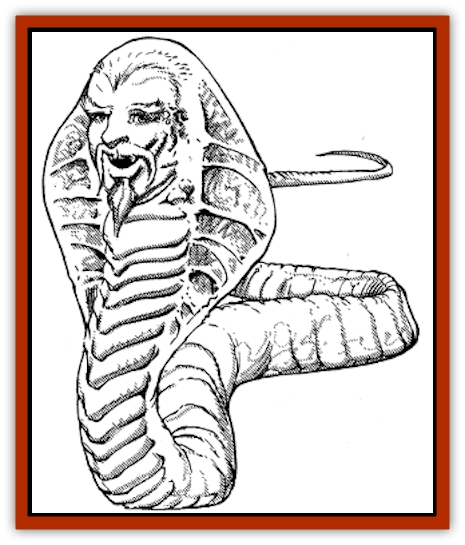

# Serpent Lord

| Statistic | **Serpent Lord** |
| --- | --- |
| **Activity Cycle:** | Any |
| **Alignment:** | Lawful good |
| **Armor Class:** | -2 |
| **Climate/Terrain:** | Tropical/Hills and ruins |
| **Damage/Attack:** | 4-24 |
| **Diet:** | Omnivore |
| **Frequency:** | Very rare |
| **Hit Dice:** | 16 |
| **Intelligence:** | Genius (17-18) |
| **Magic Resistance:** | 70% |
| **Morale:** | Champion (16) |
| **Movement:** | 6 |
| **No. Appearing:** | 1 |
| **No. of Attacks:** | 1 |
| **Organization:** | Solitary |
| **Size:** | G (50' long) |
| **Special Attacks:** | Constriction, spells |
| **Special Defenses:** | Spells |
| **THAC0:** | 5 |
| **Treasure:** | A,S,T |
| **XP Value:** | 15,000 |

Serpent lords, who resemble giant white cobras with human faces, are renowned healers and sages. They have a kind and compassionate nature.

The body of a serpent lord resembles that of a snow-white, hooded cobra, up to 50 feet in length. They have a human face and a warm, friendly smile.

They can communicate in their own language and that shared by all serpents. They can also speak Midani.

**Combat:** Serpent lords regard themselves as healers and scholars, not fighters. They are always protected by at least four [[Snake|giant constrictor snakes]] with maximum hit points. It is not uncommon for a serpent lord to be attended by an additional 2-12 giant poisonous snakes and 2-8 spitting snakes (cobras). These guardians will fight to the death in order to protect their king or queen.

The serpent lord is endowed with strong magical powers. Each has the abilities of a 16th-level cleric with an 18 Wisdom, able to turn undead, and memorize the following number of spells: nine 1st level, nine 2nd level, eight 3rd level, seven 4th level, four 5th level, three 6th level, and one 7th level. They typically choose spells from the healing, necromantic, divination, protection, and charm spheres, but have been known to memorize combat spells as well. Their strong magical resistance protects them from the effects of most spells used against them.

Should their spells and guardians fail them, serpent lords can attack by coiling their serpentine body around an opponent and constricting for 4-24 points of damage. They can entangle up to eight man-sized opponents in their steel-like coils. Once a constriction attack has been successful, the victim takes damage automatically on subsequent rounds until freed. It requires a combined total of 70 Strength points to extricate a man-sized victim from a serpent lord's crushing embrace.

**Habitat/Society:** Serpent lords live in large, secluded caves in the wilderness, far from civilized lands. Their caves are typically found in barren, stony hills favored by snakes or in long-abandoned ruins.

Serpent lords are powerful monarchs. As king or queen of the snakes in a 20-mile radius of their lair, they can summon 10-20 normal and giant constrictors, 10-60 normal and giant poisonous snakes, and 10-40 spitting snakes to their defense if given enough time (1-4 days). The reptiles normally found in the serpent lord's company are regarded as his friends and family as well as his guardians. They will not be sacrificed in combat foolishly or haphazardly. The serpent lord will personally protect his lesser cousins against powerful adversaries and predators.

Perhaps the biggest concern for the serpent lord and his protecting snakes is the acquisition of food. They are primarily carnivores, preferring lamb or beef; chickens and other birds will suffice, but fish is definitely out of the question. Serpent lords prefer their meat cooked whenever possible. Anyone bringing meat to a serpent lord will earn a -4 bonus on the reaction roll; anyone offering roasted or cooked meat to a serpent lord will earn a -10 on the reaction roll.

Serpent lords are widely sought after for their healing powers. Over the years, they tend to accumulate a considerable hoard, consisting mainly of gifts left behind in gratitude by cured patients. Serpent lords are not greedy or avaricious creatures, however, and will often bestow a precious jewel or jar of gold to a needy supplicant or a favored guest. Of those unable to afford luxuriant gifts in exchange for healing, a serpent lord might require that they start a fire, catch a wild pig or herd animal, and cook it for the serpent lord's dinner.

Serpent lords are sages as well as powerful healers. They are specialized in the the lore of herbalism, magical potions, and clerical magic in general. They are sometimes the guardians of a powerful clerical or religious magical item (like a *Book of Exalted Deeds* or a *Sword +5, Holy Avenger*), yielding it up to whoever can perform a preordained quest.

**Ecology:** Serpent lords are the champions and protectors of snakes in the wild. They devote almost all of their attention to the practice of healing.

A wide variety of powerful potions can be made from the brain of a serpent lord. The right half of the brain is extremely toxic and can be used to make poisons. The left half of the brain is nourishing and life-giving. It is a prime ingredient in *elixirs of life* and *potions of longevity*.

---
## Discovery & Documentation

**Source Publication:** MC13 Al-Qadim Appendix (1992)
**Campaign Setting:** Al-Qadim (Forgotten Realms)
**Author(s):** C. Terry Phillips

### Other Creatures Found in This Source Book
   * [[Ammut|Ammut]]
   * [[Ashira|Ashira]]
   * [[Asuras|Asuras]]
   * [[Black_Cloud_of_Vengeance|Black Cloud of Vengeance]]
   * [[Buraq|Buraq]]
   * [[Camel|Camel]]
   * [[Camel_of_the_Pearl|Camel of the Pearl]]
   * [[Centaur_Desert|Centaur, Desert]]
   * [[Copper_Automaton|Copper Automaton]]
   * [[Debbi|Debbi]]
   * [[Elephant_Bird|Elephant Bird]]
   * [[Gen|Gen]]
   * [[Genie_Noble_Dao|Genie, Noble Dao]]
   * [[Genie_Noble_Djinni|Genie, Noble Djinni]]
   * [[Genie_Noble_Efreeti|Genie, Noble Efreeti]]
   * [[Genie_Noble_Marid|Genie, Noble Marid]]
   * [[Genie_Tasked_Architect_Builder|Genie, Tasked, Architect/Builder]]
   * [[Genie_Tasked_Artist|Genie, Tasked, Artist]]
   * [[Genie_Tasked_Guardian|Genie, Tasked, Guardian]]
   * [[Genie_Tasked_Herdsman|Genie, Tasked, Herdsman]]
   * [[Genie_Tasked_Slayer|Genie, Tasked, Slayer]]
   * [[Genie_Tasked_Warmonger|Genie, Tasked, Warmonger]]
   * [[Genie_Tasked_Winemaker|Genie, Tasked, Winemaker]]
   * [[Ghost_Mount|Ghost Mount]]
   * [[Ghul|Ghul]]
   * [[Giant_Desert|Giant, Desert]]
   * [[Giant_Jungle|Giant, Jungle]]
   * [[Giant_Reef|Giant, Reef]]
   * [[Giant_Zakhara_General_Information|Giant (Zakhara), General Information]]
   * [[Hama|Hama]]
   * [[Heway|Heway]]
   * [[Living_Idol|Living Idol]]
   * [[Lycanthrope_Werehyena|Lycanthrope, Werehyena]]
   * [[Lycanthrope_Werelion|Lycanthrope, Werelion]]
   * [[Markeen|Markeen]]
   * [[Maskhi|Maskhi]]
   * [[Mason_Wasp_Giant|Mason Wasp, Giant]]
   * [[Nasnas|Nasnas]]
   * [[Pahari|Pahari]]
   * [[Rom|Rom]]
   * [[Sabu_Lord|Sabu Lord]]
   * [[Sakina|Sakina]]
   * [[Serpent_Winged|Serpent, Winged]]
   * [[Silat|Silat]]
   * [[Simurgh|Simurgh]]
   * [[Stone_Maiden|Stone Maiden]]
   * [[Vishap|Vishap]]
   * [[Zaratan|Zaratan]]
   * [[Zin|Zin]]
