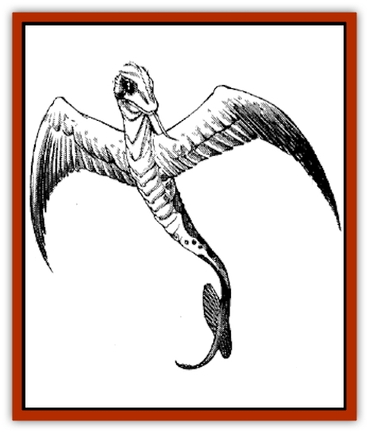

# Serpent - Winged

| Statistic | **Serpent, Winged** |
| --- | --- |
| **Activity Cycle:** | Any |
| **Alignment:** | Neutral |
| **Armor Class:** | 5 |
| **Climate/Terrain:** | Tropical/Forests |
| **Damage/Attack:** | 1-4 |
| **Diet:** | Herbivore |
| **Frequency:** | Rare |
| **Hit Dice:** | 4+4 |
| **Intelligence:** | Semi- (2-4) |
| **Magic Resistance:** | Nil |
| **Morale:** | Average (9) |
| **Movement:** | 12, Fl 18 (B) |
| **No. Appearing:** | 2-8 |
| **No. of Attacks:** | 1 |
| **Organization:** | Flocks |
| **Size:** | L (8-10' long) |
| **Special Attacks:** | Poison, spark shower |
| **Special Defenses:** | Immune to electricity |
| **THAC0:** | 17 |
| **Treasure:** | Nil |
| **XP Value:** | 1,400 |

Winged serpents, sometimes called spark snakes, are colorful reptiles that dwell in Zakhara's forests and jungles. Winged serpents come in many colors, ranging from sky blue and emerald green to raspberry red. They are supported by invisibly swift, gossamer wings, making them resemble reptilian hummingbirds. When their delicate wings are folded back, winged serpents can *spider climb* at will.

**Combat:** Winged serpents move with liquid grace and devastating speed. They always receive a -3 bonus to initiative. The bite of a winged serpent inflicts 1d4 points of damage and injects the victim with a corrosive, acidic fluid. This poison has an onset time of 1 round and inflicts an additional 2d8 points of damage for the following 2 rounds (half damage if a save vs. poison is made).

By far the most dangerous attack of these reptiles is their sparklike breath weapon. Their wings beat so quickly that they build up a static charge from the ambient air (especially in the humid forest). A winged serpent can discharge this static electricity from its mouth in a spark shower, a cloud of dancing sparks and electrical energy 10 feet in diameter. Those caught in the area of effect take 2d8 (2-16) points of damage (half if a save vs. breath weapon is made). The spark shower will also ignite any exposed flammable objects, like clothes, hair, dry wood, or lamp oil. Once it has been discharged, it takes one turn for a winged serpent to build its static charge back up. All winged serpents are immune to electricity.

Winged serpents are vulnerable to fire-based attacks (especially their delicate wings), against which they save at penalty of -2. If a winged serpent fails its saving throw against a fire attack, assume that its wings are incinerated. Although this won't affect its ability to bite a victim, the serpent cannot use its breath weapon until the wings grow back.

**Habitat/Society:** Winged serpents must eat constantly in order to survive. They flit about the jungle in small flocks, searching for tropical fruits, from which they draw their nourishment. A winged serpent will fly up to one and inject it with corrosive venom. The venom breaks down the fruit into a soft, juicy mixture, partially digesting the fruit while it still remains in its skin. The serpent will then suck out the fruity pulp through the incisions made by its fangs. A typical winged serpent will eat roughly ten times its weight in fruit each day, just to stay alive.

Winged serpents mate as often as they eat (i.e., incessantly), although they do not care for their young, which are born live and wingless. They are born with their *spider climbing* ability, which helps them climb fruit trees and search for food. The young are dark green in color to help them blend in better with the foliage, gaining their chromatic hues only after their wings mature. During the first few months of life, winged serpents are extremely vulnerable to an entire host of predators that roam the jungle heights (including mundane [[Snake|snakes]], monkeys, and [[Insect_Giant|giant insects]]). Vestigial wings appear after a month of life, and become fully functional after three months.

Winged serpents have no permanent lair and hoard no treasure.

**Ecology:** Winged serpents play an important role in the jungle ecology. Like [[Insect_Giant|giant bees]], they transport pollen from fruit tree to fruit tree and help with the distribution of seeds throughout the jungle. As adults, they have no natural enemies.

If captured during their first month of life before their wings have matured, they make excellent (if expensive) pets. They must consume a great quantity of fruit to survive, eating on average 100 gp worth of fruit each month (this cost might be reduced if a large orchard is available). A skilled animal trainer can teach a winged serpent up to three tasks or tricks per point of intelligence, which the creature will gladly perform (provided a supply of fresh fruit is constantly at hand). They can even be trained as guardians, although rogues have quickly discovered that unless they are extremely well-trained, they can be easily distracted by a decoy of aromatic, fresh fruit.

Few useful by-products can be obtained from a winged serpent. Their poison decomposes almost immediately after exposure to air, and their hide is too thin and fragile to serve as good leather. Their wings, however, if powdered and mixed with ink, can be used to inscribe a *protection from lightning* scroll.

---
## Discovery & Documentation

**Source Publication:** MC13 Al-Qadim Appendix (1992)
**Campaign Setting:** Al-Qadim (Forgotten Realms)
**Author(s):** C. Terry Phillips

### Other Creatures Found in This Source Book
   * [[Ammut|Ammut]]
   * [[Ashira|Ashira]]
   * [[Asuras|Asuras]]
   * [[Black_Cloud_of_Vengeance|Black Cloud of Vengeance]]
   * [[Buraq|Buraq]]
   * [[Camel|Camel]]
   * [[Camel_of_the_Pearl|Camel of the Pearl]]
   * [[Centaur_Desert|Centaur, Desert]]
   * [[Copper_Automaton|Copper Automaton]]
   * [[Debbi|Debbi]]
   * [[Elephant_Bird|Elephant Bird]]
   * [[Gen|Gen]]
   * [[Genie_Noble_Dao|Genie, Noble Dao]]
   * [[Genie_Noble_Djinni|Genie, Noble Djinni]]
   * [[Genie_Noble_Efreeti|Genie, Noble Efreeti]]
   * [[Genie_Noble_Marid|Genie, Noble Marid]]
   * [[Genie_Tasked_Architect_Builder|Genie, Tasked, Architect/Builder]]
   * [[Genie_Tasked_Artist|Genie, Tasked, Artist]]
   * [[Genie_Tasked_Guardian|Genie, Tasked, Guardian]]
   * [[Genie_Tasked_Herdsman|Genie, Tasked, Herdsman]]
   * [[Genie_Tasked_Slayer|Genie, Tasked, Slayer]]
   * [[Genie_Tasked_Warmonger|Genie, Tasked, Warmonger]]
   * [[Genie_Tasked_Winemaker|Genie, Tasked, Winemaker]]
   * [[Ghost_Mount|Ghost Mount]]
   * [[Ghul|Ghul]]
   * [[Giant_Desert|Giant, Desert]]
   * [[Giant_Jungle|Giant, Jungle]]
   * [[Giant_Reef|Giant, Reef]]
   * [[Giant_Zakhara_General_Information|Giant (Zakhara), General Information]]
   * [[Hama|Hama]]
   * [[Heway|Heway]]
   * [[Living_Idol|Living Idol]]
   * [[Lycanthrope_Werehyena|Lycanthrope, Werehyena]]
   * [[Lycanthrope_Werelion|Lycanthrope, Werelion]]
   * [[Markeen|Markeen]]
   * [[Maskhi|Maskhi]]
   * [[Mason_Wasp_Giant|Mason Wasp, Giant]]
   * [[Nasnas|Nasnas]]
   * [[Pahari|Pahari]]
   * [[Rom|Rom]]
   * [[Sabu_Lord|Sabu Lord]]
   * [[Sakina|Sakina]]
   * [[Serpent_Lord|Serpent Lord]]
   * [[Silat|Silat]]
   * [[Simurgh|Simurgh]]
   * [[Stone_Maiden|Stone Maiden]]
   * [[Vishap|Vishap]]
   * [[Zaratan|Zaratan]]
   * [[Zin|Zin]]
