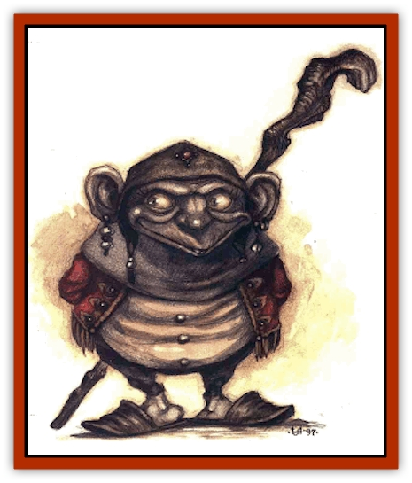

# Shad

| Statistic | **Shad** |
| --- | --- |
| **Activity Cycle:** | Any |
| **Alignment:** | Neutral |
| **Armor Class:** | 6 |
| **Climate/Terrain:** | Elemental Plane of Earth |
| **Damage/Attack:** | 1d3 or by weapon |
| **Diet:** | Omnivore |
| **Frequency:** | Rare |
| **Hit Dice:** | 2+1 |
| **Intelligence:** | Average (8-10) |
| **Magic Resistance:** | Nil |
| **Morale:** | Steady (11-12) |
| **Movement:** | 12 |
| **No. Appearing:** | 2d8 |
| **No. of Attacks:** | 1 |
| **Organization:** | Tribal |
| **Size:** | S-M (4-5½' tall) |
| **Special Attacks:** | Nil |
| **Special Defenses:** | Contortion, save bonus, immunities |
| **THAC0:** | 19 |
| **Treasure:** | Q |
| **XP Value:** | 175 |

Long ago, a druidic cadre on a prime-material world known as Verdorth gathered together in order to perform a task so monumental that only a clueless prime would think it possible. They sought to transform the Elemental Plane of Earth.

See, these folks had learned of the Beastlands, a plane where the animal life ruled, and they sought to find a plane where the same could be said for the plant life. The druids found no such place (except for a certain layer of the Abyss, but that didn't have the kind of plant life they really meant) and decided to make their own. These ambitious berks were confident - some might say overconfident - that they were doing a good thing.

The druids of Verdorth used their spells to create air-filled grottoes within the Elemental Plane of Earth. These cavernous chambers were then fertilized and cultivated. The prime bloods grew all manner of plants in the secret gardens, and as time passed, the druids - and the subsequent generations that came after them - intensified their magic and extended the caverns throughout the plane. Temporary artificial gates leading to the Elemental Plane of Water provided the vast gardens with water, while "sunlight" streamed in through similar rifts to the Quasiplane of Radiance. For years, the plants flourished under the care of the druids, who nurtured the flora in ways that nature never could.

Chant has it that the plants grew in strange and unpredlctable ways. Trees shot up to mountainous heights, vines moved of their own accord, and fruit offered more than simply sweet flavor. Unfortunately, it's unlikely that anyone'll ever corroborate these stories, because disaster struck the druids - and thus, their gardens. An unknown force (some say the [[Genie|dao]], some say the [[Elemental_Earth_Kin|pech]], some say an enemy from Verdorth itself) slaughtered the dedicated caretakers. Each and every one was put in the dead-book, and it didn't take long for neglect to claim the fantastic forests and orchards they'd cultivated within Earth.

But flora wasn't all that lived in those hidden caverns. Monstrous trees over a thousand feet tall were the homes of hordes of tiny, gray-skinned, humanoid creatures with very short hair and large eyes. Where they came from, no one knows, but it's said that not even the druids knew of their presence. As the towering plants died, the creatures fled like insects from a withered oak. They spread into the artificial grottoes and eventually adopted the plane of Earth as their own.

Today, folks know these invaders as the shad, and though many consider them to be vermin, they're actually surprisingly intelligent. Shad have their own language. and they adorn their large ears with multiple earrings. They also like to attach precious stones to their otherwise simple garments.

**Combat:** The shad prefer weapons of ancient wood or stone such as axes, clubs, staves, knives, daggers, spears, and short swords. Though the weapons may appear crude, they actually possess keen edges and sturdy constriction. After all, the shad must contend with true natives of Earth, creatures made partly or wholly of stone, so they take care to craft weapons that'll stand up to repeated pounding on solid rock.

The harsh environment in which the shad have lived for many centuries has produced only the hardiest of individuals. Thus, the creatures are immune to poison, disease, petrification, and paralyzation. Further, they gain a +1 bonus on all saving throws versus spell, breath weapon. and rod/staff/wand.

Thin and wiry, the shad can contort their bodies to fit through openings as tiny as 6 inches by 6 inches (or sometimes even smaller). Naturally, this also means they can slip most any manner of bonds. Both skills aid the creatures in escaping the dao slavers that hunt them mercilessly.

Among the shad, a small number of priests and even (strangely enough) druids exist. Such individuals can reach 6th level. Additionally, for every 10 normal shad in a tribe, there's usually one great warrior with 3 or even 4 Hit Dice. These rare bashers sometimes carry wooden shields, which improve their AC by 1 (to 5).

**Habitat/Society:** Virtually all creatures on the Elemental plane of Earth see the shad as invaders, vermin, and enemies. Remarkably, despite the fact that nearly everything else on the plane seeks their destruction, the shad have survived - and even flourished. They are incredibly adaptable and prolific in reproduction.

Since they have no ability to pass through stone, the nomadic shad must occupy existing openings and caverns that wend their way through the plane. Occasionally, they use their tools to painstakingly carve out their own tunnels and caves.

The shad aren't openly aggressive (at least, not if they've eaten recently), but they're unlikely to trust or help strangers. They've lasted as long as they have only by focusing on their own survival. Peery to the extreme, the shad assume that all creatures are out to get them, or, at the very least, are competition for meager local resources.

The priests and druids of the shad possess the power to spontaneously produce small amounts of plant life or fungus, which they nurture as best as they can in the lightless environment. The flora relies on water from the rare pockets that seep in from that Elemental Plane, which provides needed liquid to the shad as well. The tribes sustain themselves by eating these plants, but they always leave some of the flora intact. Perhaps they have a racial memory of the Verdorth druids and are slowly attempting to carry on their ancient mission.

Shad have a high birth rate and a short life expectancy, so they take steps to spread knowledge among their kind in lasting ways. For example, if a tribe comes upon a dangerous area (perhaps one of unstable terrain), they mark it with a warning symbol in the nearby stone to alert other wandering shad. But the sign's intended for their own tribe as well - by the time they return that way, everyone who explored the area firsthand might have long since died, replaced by new shad. The symbol will prevent them from repeating the mistakes of the previous generation.

Shad also mark areas of nearby water, secret food caches, and so on. Berks unskilled in interpreting the symbols find them impossible to decipher. Planewalkers who know the dark of the markings, however, may find their time on the Elemental Plane of Earth a little easier.

**Ecology:** Aliens on their own plane, the shad are nomadic pariahs that roam Earth's tunnels looking for water and air. They eat plants and fungus produced by their tribes' priests and druids, as well as slain digestible foes, which are few (though [[Khargra|khargra]] innards can be cooked up nicely). Most folks find it distasteful that the shad also eat their own dead, but this apparently causes them no ill effect, and they never seem to kill one another just for food.

Though they don't appear insectoid in nature, some graybeards speculate that the shad somehow descended from insects that lived and mutated in the druids' giant trees. 'Course, that still doesn't explain how the original insects got there in the first place.

---
## Discovery & Documentation

**Source Publication:** Planescape III (1996)
**Campaign Setting:** Planescape
**Author(s):** Monte Cook

### Other Creatures Found in This Source Book
   * [[Animental|Animental]]
   * [[Archomental_Evil|Archomental, Evil]]
   * [[Archomental_Good|Archomental, Good]]
   * [[Belker|Belker]]
   * [[Bzastra|Bzastra]]
   * [[Chososion|Chososion]]
   * [[Darklight|Darklight]]
   * [[Devete|Devete]]
   * [[Devourer_Planescape|Devourer (Planescape)]]
   * [[Dharum_Suhn|Dharum Suhn]]
   * [[Egarus|Egarus]]
   * [[Elemental_Athas_Lesser_Air_Earth|Elemental (Athas), Lesser, Air/Earth]]
   * [[Elemental_Athas_Lesser_Fire_Water|Elemental (Athas), Lesser, Fire/Water]]
   * [[Elemental_Fire_Kin_Salamander_II|Elemental, Fire Kin, Salamander II]]
   * [[Entrope|Entrope]]
   * [[Facet|Facet]]
   * [[Frost_Salamander|Frost Salamander]]
   * [[Fundamental_Air_Earth|Fundamental, Air/Earth]]
   * [[Fundamental_Fire_Water|Fundamental, Fire/Water]]
   * [[Fundamental_All_Elements|Fundamental, All Elements]]
   * [[Garmorm|Garmorm]]
   * [[Homunculus_Elemental|Homunculus, Elemental]]
   * [[Immoth|Immoth]]
   * [[Khargra|Khargra]]
   * [[Klyndes|Klyndes]]
   * [[Magran|Magran]]
   * [[Menglis|Menglis]]
   * [[Nathri|Nathri]]
   * [[Ooze_Sprite|Ooze Sprite]]
   * [[Paraelemental|Paraelemental]]
   * [[Phirblas|Phirblas]]
   * [[Psurlon|Psurlon]]
   * [[Quasielemental_Negative|Quasielemental, Negative]]
   * [[Quasielemental_Positive|Quasielemental, Positive]]
   * [[Rast|Rast]]
   * [[Ravid|Ravid]]
   * [[Ruvoka|Ruvoka]]
   * [[Scile|Scile]]
   * [[Shocker|Shocker]]
   * [[Sislan|Sislan]]
   * [[Suisseen|Suisseen]]
   * [[Terithran|Terithran]]
   * [[Thoqqua|Thoqqua]]
   * [[Trilloch|Trilloch]]
   * [[Tsnng|Tsnng]]
   * [[Ungulosin|Ungulosin]]
   * [[Vacuous|Vacuous]]
   * [[Wavefire|Wavefire]]
   * [[Xag-Ya_Xeg-Yi|Xag-Ya/Xeg-Yi]]
   * [[Xill|Xill]]
