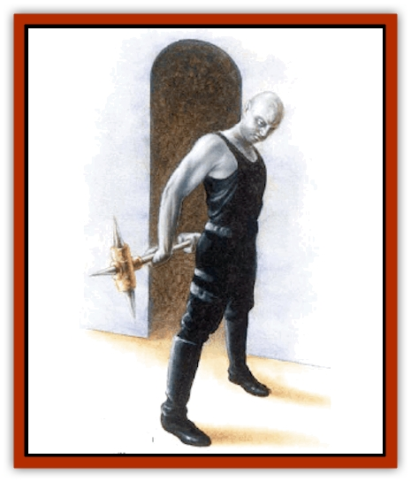

# Shade

| Statistic | **Shade** |
| --- | --- |
| **Activity Cycle:** | Twilight/night |
| **Alignment:** | Any nongood |
| **Armor Class:** | 10 (or by armor type) |
| **Climate/Terrain:** | Any land, Plane of Shadow |
| **Damage/Attack:** | By weapon (usually 1d8) |
| **Diet:** | Omnivore |
| **Frequency:** | Very rare |
| **Hit Dice:** | 10 (or by class &amp; level) |
| **Intelligence:** | Low to genius (5-18) |
| **Magic Resistance:** | Variable |
| **Morale:** | Elite (13-14) |
| **Movement:** | 15 |
| **No. Appearing:** | 1-2 |
| **No. of Attacks:** | 1 (or by class &amp; level) |
| **Organization:** | Solitary |
| **Size:** | M (usually about 6' tall) |
| **Special Attacks:** | <i>Quasi-real images</i>, surprise |
| **Special Defenses:** | <i>Shadow images</i>, <i>blink</i>, regeneration |
| **THAC0:** | 11 (or by class&amp; level) |
| **Treasure:** | K,M,N,W (Varies) |
| **XP Value:** | 6,000 (or class &amp; level +7 HD) |

Even the most astute observer could mistake a shade for a human. In fact, most shades once were human, but have shed their mortality for the essence of shadowstuff.

Most shades appear as humans of their former physical height and appearance, but with grayish or nearly black, dusky skin and veiled eyes. They are often tall and thin. They favor somber clothing and wear armor if they so desire, provided it does not interfere with their spellcasting abilities, if any. Shades can speak as many languages as their intelligence allows, but have no special language of their own. All shades that once were human speak their native tongue (most often Common, but sometimes a regional tongue).

**Combat:** Shades, by their nature, both have an affinity for shadow and have their capabilities linked to the degree of ambient shadow they occupy. They become fairly weak when exposed to unrelieved light or complete darkness, but prove formidable when in shadows.

*No Shadows:* The shade is surrounded by multiple light sources: within a magical *light* or *darkness* spell, in a room cut off from all light sources (complete darkness), or in the open on a bright, clear day. The shade suffers these penalties:

<ul><li>All the shade's senses function at half the human norm.</li><li>Base movement rate reduced to 12.</li><li>-2 hit points per hit die (minimum 1 point per die).</li><li>-4 saving throw penalty.</li></ul>*Weak Shadows:* These lighting conditions include outdoors at dawn or twilight, in the woods on a bright day, in average indoor light, or outdoors on a moonless or overcast night. The shade functions normally in most respects, enjoying acute eyesight and hearing. The shade inflicts a -1 penalty on an opponents's surprise rolls.

*Strong Shadows:* The shade is outdoors at night or in dim indoor light. The shade enjoys the following advantages:

<ul><li>Highly acute eyesight and hearing equal to twice the human norm.</li><li>+1 hit point per hit die.</li><li>+2 to surprise rolls, -2 to opponent's surprise rolls.</li><li>Base movement rate of 15.</li><li>+1 to all saving throws, attack rolls, and damage rolls; all such rolls made against the shade suffer a -1 penalty (minimum 1 point of damage per die).</li><li>Magic resistance equal to 2% per hit die or level of experience (but never more than 40%).</li><li>*Invisibility* once per turn, maximum duration 1 hour per use.</li><li>The ability to create *shadow images* once an hour. This ability is similar to a *mirror image* spell cast at the shade's level (or 2nd level, whichever is better), except that 1d4+3 images appear.</li><li>The ability to regenerate 1 hit point a turn. The shade can regenerate severed limbs if the lost limb is pressed against the stump, but cannot regenerate its head if decapitated.</li></ul>*Very Shadowy:* These lighting conditions include: being in the woods or jungle at twilight; being in a windowless room with a single, flicking light source (torch, candle, or small fire); or being outdoors at night along the edges of the circle of light thrown by an artificial light source (see the *Player's Handbook*, Table 63).

<ul><li>Highly acute eyesight and hearing equal to twice the human norm. The shade sees through shadows as well as a human sees in broad daylight. Any hide in shadows attempts (except by other shades) automatically fail with respect to the shade.</li><li>+3 hit points per hit die.</li><li>+3 to surprise rolls, -3 to opponent's surprise rolls.</li><li>Base movement rate of 18 and ability to make a controlled *blink* once every two rounds. This ability allows the shade to appear in any very shadowy area within 100 yards and attack, use an ability, or cast a spell after it appears. The shade never appears inside a solid object.</li><li>+3 to all saving throws, attack rolls, and damage rolls; all such rolls made against the shade suffer a -3 penalty (minimum 1 point of damage per die).</li><li>Magic resistance equal to 3% per hit die or level of experience (but never more than 70%).</li><li>The ability to create *shadow images* once a turn as noted above.</li><li>The ability to create *quasi-real images* once an hour. This ability is similar to a *demishadow monsters* spell cast at the shade's level (or 2nd level, whichever is better), except that 1d4 duplicates of the shade appear. The shade has mental control over the duplicates.</li><li>The ability to regenerate 3 hit points a round, with the limitations noted above under the regeneration ability for strong shadows.</li><li>The ability to *teleport witout error* to any very shadowy locale on the same world as the shade or *plane shift* to or from the Demiplane of Shadow. The shade can either *teleport* or *plane shift* once a day, but not both.</li></ul>**Habitat/Society:** Shades tend toward taciturn dispositions and prefer solitude. Their preferred abode is the Demiplane of Shadow. Many shades were formerly mages (such as the Abuyakas of the Eshowe tribe in the Jungles of Chult), thieves, or fighters, and a small fraction are priests of such deities as Eshowdow. Some shades still maintain strong connections with their former abodes on the Prime Material Plane, living more for their mortal culture than any to which they gained access by becoming shades, while other underwent the transformation to become shades so long ago that they have almost forgotten their lives as mortals. Such shades behave in a distant manner to non-shades and seem to find many urgent concerns of mortals trivial. They may even have difficulty concentrating on the conversations of mortals addressing them, having grown used to the practice of ignoring those people and things that do not concern or interest them.

Shades spend a great deal of time returning to the Prime Material Plane, much more so than many other creatures of the planes. Why this is so may relate to personal goals of particular shades or may have to do with the larger concerns of shade society in the Demiplane of Shadow; sages are not sure. Many shades encountered on the Prime Material Plane seem to be on missions to gather information, retrieve powerful items, kidnap or kill important (or seemingly unimportant) beings, or to protect a certain location.

**Ecology:** Shades are effectively immortal, never dying unless slain and prevented from regenerating. They achieve this state by exchanging their spirits for the stuff of shadows. (Sages disagree on exactly how they accomplish this feat, although powerful magic is certainly involved.) The transformation leaves them sterile.

Shades eat much the same diet as they did while mortal, but apparently receive some nourishment from shadow itself; no accounts exist of any of captive shades (for what little time they were captured) starving or becoming malnourished for lack of food and water. Shades do not create an uneasy reaction in animals, as do many unnatural creatures; quite to the contrary, they seem to be ignored by creatures of lesser intelligence, perceived simply as shadows rather than as living beings.

Demihumans who become shades function as described here, though their appearance suggests their former race. A dwarven shade, for example, might appear very stout. There are very few demihuman shades compared to the number of apparently human shades.

| Lighting Condition | Senses (re. Human) | MV | hp | MR (max) | Surprise | Attack/Damage | Saving Throw | Magic |
| --- | --- | --- | --- | --- | --- | --- | --- | --- |
| No shadows | ½ | 12 | -2/die | Nil | - | - | -4 | - |
| Weak shadows | 1 | 15 | Normal | Nil | -12 | - | 0 | - |
| Strong shadows | 2 | 15 | +1/die | 2%/level (40%) | +23 | +13 | +1 | shadow image, regenerate 1/turn, invisibility 1 hour |
| Very shadowy | 21 | 18 | +3/die | 3%/level (70%) | +33 | +33 | +3 | quasi-images, blink 1/2 rds., regenerate 3/round, teleport/plane shift 1/day |

1 See in shadows as human in full daylight. Non-shade thieves in shadows are seen clearly.

2 Opponents have a -1 penalty to their surprise rolls. Shade rolls are not adjusted.

3 Opponents have an opposite bonus or penalty of the same magnitude. For example, in strong shadows, a shade has a +1 attack bonus, while its opponents have an attack penalty of -1. Hit dice are not reduced below 1 hit point/die; damage rolls are not reduced below 1.

---
## Discovery & Documentation

**Source Publication:** Monstrous Compendium, 1997 Annual, Volume 4 (1995)
**Campaign Setting:** Advanced Dungeons & Dragons 2nd Edition
**Author(s):** Jon Pickens

### Other Creatures Found in This Source Book
   * [[Anemone_Giant_Sea|Anemone, Giant Sea]]
   * [[Asperii|Asperii]]
   * [[Bainligor|Bainligor]]
   * [[Beast_of_Chaos|Beast of Chaos]]
   * [[Blindheim|Blindheim]]
   * [[Bloodsipper_Far_Realm|Bloodsipper (Far Realm)]]
   * [[Bulette_Gohlbrorn|Bulette, Gohlbrorn]]
   * [[Child_of_the_Sea|Child of the Sea]]
   * [[Clockwork_Horror|Clockwork Horror]]
   * [[Clockwork_Swordsman|Clockwork Swordsman]]
   * [[Coral|Coral]]
   * [[Darklore|Darklore]]
   * [[Dharculus|Dharculus]]
   * [[Dolphin_Athas|Dolphin (Athas)]]
   * [[Dragon_Neutral_Moonstone|Dragon, Neutral, Moonstone]]
   * [[Dragon_Prismatic|Dragon, Prismatic]]
   * [[Dream_Stalker|Dream Stalker]]
   * [[Dragon-kin_Albino_Wyrm|Dragon-kin, Albino Wyrm]]
   * [[Echyan|Echyan]]
   * [[Firestar|Firestar]]
   * [[Firetail|Firetail]]
   * [[Fish_Ascallion|Fish, Ascallion]]
   * [[Fish_Deep_Ocean|Fish, Deep Ocean]]
   * [[Fish_Tropical|Fish, Tropical]]
   * [[Fish_Vurgens|Fish, Vurgens]]
   * [[Fogwarden|Fogwarden]]
   * [[Fraal|Fraal]]
   * [[Giant_Crag|Giant, Crag]]
   * [[Gibberling_Brood|Gibberling, Brood]]
   * [[Glutton_Sea|Glutton, Sea]]
   * [[Golden_Ammonite|Golden Ammonite]]
   * [[Golem_Brass_Minotaur|Golem, Brass Minotaur]]
   * [[Golem_Gemstone|Golem, Gemstone]]
   * [[Golem_Maggot|Golem, Maggot]]
   * [[Groundling|Groundling]]
   * [[Hermit_Sea|Hermit, Sea]]
   * [[Hound_of_Law|Hound of Law]]
   * [[Human_Amazon|Human, Amazon]]
   * [[Human_Pygmy|Human, Pygmy]]
   * [[Inquisitor|Inquisitor]]
   * [[Kercpa|Kercpa]]
   * [[Kreel|Kreel]]
   * [[Lycanthrope_Lythari|Lycanthrope, Lythari]]
   * [[Mercurial|Mercurial]]
   * [[Mold_Chromatic|Mold, Chromatic]]
   * [[Mummy_Bog|Mummy, Bog]]
   * [[Neh-thalggu|Neh-thalggu]]
   * [[Nymph_Grain|Nymph, Grain]]
   * [[Nymph_Unseelie|Nymph, Unseelie]]
   * [[Octopus_Octo-Jelly|Octopus, Octo-Jelly]]
   * [[Puddingfish|Puddingfish]]
   * [[Sea_Demon|Sea Demon]]
   * [[Shadowrath|Shadowrath]]
   * [[Shark_Athas|Shark (Athas)]]
   * [[Siren_Ravenloft|Siren (Ravenloft)]]
   * [[Skeleton_Variant|Skeleton, Variant]]
   * [[Skyfish|Skyfish]]
   * [[Spectral_Scion|Spectral Scion]]
   * [[Spyder_Fiend|Spyder Fiend]]
   * [[Squid_Squark|Squid, Squark]]
   * [[Tanar'ri_Lesser_Uridezu|Tanar'ri, Lesser, Uridezu]]
   * [[Troll_Mutate|Troll Mutate]]
   * [[Vaati|Vaati]]
   * [[Vampire_Cerebral|Vampire, Cerebral]]
   * [[Varkha|Varkha]]
   * [[Wizshade|Wizshade]]
   * [[Worm_Lukhorn|Worm, Lukhorn]]
   * [[Wyste|Wyste]]
   * [[Yugoloth_Lesser_Gacholoth|Yugoloth, Lesser, Gacholoth]]
   * [[Zombie_Mud|Zombie, Mud]]
