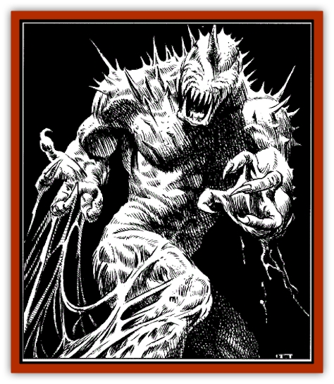

# Shadevari

| Statistic | **Shadevari** |
| --- | --- |
| **Activity Cycle:** | Any |
| **Alignment:** | Neutral Evil |
| **Armor Class:** | 0 |
| **Climate/Terrain:** | Any |
| **Damage/Attack:** | 1d8+2(×2)/2d4 |
| **Diet:** | Carnivore |
| **Frequency:** | Very rare |
| **Hit Dice:** | 7+7 |
| **Intelligence:** | Very (11-12) |
| **Magic Resistance:** | 33% |
| **Morale:** | Fearless (20) |
| **Movement:** | 18 |
| **No. Appearing:** | 1d3 |
| **No. of Attacks:** | 3 |
| **Organization:** | Solitary |
| **Size:** | M |
| **Special Attacks:** | First strike |
| **Special Defenses:** | Bat away missiles, +2 weapons or better to hit |
| **THAC0:** | 13 |
| **Treasure:** | Nil |
| **XP Value:** | 2,000 |

Beasts from the long-lost past of Toril, shadevari were recently summoned to be the servants of Shadowkings. They are bipedal and covered with irongray lizard scales, with misshapen faces; two black tusks curving like scimitars from their mouths. A single, serrated onyx horn crowns their foreheads; wicked barbs sprout from their chests, arms, and the crests atop their heads; shallow depressions exist where their eyes should be to finish their ghastly faces. The beasts have retractable talons on their hands and feet.

**Combat:** The shadevari are very quick in combat. Barring magical spells or items such as *haste* or a *short sword of quickness*, shadevari always strike first in a combat round. The beasts are hurt only by enchanted weapons of +2 or better. Any blows from lesser weapons quickly heal. Shadevari also have a chance to bat away missile weapons directed at them. For hurled missiles such as daggers, spears, or hand axes, shadevari must make a successful attack roll vs. AC5. For propelled missiles such as arrows or crossbow bolts, the roll is against AC2. If not currently engaged in melee such activities do not count as actions, though they can deflect no more than three missiles per round. Once engaged in melee, each deflection attempt costs a shadevar one attack.

**Habitat/Society:** Little is well known of the shadevari, but their history is apparently recounted in the Book of Shadows, a mystical tome currently in the possession of a mage in Iriaebor. Only 13 of these beasts ever existed according to legend, and they left or were forced from Toril long ago. In the events described below, at least four of these beings were encountered and destroyed. What this bodes for the race as a whole is not known at this time.

**Ecology:** It has been verified that the Shadevari lack eyes and seem to track their prey by scent and by noise. The latter also may explain the creatures' uncanny ability to swat missile weapons from the air; the beasts' sensitive hearing detects the whistling of the missile through the air and pinpoints its position and trajectory, at which time the creature can dodge or knock the weapon aside. At least one sage has also promoted the theory that the shadevari navigate through the world using the same high-pitched sounds that some bats use. If this is true, it means a magical silence effect might blind the creatures. (If you as a DM choose this option, then the shadevari's AC worsens by 4 and they lose the ability to swat at missile weapons successfully.)

**History:** The first recorded occurrence of shadevari in modern-day Faerûn was in 1364 DR. One of these creatures was sent by Snake, a shade in the service of the Shadowking, after the Harpers Caledan Caldorien, Mari Al'maren, and their allies. After a long pursuit and several battles, the beast was destroyed.

Not long after that, another new Shadowking began to make his presence known in the Realms. This was Caledan Caldorien. Feeling a part within him changing, he fled from his friends and loved ones, fearing for their safety. These same friends went after him, unaware of the reason for his flight.

As the evil within him grew, Caledan developed a split personality. He fought to retain control, but the evil of the Shadowking would overpower him at times and cause havoc. The undead beings known as shadows were under the Shadowking's control, as were all the “shadow magic” wizard spells. With these tools, the Shadowking wreaked much havoc and grew in strength. The evil within Caledan also released not one but three shadevari into the Realms to pursue and kill the Harper's friends.

After a long journey and many trials, the heroes came upon the Shadowking's “birth.” While unable to prevent the event, they mortally wounded the newborn king while fighting the shadevari. The heroes knew that killing the Shadowking could well cost their friend his life as well.

Fortunately, the shadevari were destroyed under unique circumstances, and Caledan emerged from the king's corpse, just barely alive. The prospects for his long-term survival do not appear to be good.

---
## Discovery & Documentation

**Source Publication:** Villains' Lorebook (1998)
**Campaign Setting:** Forgotten Realms
**Author(s):** Dale Donovan, Bill Olmesdahl, Todd Lockwood

### Other Creatures Found in This Source Book
   * [[Balhiir|Balhiir]]
   * [[Chosen_One|Chosen One]]
   * [[Darkenbeast|Darkenbeast]]
   * [[Dread_Warrior|Dread Warrior]]
   * [[Kalmari|Kalmari]]
   * [[Phaerimm|Phaerimm]]
   * [[Pteraman|Pteraman]]
   * [[Shadowmasters_the_Malaugrym|Shadowmasters (the Malaugrym)]]
   * [[Tanar'ri_Lesser_Yochlol|Tanar'ri, Lesser, Yochlol]]
