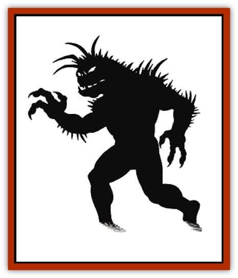

# Shadow

| Statistic | **Shadow** |
| --- | --- |
| **Activity Cycle:** | Night or darkness |
| **Alignment:** | Chaotic evil |
| **Armor Class:** | 7 |
| **Climate/Terrain:** | Any ruins or subterranean chambers |
| **Damage/Attack:** | 2-5 |
| **Diet:** | Living beings |
| **Frequency:** | Rare |
| **Hit Dice:** | 3+3 |
| **Intelligence:** | Low (5-7) |
| **Magic Resistance:** | See below |
| **Morale:** | Special |
| **Movement:** | 12 |
| **No. Appearing:** | 2-20 (2d10) |
| **No. of Attacks:** | 1 |
| **Organization:** | Roving bands |
| **Size:** | M (6' tall) |
| **Special Attacks:** | Strength drain |
| **Special Defenses:** | +1 or better weapon to hit |
| **THAC0:** | 17 |
| **Treasure:** | F |
| **XP Value:** | 420 |

Shadows are shadowy, undead creatures that drain strength from their victims with their chilling touch.

Shadows are 90% undetectable in all but the brightest of surroundings (*continual light* or equivalent), as they normally appear to be nothing more than their name would suggest. In bright light they can be clearly seen.

**Combat:** As shadows exist primarily on the Negative Material Plane, they have the ability to drain the life force of their victims. The chilling touch of a shadow inflicts 2-5 points of damage to its victim as well as draining one point of Strength. Lost Strength points return 2-8 turns after being touched. If a human or demihuman opponent is reduced to zero Strength or zero hit points by a shadow, the shadow has drained the life force and the opponent becomes a shadow as well. The newly formed shadow is then compelled to join the roving band and pursue a life of evil. Other living creatures simply collapse from fatigue (if taken to zero Strength) or fall unconscious (if taken to zero hit points), where they are left to die or are hounded again upon waking.

Shadows are immune to *sleep*, *charm*, and *hold* spells and are unaffected by cold-based attacks. They can be turned by clerics.

**Habitat/Society:** Shadows travel in loosely organized packs that freely roam ancient ruins, graveyards, and dungeons. They specialize in terrifying their victims.

Shadows have no leaders and thus spend much of their time roaming aimlessly about their chosen surroundings. Contrary to popular belief, shadows do not hoard treasure. In fact, such earthly baubles only help to remind the creatures of their former lives. Instead, the furious undead throw all of the treasure they find away, in the same location (often at the bottom of a well or deep pit), where it is out of sight of the band. It is therefore speculated that the removal of a shadow hoard would be quite easy (even welcomed), were it not for the fact that shadows attack living beings without hesitation, regardless of their intent or threat.

**Ecology:** According to most knowledgeable sages, shadows appear to have been magically created, perhaps as part of some ancient curse laid upon some long-dead enemy. The curse affects only humans and demihumans, so it would seem that it affects the soul or spirit. When victims no longer can resist, either through loss of consciousness (hit points) or physical prowess (Strength points), the curse is activated and the majority of the character's essence is shifted to the Negative Material Plane. Only a shadow of their former self remains on the Prime Material Plane, and the transformation always renders the victim both terribly insane and undeniably evil.

Attempts to remove the curse from captured shadows have all failed, thus providing more clues into the nature of the disorder. A *limited wish* spell proves only partially successful as the victim returns for an hour but remains insane for the duration. It has been recently speculated that a full *wish*, followed by a *heal* spell, might be capable of restoring a shadow to his former state, but again it must be emphasized that this is only a theory.

Fortunately, shadows rarely leave their lairs, and a bold party wishing to rescue a lost fighter or wizard should have plenty of time to venture forth and recover their friend, provided that no one else explores the lair and slays the unfortunate character while the shadows are absent.

The original body of a victim is destroyed when changed to a shadow whether by the curse itself or by unprotected exposure to the Negative Material Plane. In any case, killing a shadow is merely a case of severing the bond between the Prime Material and Negative Material forms.

---
## Discovery & Documentation

**Source Publication:** MC1 Volume I (w/binder #1) (1991)
**Campaign Setting:** Advanced Dungeons & Dragons 2nd Edition
**Author(s):** Jay Batista, Scott Bennie, Grant Boucher, William W. Connors, Steve Gilbert, Heike Kubasch, James Lowder, David Edward Martin, Bruce Nesmith, Jean Rabe, Rick Swan, John J. Terra, Gary L. Thomas

### Other Creatures Found in This Source Book
   * [[Bat|Bat]]
   * [[Bear|Bear]]
   * [[Behir|Behir]]
   * [[Boar|Boar]]
   * [[Bookworm|Bookworm]]
   * [[Brownie|Brownie]]
   * [[Bugbear|Bugbear]]
   * [[Carrion_Crawler|Carrion Crawler]]
   * [[Cat_Great|Cat, Great]]
   * [[Catoblepas|Catoblepas]]
   * [[Dragon_General_Information|Dragon, General Information]]
   * [[Dragonfish|Dragonfish]]
   * [[Elemental_Air_Kin_Aerial_Servant|Elemental, Air Kin, Aerial Servant]]
   * [[Elemental_Earth_Kin_Sandling|Elemental, Earth Kin, Sandling]]
   * [[Elephant|Elephant]]
   * [[Gnoll|Gnoll]]
   * [[Hobgoblin|Hobgoblin]]
   * [[Homunculus|Homunculus]]
   * [[Hornet_Giant|Hornet, Giant]]
   * [[Horse|Horse]]
   * [[Hyena|Hyena]]
   * [[Jackal|Jackal]]
   * [[Jackalwere|Jackalwere]]
   * [[Korred|Korred]]
   * [[Lich|Lich]]
   * [[Lizard|Lizard]]
   * [[Lizard_Man|Lizard Man]]
   * [[Lycanthrope_General_Information|Lycanthrope, General Information]]
   * [[Lycanthrope_Seawolf|Lycanthrope, Seawolf]]
   * [[Lycanthrope_Werebear|Lycanthrope, Werebear]]
   * [[Lycanthrope_Weretiger|Lycanthrope, Weretiger]]
   * [[Lycanthrope_Werewolf|Lycanthrope, Werewolf]]
   * [[Manticore|Manticore]]
   * [[Medusa|Medusa]]
   * [[Mind_Flayer|Mind Flayer]]
   * [[Minotaur|Minotaur]]
   * [[Mudman|Mudman]]
   * [[Mummy|Mummy]]
   * [[Nixie|Nixie]]
   * [[Nymph|Nymph]]
   * [[Ogre|Ogre]]
   * [[Ooze_Slime_Jelly_I|Ooze/Slime/Jelly I]]
   * [[Ooze_Slime_Jelly_II|Ooze/Slime/Jelly II]]
   * [[Orc|Orc]]
   * [[Owl|Owl]]
   * [[Owlbear_I|Owlbear I]]
   * [[Pegasus|Pegasus]]
   * [[Piercer|Piercer]]
   * [[Pudding_Deadly|Pudding, Deadly]]
   * [[Rakshasa|Rakshasa]]
   * [[Rat|Rat]]
   * [[Ray|Ray]]
   * [[Remorhaz|Remorhaz]]
   * [[Satyr|Satyr]]
   * [[Scorpion|Scorpion]]
   * [[Selkie|Selkie]]
   * [[Skeleton|Skeleton]]
   * [[Skunk|Skunk]]
   * [[Snake|Snake]]
   * [[Spectre|Spectre]]
   * [[Spider|Spider]]
   * [[Sprite|Sprite]]
   * [[Toad_Giant|Toad, Giant]]
   * [[Treant|Treant]]
   * [[Troll|Troll]]
   * [[Umber_Hulk|Umber Hulk]]
   * [[Unicorn|Unicorn]]
   * [[Vampire|Vampire]]
   * [[Wight|Wight]]
   * [[Will_O'Wisp|Will O'Wisp]]
   * [[Wolf|Wolf]]
   * [[Wolfwere|Wolfwere]]
   * [[Wraith|Wraith]]
   * [[Wyvern|Wyvern]]
   * [[Yeti|Yeti]]
   * [[Yuan-ti|Yuan-ti]]
   * [[Zombie|Zombie]]
