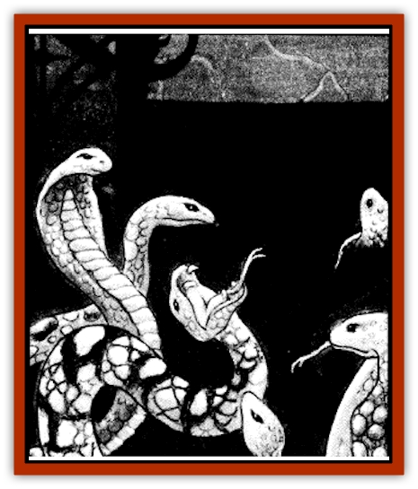

# Shadow Asp

| Statistic | **Shadow Asp** |
| --- | --- |
| **Activity Cycle:** | Any |
| **Alignment:** | Neutral |
| **Armor Class:** | 2 |
| **Climate/Terrain:** | Har'Akir |
| **Damage/Attack:** | 1d2 |
| **Diet:** | None |
| **Frequency:** | Rare |
| **Hit Dice:** | ½ (1-4 hit points) |
| **Intelligence:** | Animal (1) |
| **Magic Resistance:** | Nil |
| **Morale:** | Fearless (19-20) |
| **Movement:** | 0 |
| **No. Appearing:** | 5d6 |
| **No. of Attacks:** | 1 |
| **Organization:** | Special |
| **Size:** | T (6-12&rdquo; long) |
| **Special Attacks:** | Shadow poison, surprise |
| **Special Defenses:** | Piercing attacks do half damage |
| **THAC0:** | 20 |
| **Treasure:** | A |
| **XP Value:** | 65 |

In all of Ravenloft, no place reveres the tombs of its dead more highly than Har'Akir. Recently, the priests of this desert realm have found deadly wardens for the tombs of their pharaohs: shadow asps.

Shadow asps appear to be slender [[Snake|snakes]] composed of pure darkness. They seem to have no physical form, but look as if they are nothing more than an extension of the shadows that give them their name. Although these creatures are barely intelligent, they instinctively lash out at those who intrude upon the tombs they live in.

Shadow asps make no sound, not even a hiss or slithering, as they move.

**Combat:** Shadow asps are very hard to spot as they slide silently through the darkness of a tomb or temple. Because they make no sound and are utterly black, they often surprise their victims when they strike. To reflect this, shadow asps impose a -5 penalty on their victim's surprise roll. It is important to note that shadow asps do not radiate body heat and are thus well hidden from all infravision.

In combat, a shadow asp strikes with its needlelike fangs, just as normal asps do. Although the bite inflicts only minor injuries (1-2 points of damage), it injects an insidious toxin. Those who are bitten must save vs. poison. Failure to save indicates that the victim has been injected with the essence of darkness and gradually begins to become a [[Shadow|shadow]]. This transformation takes five rounds, during which time the character gradually grows darker and darker. At the end of the fifth round, the character must make a system shock roll. Failure indicates that the victim breaks up in the process of becoming a shadow and is lost, with no chance of resurrection. Success means that the victim has become a shadow. Shadows created by this process are bound to the area guarded by the shadow asps and join them as wardens of that place. At any time during the transformation, but not afterwards, a *remove curse* or *dispel magic* spell can be cast on the victim to halt the change.

Those who strike at a shadow asp with weapons will find it difficult to harm. Although it can be injured by any normal weapon, the snake's agility makes it very hard to hit (hence its low Armor Class). A *hold monster* spell used to immobilize one would make it AC 8. Although bludgeoning and slashing weapons inflict full damage to shadow asps, piercing attacks (such as from arrows, spears, etc.) do only half damage.

Any single shadow asp can be instantly slain by the casting of a *light* or *continual light* spell that has been directly targeted on the creature. No saving throw is allowed. Illuminating spells used to destroy shadow asps provide no additional light for vision, being cancelled out at once.

Shadow asps are not undead and cannot be turned by priests or harmed by holy water. They are summoned creatures and can be held back by spells like *protection from evil*.

**Habitat/Society:** Shadow asps are magical creatures summoned by the priests of certain gods worshiped in Har'Akir (Osiris, Set, or Nephythys). The ceremony by which these creatures are called into existence is a tightly guarded secret.

Shadow asps are very territorial. They slither about the place where they were summoned and maintain a constant vigil against the intrusions of potential grave robbers or defilers.

Because they turn their victims into shadows, there is a 40% chance of finding 1d6 shadows with any group of shadow asps.

**Ecology:** Shadow asps are not a part of the physical world. Because of their extradimensional origins, they play no part in the grand scheme of nature apart from bringing death to their victims and creating undead shadows.

---
## Discovery & Documentation

**Source Publication:** Ravenloft Appendix III (1991)
**Campaign Setting:** Ravenloft
**Author(s):** Kirk Botulla

### Other Creatures Found in This Source Book
   * [[Akikage|Akikage]]
   * [[Animator_Common|Animator, Common]]
   * [[Animator_Greater|Animator, Greater]]
   * [[Animator_Minor|Animator, Minor]]
   * [[Animator_General_Information|Animator, General Information]]
   * [[Bakhna_Rakhna|Bakhna Rakhna]]
   * [[Baobhan_Sith|Baobhan Sith]]
   * [[Beetle_Scarab|Beetle, Scarab]]
   * [[Boneless|Boneless]]
   * [[Boowray|Boowray]]
   * [[Bruja|Bruja]]
   * [[Carrionette|Carrionette]]
   * [[Carrion_Stalker|Carrion Stalker]]
   * [[Cat_Midnight|Cat, Midnight]]
   * [[Cat_Skeletal|Cat, Skeletal]]
   * [[Cloaker_Resplendent|Cloaker, Resplendent]]
   * [[Cloaker_Shadow|Cloaker, Shadow]]
   * [[Cloaker_Undead|Cloaker, Undead]]
   * [[Corpse_Candle|Corpse Candle]]
   * [[Death's_Head_Tree|Death's Head Tree]]
   * [[Doppelganger_Ravenloft|Doppelganger (Ravenloft)]]
   * [[Familiar_Pseudo-|Familiar, Pseudo-]]
   * [[Familiar_Undead|Familiar, Undead]]
   * [[Feathered_Serpent|Feathered Serpent]]
   * [[Fenhound|Fenhound]]
   * [[Figurine_Ceramic|Figurine, Ceramic]]
   * [[Figurine_Crystal|Figurine, Crystal]]
   * [[Figurine_Ivory|Figurine, Ivory]]
   * [[Figurine_Obsidian|Figurine, Obsidian]]
   * [[Figurine_Porcelain|Figurine, Porcelain]]
   * [[Figurine_General_Information|Figurine, General Information]]
   * [[Fleas_of_Madness|Fleas of Madness]]
   * [[Furies|Furies]]
   * [[Geist|Geist]]
   * [[Ghost_Animal|Ghost, Animal]]
   * [[Golem_Flesh_Ravenloft|Golem, Flesh (Ravenloft)]]
   * [[Golem_Mist_Ravenloft|Golem, Mist (Ravenloft)]]
   * [[Golem_Wax_Ravenloft|Golem, Wax (Ravenloft)]]
   * [[Gremishka|Gremishka]]
   * [[Hag_Spectral|Hag, Spectral]]
   * [[Head_Hunter|Head Hunter]]
   * [[Hearth_Fiend|Hearth Fiend]]
   * [[Hebi-No-Onna|Hebi-No-Onna]]
   * [[Hound_Phantom|Hound, Phantom]]
   * [[Hound_Skeletal|Hound, Skeletal]]
   * [[Imp_Wishing|Imp, Wishing]]
   * [[Ivy_Crawling|Ivy, Crawling]]
   * [[Jack_Frost|Jack Frost]]
   * [[Jolly_Roger|Jolly Roger]]
   * [[Kizoku|Kizoku]]
   * [[Lashweed|Lashweed]]
   * [[Leech_Magical|Leech, Magical]]
   * [[Leech_Psionic|Leech, Psionic]]
   * [[Lich_Defiler|Lich, Defiler]]
   * [[Lich_Drow|Lich, Drow]]
   * [[Lich_Elemental|Lich, Elemental]]
   * [[Lich_Psionic|Lich, Psionic]]
   * [[Living_Tattoo|Living Tattoo]]
   * [[Lycanthrope_Loup-garou|Lycanthrope, Loup-garou]]
   * [[Lycanthrope_Werejackal|Lycanthrope, Werejackal]]
   * [[Lycanthrope_Werejaguar_Ravenloft|Lycanthrope, Werejaguar (Ravenloft)]]
   * [[Lycanthrope_Wereleopard|Lycanthrope, Wereleopard]]
   * [[Lycanthrope_Wereray|Lycanthrope, Wereray]]
   * [[Mist_Ferryman|Mist Ferryman]]
   * [[Moor_Man|Moor Man]]
   * [[Obedient|Obedient]]
   * [[Odem|Odem]]
   * [[Paka|Paka]]
   * [[Plant_Blood_Rose|Plant, Blood Rose]]
   * [[Plant_Fearweed|Plant, Fearweed]]
   * [[Radiant_Spirit|Radiant Spirit]]
   * [[Recluse|Recluse]]
   * [[Remnant_Aquatic|Remnant, Aquatic]]
   * [[Rushlight|Rushlight]]
   * [[Sea_Spawn_Master|Sea Spawn, Master]]
   * [[Sea_Spawn_Minion|Sea Spawn, Minion]]
   * [[Shattered_Brethren|Shattered Brethren]]
   * [[Skeleton_Archer|Skeleton, Archer]]
   * [[Skeleton_Insectoid|Skeleton, Insectoid]]
   * [[Skin_Thief|Skin Thief]]
   * [[Spirit_Psionic|Spirit, Psionic]]
   * [[Strahd_Skeleton|Strahd Skeleton]]
   * [[Strahd_Zombie|Strahd Zombie]]
   * [[Unicorn_Shadow|Unicorn, Shadow]]
   * [[Vampire_Drow|Vampire, Drow]]
   * [[Vampire_Nosferatu|Vampire, Nosferatu]]
   * [[Vampire_Oriental|Vampire, Oriental]]
   * [[Virus_General_Information|Virus, General Information]]
   * [[Virus_I|Virus I]]
   * [[Virus_II|Virus II]]
   * [[Virus_III|Virus III]]
   * [[Vorlog|Vorlog]]
   * [[Will_O'Dawn|Will O'Dawn]]
   * [[Will_O'Deep|Will O'Deep]]
   * [[Will_O'Mist|Will O'Mist]]
   * [[Will_O'Sea|Will O'Sea]]
   * [[Zombie_Cannibal|Zombie, Cannibal]]
   * [[Zombie_Desert|Zombie, Desert]]
   * [[Zombie_Wolf|Zombie Wolf]]
   * [[Zombie_Fog|Zombie Fog]]
