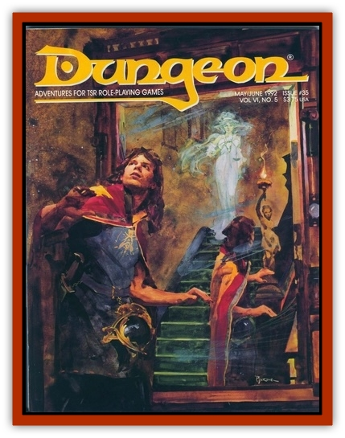

# Shadow - Ether

| Statistic | **Shadow, Ether** |
| --- | --- |
| **Activity Cycle:** | Night or darkness |
| **Alignment:** | Chaotic evil |
| **Armor Class:** | 5 |
| **Climate/Terrain:** | Any ruins or subterranean chambers |
| **Damage/Attack:** | 2-7 + special |
| **Diet:** | Living beings |
| **Frequency:** | Very rare |
| **Hit Dice:** | 8+8 |
| **Intelligence:** | High (13-14) |
| **Magic Resistance:** | Nil |
| **Morale:** | Special |
| **Movement:** | Fly 12 (A) |
| **No. Appearing:** | 1 |
| **No. of Attacks:** | 1 |
| **Organization:** | Solitary |
| **Size:** | M (6' tall) |
| **Special Attacks:** | Strength drain |
| **Special Defenses:** | +1 or better weapon to hit, spell immunities |
| **THAC0:** | 11 |
| **Treasure:** | F |
| **XP Value:** | 3,000 |

Ether [[Shadow|shadows]], also known as greater shadows, are the progenitors of the more common shadows of monster fame. Like shadows, their chilling touch drains strength at the increased rate of two points per hit. Lost strength returns after 3-18 turns. A human or demihuman drained to zero strength or hit points by an ether shadow becomes a normal shadow.

Ether shadows may travel freely through the Ethereal plane to manifest themselves as apparitions on any bordering plane. They have no power to materialize on those planes, so can neither physically affect nor be affected by anything on them. The one thing they can do is insinuate themselves into and control the dreams of any sleeper they discover - a power that lends credence to the notion that dreams are an other-planar experience. While an ether shadow may cause no actual harm to a dreamer, it can use this power to communicate freely, or more likely to plague the dreamer with nightmares of the worst caliber.

In order to combat an ether shadow, it's necessary to follow it to the Ethereal plane or to the plane on which it was originally created. On either plane, it is always partially materialized and may be affected by magical weapons and by all but a few spells. (Ether shadows are immune to *sleep*, *charm*, and *hold* spells, and all cold-based attacks.)

An ether shadow can change its body at will into any shape it desires, though that shape will always be made of the same shadow-stuff. It can also vary the exact shade of its substance and so may appear as the three-dimensional creature it is rather than a patch of darkness like ordinary shadows. Regardless, the ether shadow is always black or some shade of gray. If it chooses to remain its normal, featureless black, it is 90% undetectable in any light less bright than a *continual light* spell.

Ether shadows are created in a dark ritual that divides a creature's essence into three parts, causing it to exist simultaneously on the Ethereal plane, the Negative Material plane, and the Prime Material plane on which the ritual was performed.

---
## Discovery & Documentation

**Source Publication:** Dungeon #35 (1992)
**Campaign Setting:** Dungeon Magazine
**Author(s):**
