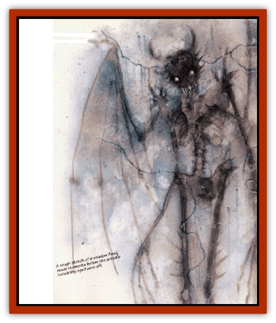

# Shadow Fiend

| Statistic | **Shadow Fiend** |
| --- | --- |
| **Activity Cycle:** | Any |
| **Alignment:** | Chaotic evil |
| **Armor Class:** | 9, 5, or 1 |
| **Climate/Terrain:** | Lower Planes |
| **Damage/Attack:** | 1d6/1d6/1d8 |
| **Diet:** | Special |
| **Frequency:** | Very rare |
| **Hit Dice:** | 7+3 |
| **Intelligence:** | Very (11-12) |
| **Magic Resistance:** | See below |
| **Morale:** | Champion (15-16) |
| **Movement:** | 12 (see below) |
| **No. Appearing:** | 1 |
| **No. of Attacks:** | 3 |
| **Organization:** | Solitary |
| **Size:** | M (6' tall) |
| **Special Attacks:** | See below |
| **Special Defenses:** | See below |
| **THAC0:** | 13 |
| **Treasure:** | Nil |
| **XP Value:** | 2,000 |

The shadow fiend looks like a tall, slender humanoid with small batlike wings and a body composed of darkness. Both the long fingers and slender toes of the creature end in terrible claws that inflict gaping wounds on enemies.

Shadow fiends have no known language, although it is said that they can communicate with other creatures from the Lower Planes. No mortal has ever confirmed this, however.

**Combat:** Like [[Shadow|shadows]], which many believe (wrongly) are related creatures, shadow fiends are 90% undetectable in dim light or shadows. When they attack those who have not spotted them, they always gain surprise. Each round the monster can strike with two claws (1d6 damage each) and bite (1d8 damage.)

Whenever the shadow fiend gains surprise, it springs onto its victim. Because of the small wings on its back, it can leap up to 30' and strike with four claws (each doing 1d6 damage). When it leaps, it cannot use its bite attack.

In combat, the power of the creature depends on the lighting in the area.

*Bright Lighting:* In brightly lit areas (open sunlight or a *continual light* spell), the shadow fiend is greatly weakened; its Armor Class is 9 and all attacks that strike it inflict double damage. Because of this, shadow fiends flee from opponents in bright light.

*Dimmer Lighting* (torch, lantern, or a *light* spell): The shadow fiend is somewhat better off. Here, it has Armor Class 5, takes normal damage from attacks, and gains +1 on its attack rolls.

*Darkness* (anything up to candlelight or moonlight): The creature is at its deadliest. It gains +2 on all attack rolls, it has Armor Class 1, and all damage done to it is halved.

Regardless of lighting, the shadow fiend is immune to damage from fire, cold, and electricity. A *light* spell cast directly upon the creature inflicts 1d6 points per level of the caster, although this damage may he reduced (or enhanced) by the lighting in the area.

Once per day the shadow fiend can cast a *darkness, 15' radius* spell or subject all persons within a 30' area to a *fear* spell. Once per week, it can cast a *magic jar* spell at a single target, provided that it has a suitable receptacle for the victim at hand. If the victim of the *magic jar* attack saves vs. spells, the shadow fiend is stunned and cannot act for 1d3 rounds.

Shadow fiends can he turned by clerics as "special" creatures on the undead turning chart.

**Habitat/Society:** Shadow fiends live in small villages throughout the Lower Planes. They have a high sense of the aesthetic, and their villages are noted for the sculptures of pure darkness. (Shadow fiends cannot use the ability to sculpt darkness outside of the Lower Planes, and the time and concentration required to do so prevents its use in combat.) Many villages are built around a gate to some other plane. These gates are tiny (only a few feet tall) and well hidden.

If trapped on a foreign plane, shadow fiends seek and dwell with ancient [[Dragon_Chromatic_Black|black dragons]]. Some speculate that the shadow fiends have some biological tie, or perhaps even social ties, with these evil [[Dragon_General_Information|dragons]]. Certain researchers of magic would find confirmation of this rumor valuable.

**Ecology:** Shadow fiends are a race of traders in the Lower Planes. They deal in minds that they have captured in dark gems. An imprisoned intellect of great power and lore, such as a wizard with a high reputation, can interest many buyers and provoke intense bidding wars. The shadow fiends trade the captured intellects for raw evil magic, which they shape by unknown processes into more shadow fiends.

Shadow fiends seek powerful minds to imprison and sell, but sometimes they inadvertently steal the intellects of braggarts and know-alls. These little minds, prone to brag of their status, thereby attract a shadow fiend's notice. Soon the victims find themselves on a trading block in the Lower Planes.

Some say the powers of the Lower Planes have close ties to the shadow fiends, and that the powers can command the fiends to do their bidding at any time.

---
## Discovery & Documentation

**Source Publication:** MC10 Ravenloft Appendix I (1989)
**Campaign Setting:** Planescape
**Author(s):** William W. Connors

### Other Creatures Found in This Source Book
   * [[Bastellus|Bastellus]]
   * [[Bat_Ravenloft|Bat (Ravenloft)]]
   * [[Bowlyn|Bowlyn]]
   * [[Broken_One|Broken One]]
   * [[Bussengeist|Bussengeist]]
   * [[Darkling|Darkling]]
   * [[Doom_Guard|Doom Guard]]
   * [[Doppelganger_Plant|Doppelganger Plant]]
   * [[Elemental_Ravenloft|Elemental (Ravenloft)]]
   * [[Ermordenung|Ermordenung]]
   * [[Ghoul_Lord|Ghoul Lord]]
   * [[Goblyn|Goblyn]]
   * [[Golem_III|Golem III]]
   * [[Golem_IV|Golem IV]]
   * [[Golem_Ravenloft|Golem (Ravenloft)]]
   * [[Grim_Reaper|Grim Reaper]]
   * [[Human_Abber_Nomad|Human, Abber Nomad]]
   * [[Human_Ravenloft|Human (Ravenloft)]]
   * [[Imp_Assassin|Imp, Assassin]]
   * [[Impersonator|Impersonator]]
   * [[Lycanthrope_Werebat|Lycanthrope, Werebat]]
   * [[Lycanthrope_Wereraven|Lycanthrope, Wereraven]]
   * [[Mist_Horror|Mist Horror]]
   * [[Mummy_Greater|Mummy, Greater]]
   * [[Quevari|Quevari]]
   * [[Quickwood|Quickwood]]
   * [[Ravenkin|Ravenkin]]
   * [[Reaver|Reaver]]
   * [[Scarecrow_Ravenloft|Scarecrow (Ravenloft)]]
   * [[Skeleton_Giant|Skeleton, Giant]]
   * [[Strahd's_Skeletal_Steed|Strahd's Skeletal Steed]]
   * [[Treant_Evil|Treant, Evil]]
   * [[Treant_Undead|Treant, Undead]]
   * [[Valpurgeist|Valpurgeist]]
   * [[Vampire_Dwarf|Vampire, Dwarf]]
   * [[Vampire_Elf|Vampire, Elf]]
   * [[Vampire_Gnome|Vampire, Gnome]]
   * [[Vampire_Halfling|Vampire, Halfling]]
   * [[Vampire_General_Information|Vampire, General Information]]
   * [[Vampire_Kender|Vampire, Kender]]
   * [[Vampyre|Vampyre]]
   * [[Widow_Red|Widow, Red]]
   * [[Wolfwere_Greater|Wolfwere, Greater]]
   * [[Zombie_Lord|Zombie Lord]]
