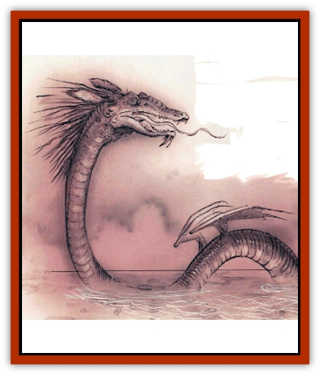

# Shadowdrake

| Statistic | **Shadowdrake** |
| --- | --- |
| **Activity Cycle:** | Night |
| **Alignment:** | Neutral evil |
| **Armor Class:** | 1 (base) |
| **Climate/Terrain:** | Any Lower Plane |
| **Damage/Attack:** | 2d4/2d4/3d12 |
| **Diet:** | Carnivore |
| **Frequency:** | Very rare |
| **Hit Dice:** | 9 (base) |
| **Intelligence:** | High (13-14) |
| **Magic Resistance:** | 10% (base) |
| **Morale:** | Elite (13-14) |
| **Movement:** | 9, Sw 12, Br 1 |
| **No. Appearing:** | 1 (1-2) |
| **No. of Attacks:** | 3 + special |
| **Organization:** | Solitary |
| **Size:** | H (25' base) |
| **Special Attacks:** | Breath, spell-like powers, cause disease |
| **Special Defenses:** | Nil |
| **THAC0:** | 11 (base) |
| **Treasure:** | Special |
| **XP Value:** | See below |

There are a few things in the Lower Planes that even the fiends're afraid of, and the shadowdrake is one of 'em. Also known as death drakes, Styx dragons, or darkwyrms, shadowdrakes are relatives of dragonkind who inhabit the upper reaches of the fiendish planes. They commonly prey on the weaker ranks of fiends around them, but they'll devour travelers or careless high-up fiends just as quick. Unlike many true [[Dragon_General_Information|dragons]], shadowdrakes've got no interest in conversation, servants, or plots; every sod they meet's just another meal waiting to be eaten.

Shadowdrakes have long, serpentine bodies covered with slimy scales ranging from dark brown to rusty red. Their eyes glow with a feral yellow light, and mismatched fangs jut from their terrible jaws. The wings of a shadowdrake are vestigial, and can't support the creature in flight. Instead, the drake's wings are used with its powerful tail for swimming. Shadowdrakes are one of the few creatures that can abide the touch of the polluted Styx, and they frequently attack sods on or near the river. On land, the shadowdrake's forced to slither snakewise since its tiny legs can't support its weight.

The distinguishing feature of a shadowdrake is its twin tail, which forks about halfway down its length. Long, razorsharp blades of bone line the tips of each limb, and the shadowdrake can slash and grapple with with its tails as well as other dragon-kin can attack with their claws.

**Combat:** Shadowdrakes are extremely aggressive, territorial, and predatory. They're often overconfident, and they'll take on anything smaller than a [[Baatezu_Greater_Pit_Fiend|pit fiend]] or [[Tanar'ri_True_Balor|balor]] that comes anywhere near their lair or hunting ground. The shadowdrake attacks with a bite and two lashes from its tail; it's long and flexible enough to use its forked tail against opponents in front of itself. The shadowdrake prefers to attack with a sudden ruh from a dismal burrow or from the filthy waters of the Styx; if it can do this, it imposes a -2 penalty on its enemies' surprise checks.

Any sod injured by the drake's bite or tail leash is 50% likely to contract a gangrenous disease, even if she survives her wounds. This disease sets in within 3 to 24 hours, and renders the victim completely helpless with fever and delirium. If untreaed, the rot reaches the victim's vital organs and kills her within 12 to 48 (d4x12) hours after onset. The disease can be cured by any spell or item that can *cure disease* or *neutralize poison*, but a character with the healing proficiency suffers a -4 penalty to his proficiency check when treating the disease, and any *cure wounds* spell heals only half the normal points of damage if the gangrene is active.

**Breath Weapon/Special Abilities:** The shadowdrake's hesistant to use its breath weapon, since it usually deprives the beast of its intended meal. The drake expels a gout of sticky, corrosive spittle 30 feet long and 3 feet wide. Normally, it can strike only 2 or 3 targets at most, and then only if they're standing close together. If the victim makes her saving throw, she takes half the listed damage. If she fails, the corrosive goo causes full damage in the first round, half damage in the next round, and one-quarter damage in the third round. Leather, bone, or wood armor's destroyed by one round of contact; metal chain or scale's destroyed in two rounds; and metal plate is ruined in three rounds. (Magical armor or equipment gains an item saving roll versus acid to avoid the effect.

A shadowdrake doesn't normally cast spells, but it does possess spell-like powers, cumulative with age, as shown below:

| Age | Abilities |
| --- | --- |
| Hatchling | Immune to all poison or disease |
| Young | corrupt water by contact |
| Adult | darkness 15' radius 2/day |
| Old | hold monster 1/day |
| Wyrm | summon aquatic monsters 1/day |

**Habitat/Society:** Shadowdrakes are most often found along the banks of rivers or in the swamps and bogs of the Lower Planes, including the Styx in all of its wanderings. They often dig extensive burrows of dank, slimy tunnels. Some portions of their lair can be reached only a long, black swim through a water-filled siphon. Shadowdrakes prefer to sleep in their lairs by day and hunt by night, sometimes traveling quite a distance from their lair before returning.

Shadowdrakes are territorial and don't get along well with each other. The only time two of these creatures'll be seen together is during a rare mating season. Even then, the drakes don't remain together long or cooperate in hunting or the defense of their young or their lair.

It's almost impossible to deal with a shadowdrake, because shadowdrakes don't listen to anything a weaker creature has to say, and they avoid contact with more powerful monsters. However, they're not stupid, and a drake'll attempt trickery or negotiation if physicyal methods clearly aren't going to work. Shadowdrakes are cunning and deceitful; they love to twist words or make false promises when they see the chance.

**Ecology:** The bulk of a shadowdrake's diet comprises the most wretched types of fiends, such as [[Baatezu_Lemure|lemures]], [[Tanar'ri_Least_Dretch|dretches]], [[Baatezu_Least_Nupperibo|nupperibos]], or [[Tanar'ri_Least_Manes|manes]]. Powerful shadowdrakes've been known to take [[Yugoloth_Lesser_Hydroloth|hydroloths]] or [[Yugoloth_Lesser_Marraenoloth|marraenoloths]], and it's not at all uncommon for any solitary traveler to attract the attention of a shadowdrake.

| Age | Body | Tail | AC | Breath | MR | Treasure | XP |
| --- | --- | --- | --- | --- | --- | --- | --- |
| 1 Hatchling | 9-17 | 10-16 | 4 | 2d3+1 | 10% | Nil | 3,000 |
| 2 Very young | 18-30 | 17-28 | 3 | 3d4+2 | 15% | P,R | 5,000 |
| 3 Young | 31-40 | 29-38 | 2 | 4d4+3 | 20% | R,W | 8,000 |
| 4 Juvenile | 41-49 | 39-47 | 1 | 5d4+4 | 25% | A,W | 10,000 |
| 5 Young adult | 50-58 | 48-56 | 0 | 6d4+5 | 30% | F,W | 11,000 |
| 6 Adult | 59-67 | 57-66 | -1 | 7d4+6 | 35% | H,W | 12,000 |
| 7 Mature adult | 68-75 | 67-74 | -2 | 8d4+7 | 40% | H,W | 13,000 |
| 8 Old | 75-81 | 75-80 | -3 | 9d4+8 | 45% | H,W | 14,000 |
| 9 Very old | 82-86 | 81-85 | -4 | 10d4+9 | 50% | H,V,W | 15,000 |
| 10 Venerable | 87-90 | 86-91 | -5 | 11d4+10 | 55% | H,V,W | 16,000 |
| 11 Wyrm | 91-94 | 92-95 | -6 | 12d4+11 | 60% | Hx2,V | 17,000 |
| 12 Great Wyrm | 95-100 | 96-99 | -7 | 14d4+12 | 70% | Hx3,V | 18,000 |

---
## Discovery & Documentation

**Source Publication:** Planescape II (1996)
**Campaign Setting:** Planescape
**Author(s):** Rich Baker, Karen S. Boomgarden

### Other Creatures Found in This Source Book
   * [[Aasimar|Aasimar]]
   * [[Abrian|Abrian]]
   * [[Arcane|Arcane]]
   * [[Balaena|Balaena]]
   * [[Beholder-kin_Observer|Beholder-kin, Observer]]
   * [[Bloodthorn|Bloodthorn]]
   * [[Bonespear|Bonespear]]
   * [[Darkweaver|Darkweaver]]
   * [[Demarax|Demarax]]
   * [[Dhour|Dhour]]
   * [[Eater_of_Knowledge|Eater of Knowledge]]
   * [[Eladrin_Greater_Firre|Eladrin, Greater, Firre]]
   * [[Eladrin_Greater_Ghaele|Eladrin, Greater, Ghaele]]
   * [[Eladrin_Greater_Tulani|Eladrin, Greater, Tulani]]
   * [[Eladrin_Lesser_Bralani|Eladrin, Lesser, Bralani]]
   * [[Eladrin_Lesser_Coure|Eladrin, Lesser, Coure]]
   * [[Eladrin_Lesser_Noviere|Eladrin, Lesser, Noviere]]
   * [[Eladrin_Lesser_Shiere|Eladrin, Lesser, Shiere]]
   * [[Fhorge|Fhorge]]
   * [[Ghostlight|Ghostlight]]
   * [[Guardinal_Avoral|Guardinal, Avoral]]
   * [[Guardinal_Cervidal|Guardinal, Cervidal]]
   * [[Guardinal_General_Information|Guardinal, General Information]]
   * [[Guardinal_Equinal|Guardinal, Equinal]]
   * [[Guardinal_Leonal|Guardinal, Leonal]]
   * [[Guardinal_Lupinal|Guardinal, Lupinal]]
   * [[Guardinal_Ursinal|Guardinal, Ursinal]]
   * [[Hollyphant|Hollyphant]]
   * [[Incantifer|Incantifer]]
   * [[Ironmaw|Ironmaw]]
   * [[Keeper|Keeper]]
   * [[Khaasta|Khaasta]]
   * [[Leomarh|Leomarh]]
   * [[Monster_of_Legend|Monster of Legend]]
   * [[Mortai|Mortai]]
   * [[Noctral|Noctral]]
   * [[Quill|Quill]]
   * [[Razorvine|Razorvine]]
   * [[Reave|Reave]]
   * [[Retriever|Retriever]]
   * [[Rilmani_Abiorach|Rilmani, Abiorach]]
   * [[Rilmani_General_Information|Rilmani, General Information]]
   * [[Rilmani_Argenach|Rilmani, Argenach]]
   * [[Rilmani_Aurumach|Rilmani, Aurumach]]
   * [[Rilmani_Cuprilach|Rilmani, Cuprilach]]
   * [[Rilmani_Ferrumach|Rilmani, Ferrumach]]
   * [[Rilmani_Plumach|Rilmani, Plumach]]
   * [[Spellhaunt|Spellhaunt]]
   * [[Spider_Hook|Spider, Hook]]
   * [[Sunfly|Sunfly]]
   * [[Sword_Spirit|Sword Spirit]]
   * [[Tanar'ri_Lesser_Bulezau|Tanar'ri, Lesser, Bulezau]]
   * [[Tanar'ri_Lesser_Maurezhi|Tanar'ri, Lesser, Maurezhi]]
   * [[Tanar'ri_Lesser_Yochlol|Tanar'ri, Lesser, Yochlol]]
   * [[Tanar'ri_General_Information|Tanar'ri, General Information]]
   * [[Tanar'ri_True_Alkilith|Tanar'ri, True, Alkilith]]
   * [[Terlen|Terlen]]
   * [[Tso|Tso]]
   * [[T'uen-rin|T'uen-rin]]
   * [[Vaporighu|Vaporighu]]
   * [[Vorr|Vorr]]
   * [[Wastrel|Wastrel]]
   * [[Wraithworm|Wraithworm]]
   * [[Yugoloth_Lesser_Canoloth|Yugoloth, Lesser, Canoloth]]
   * [[Zoveri|Zoveri]]
