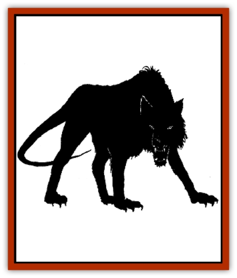

# Shadowhound

| Statistic | **Shadowhound** |
| --- | --- |
| **Activity Cycle:** | Any |
| **Alignment:** | Chaotic evil |
| **Armor Class:** | 3 |
| **Climate/Terrain:** | Ice Spire/Abyss |
| **Damage/Attack:** | 1d8 |
| **Diet:** | Special |
| **Frequency:** | Very rare |
| **Hit Dice:** | 3 |
| **Intelligence:** | Low (5-7) |
| **Magic Resistance:** | 5% |
| **Morale:** | Elite (14) |
| **Movement:** | 16 |
| **No. Appearing:** | 2d4 |
| **No. of Attacks:** | 1 |
| **Organization:** | Pack |
| **Size:** | M |
| **Special Attacks:** | Fear |
| **Special Defenses:** | +1 or better weapon to hit |
| **THAC0:** | 17 |
| **Treasure:** | Nil |
| **XP Value:** | 270 |

Like [[Hell_Hound|hell hounds]], shadowhounds are fierce [[Dog|canines]] from another plane of existence sent to the Prime Material Plane in the service of evil beings. The difference between the two breeds is that hell hounds are native to Baator and serve the [[Baatezu_General_Information|baatezu]], while shadowhounds are native to the Abyss and serve the [[Tanar'ri_General_Information|tanar'ri]].

Shadowhounds resemble large, black dogs with long, whipping tails and razor sharp teeth. No individual details are visible on their bodies; they seem to exist only as murky silhouettes. As they move, the hideous canines seem to glide over the terrain without making the slightest sound (-5 to opponents' surprise rolls). In fact, even when agitated or injured, they are always completely silent.

**Combat:** Like hell hounds, shadowhounds are clever hunters that like to operate in large packs. Totally incorporeal to the touch, the dogs are incapable of physically biting their targets, but anyone who comes into contact with their shadowy form feels an icy chill and suffers 1d8 points of damage.

The dogs' most vicious attack form, however, is their natural ability to induce *fear* in everyone within 30 feet except their master (normal saving throws apply). Typically, the hounds invoke this ability to send their target running and screaming, then bolt after him and take him on the run.

Shadowhounds enjoy a number of special defenses: They are immune to *fear* themselves, take only half damage from electricity and fire, and aren't susceptible to any sort of *charm monster* spell or ability.

**Habitat/Society:** Shadowhounds are native to the Abyss, where they like to roam cold, subterranean passageways looking for easy prey. Many powerful tanar'ri lords keep huge kennels of shadowhounds in their palaces and dispatch the beasts to their human followers on the Prime Material Plane. Baphomet has sent a large pack of shadowhounds to the ogres of the Ice Spires. [[Abyssal_Lord|Graz'zt]] keeps a kennel of them in his palace for hunts in Zrintor, the Viper Forest.

Incorporeal, shadowhounds are not capable of eating actual meat. Instead, they feed off the fear of their victims by chilling them with their shadowy touch.

Approximately 15% of all Shadowhounds encountered in the Abyss will be accompanied by 1d4 young. Born in litters of 2d4 with the weakest half of the litter always immediately consumed by the stronger half, shadowhound young have 1 Hit Die and inflict only 1d4 points of damage per touch, but grow to full size in less than a year.

**Ecology:** In the Abyss, shadowhounds serve to quickly remove trespassers from undesirable areas (such as the approaches to a tanar'ri lord's palace). Because of their ferocious nature, unparalleled loyalty, and ability to easily surprise intruders, they make excellent watch dogs.

Shadowhounds are remarkably easy to domesticate. Generally, they tend to naturally latch on to a master (always of chaotic evil alignment) from whom they will gladly accept any reasonable orders until one of three conditions is met: they die, their master dies, or they stumble across a more powerful or more evil patron (at which point, they switch alliances).

---
## Discovery & Documentation

**Source Publication:** FOR7 Giantcraft (1993)
**Campaign Setting:** Forgotten Realms
**Author(s):** Ray Winninger

### Other Creatures Found in This Source Book
   * [[Krotter|Krotter]]
   * [[Ogre_Ice_Spire|Ogre, Ice Spire]]
