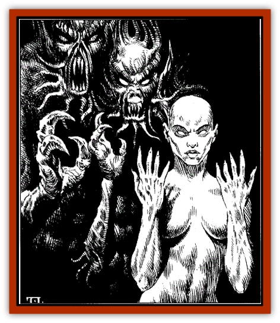

# Shadowmasters - the Malaugrym

| Statistic | **Shadowmasters (the Malaugrym)** |
| --- | --- |
| **Activity Cycle:** | Any |
| **Alignment:** | Chaotic evil |
| **Armor Class:** | 3 |
| **Climate/Terrain:** | Any (Demiplane of Shadow) |
| **Damage/Attack:** | By weapon or spell |
| **Diet:** | Omnivore |
| **Frequency:** | Very Rare |
| **Hit Dice:** | 5+5 |
| **Intelligence:** | Average to Genius |
| **Magic Resistance:** | 25% |
| **Morale:** | Champion (15) |
| **Movement:** | 12 |
| **No. Appearing:** | 2d6 |
| **No. of Attacks:** | 1 |
| **Organization:** | Clan |
| **Size:** | M |
| **Special Attacks:** | Surprise |
| **Special Defenses:** | Immune to poison, silver/magical weapons needed to hit |
| **THAC0:** | 15 |
| **Treasure:** | R (personal), H (lair) |
| **XP Value:** | 2,000 |

The Shadowmasters, also known as the Malaugrym, are a clan of shape-shifting humans who make their home in the Castle of Shadows on the Demiplane of Shadow. Further, they travel to Toril whenever they can. There they seek to use their shapechanging powers to dominate and rule all the Realms.

These beings have total control of their bodies and can change or "morph" portions of body, and can appear literally as any living thing-perhaps as a horrible nonhumanoid creature. The only nonmagical way to tell a malaugrym is by the golden light that shines in its eyes. DMs should make Wisdom or appropriate proficiency checks with penalties suitable to the circumstances.

**Combat:** Malaugrym are strong, sturdy creatures, their shape-shifting powers granting them amazing fortitude. They regenerate one hit point per round after being damaged. They are also immune to poison and only silver or magical weapons harm them. (Silver weapons do maximum damage with any successful hit and they do not *regenerate* wounds inflicted by silver weapons.) One reason human malaugrym have such high HD and AC ratings is that they tend to constantly shift their shapes as combat evolves, even to the point of moving their internal organs out of their normal positions-making it extremely difficult to strike a killing blow against them.

They can fight with weapons normally-some are powerful members of PC classes (unlimited advancement as humans; none but the leader of the clan can cast gate or other interplanar magic)-or can fight using tentacles or pseudopods. Malaugrym receive a number of attacks in this manner as per their class and level, and a typical spiked tentacle or pseudopod does damage as a long sword (1d8/1d12).

**Habitat/Society:** The malaugrym are led by one called the Shadowmaster. This malaugrym is usually the most powerful mage in the clan. Intrigue and one-upsmanship are realities for the malaugrym as each jockeys for a better position within the clan and to curry favor with the Shadowmaster. Malaugrym are so distrustful that they often constantly shift their shape in order to make themselves more difficult targets.

It seems that only the Shadowmaster is capable of opening gates to the Prime Material Plane and Toril itself. Many eagerly await their chance to visit the Realms and wreak havoc, seeking to cripple or eliminate powerful, good-aligned forces, paving the way for an eventual invasion. The whole clan of malaugrym seldom exceeds 100 individuals, and the majority of them wish to conquer Faerûn.

More than just long-lived, the malaugrym seem effectively immortal unless they perish in combat. They do seem to suffer effects of aging, as the Shadowmaster is periodically deposed by a younger, stronger malaugrym. Perhaps the stresses of leadership or of working planar magic has some degrading effect.

The malaugrym are incapable of having offspring themselves. Either gender must engage a normal human in order to ensure the next generation of malaugrym. These babes are usually stolen by their malaugrym parent soon after birth.

The shape-shifting ability of the malaugrym is an effect of their environment, not some innate ability. Some property of the Demiplane or the Castle of Shadows itself imparts the malaugrym's shapechanging abilities on all humans who venture there. These abilities are not permanent, and they fade soon after any visitors leave the Demiplane. For those who venture there, a Constitution check every round is needed until three consecutive successes are reached to be able to control the random shapeshifting that occurs.

**Ecology:** Like most humans, malaugrym are omnivorous, but they seem to prefer living meat - human ideally. Their normal mode for consuming such meals is to extend tentacles that end in sharpfanged maws that hold and consume the prey, often from within by entering the mouth or other bodily openings of their victims.

**History:** The malaugrym are all the descendants of the ancient mage, Malaug, who was apparently the first to penetrate the Demiplane of Shadow.

Centuries ago, the malaugrym first entered the Realms and tried to plunder magical knowledge and items from a certain human mage of Shadowdale and Chosen of Mystra. Elminster killed one of the malaugrym that day, earning himself the title of "the Enemy" that is his to this day. Realizing the terrible threat these shape-shifting beings presented, Elminster set planar wards to alert him any time a malaugrym entered the Realms. This event has occurred on two separate occasions recently.

The first was in 1357 DR, when young Shandril Shessair awakened the latent power of *spellfire* within her. Elminster became aware that two malaugrym had entered the Realms soon after that, likely with the intent of taking *spellfire* for themselves—a truly terrifying possibility. Elminster killed one, but the other fled. Elminster sent Torm and Rathan of the Knights of Myth Drannor after it. The duo tracked and eventually eliminated the malaugrym with no danger to the young *spellfire* wielder.

A much larger force entered the Realms during the Year of Shadows, 1368 DR, the year of the Time of Troubles. The malaugrym hoped to take advantage of the situation and eliminate Elminster and infiltrate Realmsian society in preparation for their killing and replacing many important personages in Faerûn.

Elminster was again alerted to their presence, and he and three rangers (two Harpers and one Knight of Myth Drannor) led the counterattack. At one point, the Rangers Three (as they came to call themselves) were granted a magical silver sword by the goddess Mystra. They then entered the Demiplane of Shadow and battled the malaugrym on their own territory. It was they who learned that all humans gain shape-shifting abilities in the Castle of Shadows.

Several malaugrym also attacked Khelben Arunsun and Laeral Silverhand in Waterdeep, although they were quickly dealt with.

---
## Discovery & Documentation

**Source Publication:** Villains' Lorebook (1998)
**Campaign Setting:** Forgotten Realms
**Author(s):** Dale Donovan, Bill Olmesdahl, Todd Lockwood

### Other Creatures Found in This Source Book
   * [[Balhiir|Balhiir]]
   * [[Chosen_One|Chosen One]]
   * [[Darkenbeast|Darkenbeast]]
   * [[Dread_Warrior|Dread Warrior]]
   * [[Kalmari|Kalmari]]
   * [[Phaerimm|Phaerimm]]
   * [[Pteraman|Pteraman]]
   * [[Shadevari|Shadevari]]
   * [[Tanar'ri_Lesser_Yochlol|Tanar'ri, Lesser, Yochlol]]
