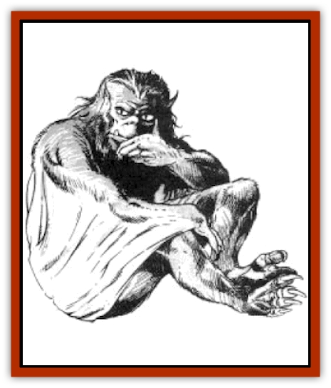

# Shadowperson

| Statistic | **Revered Ancient One** | **Shadowperson** |
| --- | --- | --- |
| **Activity Cycle:** | Any | Night |
| **Alignment:** | Neutral good | Neutral (good) |
| **Armor Class:** | Nil | 2 |
| **Climate/Terrain:** | Any/Subterranean | Any/Subterranean |
| **Damage/Attack:** | Nil | 1-8 (shadowstaff) |
| **Diet:** | None | Omnivore |
| **Frequency:** | Very rare | Rare |
| **Hit Dice:** | Nil | 3+1 |
| **Intelligence:** | Genius (18) | Very (11-12) |
| **Magic Resistance:** | Nil | Nil |
| **Morale:** | Nil | Steady (11) |
| **Movement:** | Nil | 12, Fl 18 (C) |
| **No. Appearing:** | 1 | 2-40 |
| **No. of Attacks:** | Nil | 1 |
| **Organization:** | Solitary | Clan |
| **Size:** | Nil | M (5' tall) |
| **Special Attacks:** | Nil | See below |
| **Special Defenses:** | Nil | See below |
| **THAC0:** | Nil | 17 |
| **Treasure:** | Nil | Nil |
| **XP Value:** | Nil | 175 |

The shadowpeople are a race of mammals that lives underground in small self-contained communities. One of the oldest races of Krynn, they are little known to the outside world.

Shadowpeople resemble slim, gangly apes. They have hairy heads with small flat noses, pointed ears, and sharp fangs, two of which protrude above their lower lips when their mouths are closed. Their eyes are green or amber and resemble those of a cat. They have long claws on their hands and feet. Smooth fur, either black or dark brown, covers their bodies. A long, stretchable membrane connects their arms to their flanks. The membrane enables them to glide through the air, covering ten feet of ground for every foot they drop (for instance, a shadowperson dropping from a ten-foot ledge could glide 100').

When in their subterranean homes, shadowpeople wear few clothes. Their fur provides sufficient warmth, and they have no interest in body decoration. On their rare trips to the surface, they are likely to wear long, dark robes and hoods to conceal their identities.

To the surface-dwelling races of Krynn, shadowpeople are commonly regarded as creatures of myth. Cherishing their privacy, the shadowpeople have gone to great lengths to preserve their reputation as nonexistent creatures, seldom interacting with other races and maintaining their communities far from other civilized outposts. Shadowpeople are, in tact, a kind and benevolent race, capable in drastic situations of uniting with good citizens of other races to promote their common interests.

Shadowpeople can communicate in a series of squeaks and growls that forms a primitive language, but they are much more likely to use their advanced mental abilities to send and receive messages. All shadowpeople can send and receive thoughts telepathically to creatures within a 60-foot range, assuming the sender and receiver share a common language and that they are not separated by more than three feet of stone, three inches of iron, or any solid sheeting of lead, gold, or steel. Additionally, shadowpeople can use *ESP* at will, as per the 2nd-level wizard spell, up to a range of 50 yards.

**Combat:** The two classes of shadowpeople are warriors and counselors. The counselors are unskilled in combat; they depend on the warriors for protection. Shadow warriors are skilled and able fighters, striking quickly and silently. Each shadow warrior employs a wickedly curved hook called a *shadowstaff* to both attack and restrain opponents. Once an opponent has been impaled on the hook of a shadowstaff, the opponent's attacks are hampered and he continues to take damage from the hook. The victim suffers a -2 penalty on all attack rolls and sustains an additional 1d8 points of damage every round until one or the other of the combatants is dead or until the fight ends. An impaled victim is also unable to cast spells. The construction of a shadowstaff is such that is very difficult for a victim to pull himself free once he is impaled; if he takes no other actions and succeeds in Dexterity checks for two successive rounds with a -2 penalty, he has freed himself from the shadowstatf.

The *ESP* ability of the shadowpeople accounts for their low Armor Class. In combat, they are able to anticipate the actions of their enemies and can take the appropriate measures to defend themselves. Shadowpeople cannot be surprised by any sentient creature within 60'.

The shadowpeople's most important defense is the *mindweave*, a ritual undertaken by shadow warriors prior to venturing into situations of potential danger. The mindweave ritual lasts about one hour, during which time the participants link hands to form a large circle, then chant in unison and concentrate. During the mindweave, the shadowpeople use their telepathic abilities to tie all of their minds together. For 1d4+4 hours after the ritual, the shadowpeople share a collective awareness that enables them to move, fight, and defend in perfect unison, giving them a +1 bonus to all attack rolls and saving throws. Characters of other races invited to participate in the mindweave can also receive the benefits of the ritual if they succeed in an Intelligence check with a -5 penalty.

Though good fighters in darkness, shadowpeople are severely handicapped when fighting in the light of the sun. When the sky is overcast, they can execute normal actions, but do so at great pain, causing a -2 penalty to all attack rolls. In bright sunlight, this penalty increases to -4. Shadowpeople exposed to bright sunlight become temporarily blinded after 2d6 turns of exposure. The blindness lasts for a number of hours equal to the number of turns spent outside.

**Habitat/Society:** Shadowpeople are most commonly found in catacombs beneath large cities, or in dungeons and underground reaches of vast, abandoned cities in the more desolate regions of the world. One of the largest communities of shadowpeople is located beneath the dark city of Sanction, a port in central Ansalon on the northeastern shore of the New Sea. Surrounded by three great volcanos, Sanction is an unappealing jumble of warehouses, brothels, slum dwellings, and slave markets. During the War of the Lance, Sanction was a major stronghold of the forces of evil; unknown to them, a tunnel system honeycombing the land below the city provided a hiding place for a thriving community of shadowpeople.

In Sanction, as in other populated areas near shadowpeople communities, the existence of the race is the subject of rumors and speculation. From time to time, a solitary explorer or an inquisitive wizard may stumble on a community of shadowpeople, but such intruders are usually sworn to secrecy or given potions to erase their memories. So far, no one has revealed the existence of the shadowpeople to the world at large - at least, no such stories have yet been believed. Still, shadowpeople are occasionally seen at night by children or the elderly; shadowpeople have a special affinity for human children and senior citizens, and sometimes engage in pleasant mental conversations with them at their bedsides.

Shadowpeople have a close, clannish culture. Mated shadowpeople have 1d4 offspring at a time, and the young are cared for by whatever adults happen to be nearby. When young shadowpeople reach the age of ten, they are assigned to either the warrior class or to the counselor class. These assignments are not arbitrary; they are made on the basis of the youngsters' aptitudes and interests.

The warriors patrol the underground tunnel network and defend the clan against intrusion. The counselors make all of the administrative decisions for the clan. One of the counselors is elected to serve as king. The king makes the final decisions in instances where the counselors are unable to reach a consensus. The counselors also participate in a mindweave ritual similar to that of the warriors to create the Revered Ancient One (see following).

A typical settlement of shadowpeople is a labyrinth of subterranean passages linking variouslysized natural caverns. Passages leading to the main living areas are lined with traps. Intruders stepping in the wrong place trigger two immense slabs of stone to drop from the ceiling, completely blocking the passage. Trapped intruders are telepathically examined by shadow warriors to determine their motives. Intruders are required to agree to the terms of the shadow warriors, or are left trapped between the slabs.

Personal residences are furnished simply, with stone furniture and woven mats for sleeping. Each residence has three vents; one vent leads to the surface to bring in fresh air, the second leads to an underground stream to provide fresh water, and the third leads to a bottomless passage or a lava stream for refuse disposal. Other caverns are used for mushroom farms, conference rooms, and recreational areas. The deepest and most inaccessible cavern is reserved for the Revered Ancient One.

Shadowpeople do not collect treasure, but are fascinated by art. Most cavern walls are decorated with elaborate drawings depicting scenes and heroes from the shadowpeople's past. Shadow warriors sometimes venture to the surface world to make oft with an especially attractive sculpture or painting.

**Ecology:** Shadowpeople have no natural enemies, save for the [[Lizard_Man_Krynn|jarak-sinn]], a race of savage lizard men who occasionally raid shadowpeople settlements in an attempt to drive them from their homes. Shadowpeople do not keep any domesticated animals.

Mushrooms and other fungi are dietary staples, supplemented at times by insects and worms. Shadowpeople do not engage in trade.

**Revered Ancient One**

  The Revered Ancient One is the manifestation of the mental energies of the shadowpeople counselors. When the counselors link hands to form a large circle, then chant in unison and concentrate for an hour, the Revered Ancient One appears. The amount of time the Revered Ancient One remains conjured depends on the number of counselors performing the mindweave ritual. If four to ten counselors perform the ritual, the Revered Ancient One appears for 1-2 hours. If 11 or more counselors perform the ritual, the Revered Ancient One appears for 2d4 hours. Fewer than four counselors cannot conjure the Revered Ancient One. Characters of other races can participate in the mindweave ritual, but they do not count as counselors when determining whether the Revered Ancient One is conjured or how long it stays.

The Revered Ancient One has no physical properties or attributes. Its intelligence is always genius level, and it is always of neutral good alignment. The Revered Ancient One can cast *cure serious wounds* an unlimited number of times per day, providing the recipient of the spell is brought to the Revered Ancient One's cavern (see below). The Revered Ancient One can also cast *teleport without error* on anyone brought to its cavern; the recipient can be teleported to any location in the Prime Material plane, providing he has been there before. Finally, the Revered Ancient One can answer any question mentally posed by any of the counselors who conjured it The Revered Ancient One answers these questions with 95% accuracy: however, the Revered Ancient One has no ability to foresee future events.

The Revered Ancient One usually resides in a sacred cavern adjacent to the shadowpeople's community. This cavern is always blocked by a permanent *wall of force* that the Revered Ancient One can negate at will, enabling it to decide who will pass through. No light of any kind exists in the Revered Ancient Ones cavern, even when it is not present: the darkness cannot be dispelled by magical or any other means. The Revered Ancient One communicates mentally, a character perceives its words as a soothing voice, distant and echoed.

---
## Discovery & Documentation

**Source Publication:** MC4 Dragonlance Appendix (w/binder #2) (1989)
**Campaign Setting:** Dragonlance
**Author(s):** Rick Swan

### Other Creatures Found in This Source Book
   * [[Anemone_Giant_Sea|Anemone, Giant Sea]]
   * [[Bear_Ice|Bear, Ice]]
   * [[Beast_Undead|Beast, Undead]]
   * [[Bird_Krynn|Bird (Krynn)]]
   * [[Disir|Disir]]
   * [[Draconian_Aurak|Draconian, Aurak]]
   * [[Draconian_Baaz|Draconian, Baaz]]
   * [[Draconian_Bozak|Draconian, Bozak]]
   * [[Draconian_Kapak|Draconian, Kapak]]
   * [[Draconian_General_Information|Draconian, General Information]]
   * [[Draconian_Sivak|Draconian, Sivak]]
   * [[Draconian_Proto-_Traag|Draconian, Proto-, Traag]]
   * [[Dragon_Amphi|Dragon, Amphi]]
   * [[Dragon_Astral|Dragon, Astral]]
   * [[Dragon_Kodragon|Dragon, Kodragon]]
   * [[Dragon_Krynn_Othlorx_General_Information|Dragon (Krynn), Othlorx, General Information]]
   * [[Dragon_Krynn_General_Information|Dragon (Krynn), General Information]]
   * [[Dragon_Sea|Dragon, Sea]]
   * [[Dreamshadow|Dreamshadow]]
   * [[Dreamwraith|Dreamwraith]]
   * [[Dwarf_Daergar|Dwarf, Daergar]]
   * [[Dwarf_Hill_Neidar|Dwarf, Hill, Neidar]]
   * [[Dwarf_Mountain_Hylar|Dwarf, Mountain, Hylar]]
   * [[Dwarf_Theiwar|Dwarf, Theiwar]]
   * [[Dwarf_Zakhar|Dwarf, Zakhar]]
   * [[Elf_Half-|Elf, Half-]]
   * [[Elf_High_Qualinesti|Elf, High, Qualinesti]]
   * [[Elf_High_Silvanesti|Elf, High, Silvanesti]]
   * [[Elf_Sea_Dargonesti|Elf, Sea, Dargonesti]]
   * [[Elf_Sea_Dimernesti|Elf, Sea, Dimernesti]]
   * [[Elf_Wild_Kagonesti|Elf, Wild, Kagonesti]]
   * [[Eyewing|Eyewing]]
   * [[Fetch|Fetch]]
   * [[Fire_Minion|Fire Minion]]
   * [[Fireshadow|Fireshadow]]
   * [[Gnome_Tinker|Gnome, Tinker]]
   * [[Gurik_Cha'ahl|Gurik Cha'ahl]]
   * [[Haunt_Knight|Haunt, Knight]]
   * [[Horax|Horax]]
   * [[Human_Krynn|Human (Krynn)]]
   * [[Imp_Blood_Sea|Imp, Blood Sea]]
   * [[Kalothagh|Kalothagh]]
   * [[Kani_Doll|Kani Doll]]
   * [[Kender|Kender]]
   * [[Kyrie|Kyrie]]
   * [[Lizard_Man_Krynn|Lizard Man (Krynn)]]
   * [[Minotaur_Krynn|Minotaur, Krynn]]
   * [[Ogre_High|Ogre, High]]
   * [[Ogre_Krynn|Ogre (Krynn)]]
   * [[Phaethon|Phaethon]]
   * [[Saqualaminoi|Saqualaminoi]]
   * [[Shimmerweed|Shimmerweed]]
   * [[Skrit|Skrit]]
   * [[Spectral_Minion|Spectral Minion]]
   * [[Spider_Krynn|Spider (Krynn)]]
   * [[Stag|Stag]]
   * [[Tayling|Tayling]]
   * [[Thanoi|Thanoi]]
   * [[Tylor|Tylor]]
   * [[Wichtlin|Wichtlin]]
   * [[Wyndlass|Wyndlass]]
   * [[Yaggol|Yaggol]]
