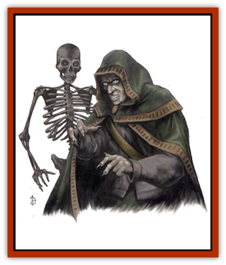

# Shadowrath

| Statistic | **Greater** | **Lesser** |
| --- | --- | --- |
| **Activity Cycle:** | Any | Any |
| **Alignment:** | Neutral evil | Neutral evil |
| **Armor Class:** | 5 (or as former self) | 4 |
| **Climate/Terrain:** | Any land | Any land |
| **Damage/Attack:** | 2d4 | 1d6 |
| **Diet:** | None | None |
| **Frequency:** | Very rare | Very rare |
| **Hit Dice:** | 5+5 | 4+4 |
| **Intelligence:** | As former self | As former self |
| **Magic Resistance:** | 25% | 10% |
| **Morale:** | Fearless (20) | Fearless (20) |
| **Movement:** | 12 | 9 |
| **No. Appearing:** | 1-10 | 2-12 |
| **No. of Attacks:** | As former self | 1 |
| **Organization:** | Solitary | Solitary |
| **Size:** | As former self | As former self |
| **Special Attacks:** | Energy drain | Strength drain |
| **Special Defenses:** | Hit only by +1 or better magical weapons | Hit only by +1 or better magical weapons |
| **THAC0:** | 15 | 17 |
| **Treasure:** | W | W |
| **XP Value:** | 2,000 | 1,400 |

Shadowraths are created by a fell artifact, the *Crown of Horns*. All shadowraths are intelligent, but are totally under the control of the wearer of the *Crown of Horns* if the latter is within 100 yards of their location. Shadowraths drain life and vitality from their surroundings and return nothing. If left without direct control, they alway seek out and destroy wizards and worshipers of Mystra, as revenge for Mystra's destruction of Myrkul during the Godswar.

**Lesser Shadowrath**

  These undead beings appear as totally black [[Skeleton|skeletons]] with only their eyesockets aglow with red, deadly energy. They are created by the *ray of undeath* power of the artifact, *Crown of Horns*. Those killed by this ray arise as lesser shadowraths, also known as *blackbones*. Nonmagical equipment worn by these victims is consumed during the transformation; magical items are simply abandoned or collected for the Crown bearer. Any magical or psionic powers the shadowrath possessed while alive are lost in the conversion to undead status.

Lesser shadowraths attack by using a *chilling touch*, which inflicts 1-6 points of damage and requires the creature struck to save vs. death magic or lose one point of Strength. Creatures completey drained of Strength by lesser shadowraths die, and such a death is irreversible, even with a *wish*. Strength points return at the rate of one per hour. Lesser shadowraths are immune to the effacts of normal and silver weapons, and can be turned as ghasts.

Lesser shadowraths are created by the *Crown of Horns*. These undead retain their intelligence, but they willingly serve the wearer of the *Crown* until destroyed. They can understand instructions given them by the *Crown's* wearer and can perform complex tasks set for them. Although lesser shadowraths often wear clothing as a disguise, most nonmagical cloth becomes tattered, rotten, and eventually disintegrates after prolonged contact with them.

**Greater Shadowrath**

  These powerful undead are also created by the *Crown of Horns*. Those slain by *Myrkul's hand*, the other major power of the artifact, arise as greater shadowraths. Gerater shadowraths retain both the intelligence they possessed during life and their original general appearance, including clothing, armor, equipment, and so on. However, they have no eyes, internal organs, or bones. Instead, they are filled with and animated by negative material energy. This crackling black energy is visible in the creatures' eyes, open mouths, and any open wounds. Greater shadowraths can use all equipment they formerly carried, except magical items opposed to their new alignment. As with lesser shadowraths, any magical or psionic abilities of the shadowrath's previous existence are lost. Greater shadowraths cannot activate any magical item that employs command words, as they are mute.

The touch of a greater shadowrath causes 2-8 (2d4) points of damage and requires a saving throw vs. death magic; failure means one experience level is drained. Beings completely drained of levels by a greater shadowrath die a permanent, irrevocable death. Greater shadowraths are turned as mummies.

Greater shadowraths often accompany the *Crown*-wearer as bodyguards and enforcers of the *Crown*-weaer's will. Greater shadowraths might also lead groups of lesser shadowraths when assigned a difficult task by their creator. They often cover themselves in heavy cloaks and hoods to approach their victims unawares; and can pass for their previous selves, as long as their eyes, mouths, and other negative energy spots are hidden.

---
## Discovery & Documentation

**Source Publication:** City of Splendors (1994)
**Campaign Setting:** Forgotten Realms
**Author(s):** Ed Greenwood, Elain Cunningham

### Other Creatures Found in This Source Book
   * [[Curst|Curst]]
   * [[Doppelganger_Greater|Doppelganger, Greater]]
   * [[Duhlarkin|Duhlarkin]]
   * [[Gulguthhydra|Gulguthhydra]]
   * [[Hakeashar|Hakeashar]]
   * [[Leucrotta_Greater|Leucrotta, Greater]]
   * [[Lycanthrope_Wereshark|Lycanthrope, Wereshark]]
   * [[Nyth|Nyth]]
   * [[Ooze_Slime_Jelly_Ghaunadan|Ooze/Slime/Jelly, Ghaunadan]]
   * [[Palimpsest|Palimpsest]]
   * [[Peltast|Peltast]]
   * [[Raggamoffyn|Raggamoffyn]]
   * [[Snake_Sewerm|Snake, Sewerm]]
   * [[Watchspider|Watchspider]]
