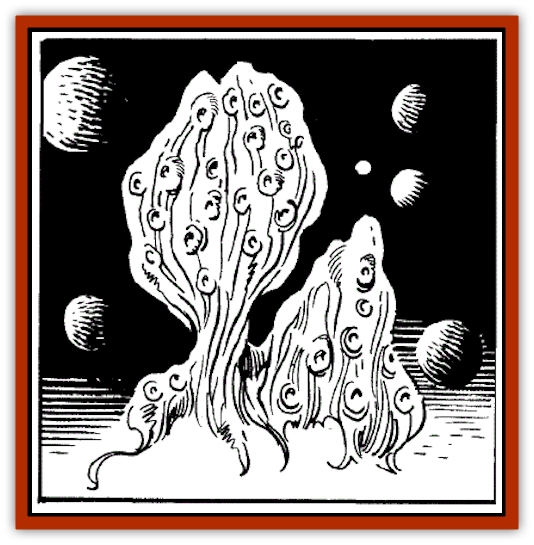

# Shadowsponge - Air Stealer

| Statistic | **Shadowsponge (Air Stealer)** |
| --- | --- |
| **Activity Cycle:** | Any |
| **Alignment:** | Chaotic neutral |
| **Armor Class:** | 9 |
| **Climate/Terrain:** | Any space |
| **Damage/Attack:** | 1-4/round ( constriction) or 1(ram) |
| **Diet:** | Special |
| **Frequency:** | Rare |
| **Hit Dice:** | 7+7 |
| **Intelligence:** | Semi- (2-4) |
| **Magic Resistance:** | Nil |
| **Morale:** | Steady (11) |
| **Movement:** | Fl 13 (C) |
| **No. Appearing:** | 1-6 |
| **No. of Attacks:** | 1 |
| **Organization:** | Solitary or groups |
| **Size:** | G (ovoid, 36' + long) |
| **Special Attacks:** | Gas effects |
| **Special Defenses:** | Nil |
| **THAC0:** | 13 |
| **Treasure:** | Nil |
| **XP Value:** | 1400 |

These strange monsters are feared by all spacefarers. They drift in space until they sense the approach of an atmosphere, and attack mindlessly, absorbing precious air.

A shadowsponge appears as a greyish sponge. Hundreds of rubbery, many-branched air sacs protrude from a central mass. Studded with small, keen eyes and sensory patches, a sponge can 'smell' air in the void up to three miles away.

The substance of a shadowsponge is inedible. If struck by fiery or electrical attacks (which do normal damage), it burns with a thick, choking smoke. The smoke expands rapidly to fill a 30' spherical area, and lasts for 2-5 turns, completely blocking normal vision beyond 4', and turning clean air within its confines to foul.

**Combat:** A shadowsponge concentrates on absorbing air, swooping and turning continuously in an atmosphere. Any nearby creature risks being rammed or enveloped.

A ram (successful attack roll required) does 1 point of damage. The victim must make a Strength Check or be bowled over (items carried must save vs. "fall").

An enveloping attack surrounds a victim, squeezing and smothering for 1 point of initial damage. In subsequent rounds, enveloped beings suffer 1-4 points of constriction damage. They may automatically hit the shadowsponge with any piercing or slashing weapons in hand, but are unable to cast spells, get out other items, or wield bludgeoning weapons. Very large sponges (those of over 40 hp) can envelop two M-sized beings at once; smaller shadowsponges can entrap only one.

Any attack on a sponge may be partially suffered by an enveloped being. The being saves against the attack form (for physical weapon attacks, against Breath Weapon) to avoid taking a quarter of the damage done to the sponge (round fractions down to a minimum damage of 1 hp).

The porous, air-filled nature of a shadowsponge prevents enveloped beings from suffocating, but they must save vs. Breath Weapon on every second round or suffer the effects of harmful gases absorbed earlier by the sponge (refer to Gas Clouds in the "Flotsam of Space" section for such effects).

When a sponge is killed or dealt over 20 hp damage in a single round, it convulsively releases enveloped beings (who suffer damage from the attacks causing their release).

**Habitat/Society:** Shadowsponges are only semi-intelligent, but seem to herd together by instinct and move toward atmospheres in space. They avoid the large, stable atmospheres of worlds. Some sages believe shadowsponges are merely a stage in the lives of more advanced fungoid creatures. This stage, it is thought, ends when a sponge reaches a certain inner state by absorbing the nutrients it needs from absorbed gases. It then enters a world's atmosphere and falls to the surface, metamorphosing into spores to begin life anew in some other form.

Elminster cautions us that although this theory cannot be discounted, definite proof in support of it is so far lacking for several parts of the hypothetical life-cycle; the true nature of shadowsponges may be far different.

Shadowsponges never collide with each other or fight among themselves. They seem capable of rejoining scattered portions of themselves, or even joining with another sponge to form a larger whole, and have no reproductive lives or family units.

**Ecology:** Shadowsponges feed on nutrients gleaned from gases, absorbed light, and low level electrical and heat energy. Attacks relying entirely on heat for damage, and not flame (which has its usual effect), do not harm a shadowsponge, but rather give it additional or healing hit points equal to the normal damage done.

Sponges play no part in any food-chain. Alchemists and spell researchers of all races have looked in vain for uses for shadowsponge tissue and essence.

One experiment has given questionable results. Application of low-level electrical energy generated by a *shocking grasp* spell and certain gnomish energy creation and storage devices causes the sponge to release 25% of its stored atmosphere.

Desperate spacefarers have been known to enclose shadowsponges in a spacewreck or other large, sturdy spacegoing storage container and forcibly drag them through planetoid atmospheres, and to skim the atmospheres of worlds. The intent of this stratagem is to gain a portable atmosphere allowing a too-small ship to carry too-large a crew on too-long a space voyage. A secondary use of caged shadowsponges is to steal air from enemies by setting a spacegoing cage adrift on a course that will bring it through the atmosphere of, or into a collision with, a hostile planetoid, base, ship, or elven armada craft.

Shadowsponges imprisoned or brought into contact with planetary atmospheres will take on and store air usable in space voyages, but the shock of this treatment seems to ultimately kill them. Each sponge saves vs. Petrification for every day of confinement. If it fails, it dies instantly, poisoning the air around it.

A dying shadowsponge fouls 40 tons of air. Once the entire carried atmosphere of a ship is fouled, additional 40-ton foulings turn 40 tons of fouled air into deadly air. Many an intrepid space explorer has been forced to cut loose towed space barges full of dead shadowsponges to escape the poisoned air and stagger along on inadequate air reserves.

**Herd Clouds**

Some small, dark shadowsponges have been observed to lead their fellows on long voyages in space and round them up into groups. These "herd clouds" have recently been studied with interest by several sages.

Herd clouds have been found to be Very intelligent (11-12) and possessed of unusually high morale: Champion (15-16). They have 8+8 Hit Dice and an XP Value of 3000.

They also have the ability to gather electrical charges, discharging these as weapons against other beings. A typical herd cloud can emit one 9d6 *chain lightning* attack and two forked 6d6 *lightning bolts* in a "day" (144-turn period). Mere contact with, or even passing through a 'charged' herd cloud will not attract such damage unless the cloud wishes to release its energy.

---
## Discovery & Documentation

**Source Publication:** SJR1 Lost Ships (1990)
**Campaign Setting:** Spelljammer
**Author(s):** Ed Greenwood, Paul Jaquays, Anne Brown, Dell Barras, Brom, Jeff Grubb

### Other Creatures Found in This Source Book
   * [[Beholder_Undead_Death_Tyrant|Beholder, Undead (Death Tyrant)]]
   * [[Flow_Barnacle|Flow Barnacle]]
   * [[Lich_Arch|Lich, Arch]]
   * [[Neogi:_Undead_Old_Master|Neogi: Undead Old Master]]
   * [[Beholder_Eater_Thagar_Grimgobbler|Beholder Eater, Thagar (Grimgobbler)]]
   * [[Tinkerer_Giant_Bubble|Tinkerer (Giant Bubble)]]
   * [[Sarphardin_Watcher|Sarphardin (Watcher)]]
   * [[Men:_Wonderseeker|Men: Wonderseeker]]
   * [[Spaceworm|Spaceworm]]
