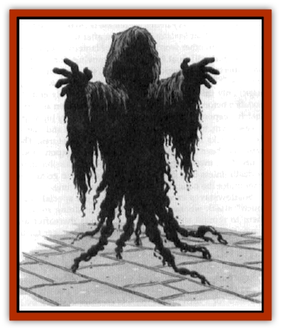
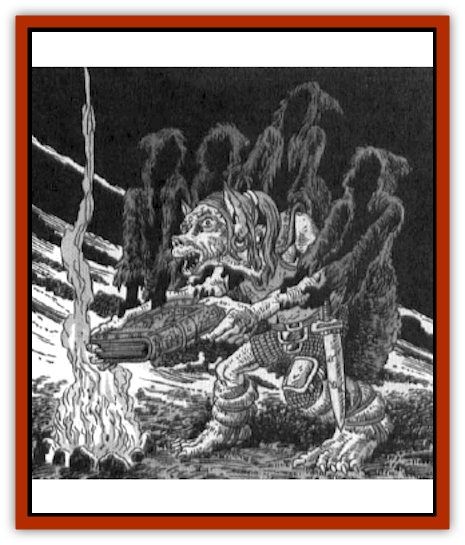

# Shadowstaff

| Statistic | **Shadowstaff** |
| --- | --- |
| **Activity Cycle:** | Any |
| **Alignment:** | Lawful neutral |
| **Armor Class:** | 6 |
| **Climate/Terrain:** | Any |
| **Damage/Attack:** | 1d4+1 &times;4/1d4+1 &times;4 or by weapon type |
| **Diet:** | None |
| **Frequency:** | Very rare |
| **Hit Dice:** | 9+9 |
| **Intelligence:** | As in life |
| **Magic Resistance:** | 66% |
| **Morale:** | Fearless (20) |
| **Movement:** | 16, Fl 22 (A) |
| **No. Appearing:** | 1 (1-8) |
| **No. of Attacks:** | 2 |
| **Organization:** | Solitary (or guardian groups) |
| **Size:** | M (average 6' tall) |
| **Special Attacks:** | Spell use, <i>hold</i> touch |
| **Special Defenses:** | <i>Wraithform</i>, immunities |
| **THAC0:** | 11 |
| **Treasure:** | Nil |
| **XP Value:** | 14,000 |

Shadowstaves are former mortals who resemble [[Ghost|ghosts]] or [[Wraith|wraiths]]. They appear as translucent, shadowy humanlike forms or hooded, cloaked amorphous figures that seem little more than tattered cloaks - or cowled heads and shoulders whose bodies and limbs trail away to nothing. They walk, float, or fly silently about, often "rising from" or "sinking down into" apparently solid floors (actually becoming wraithlike and passing through crevices). No shadowstaff can ever become truly invisible, but as their name suggests, they can attain the appearance of a deep, dark [[Shadow|shadow]] that cannot be seen by most creatures in dark or gloomy surroundings.

A shadowstaff is created by Azuth or Mystra from the soul or spirit of a Magister or a deeply loyal worshiper when the being is willing to enter such service, and is judged fitting for such an existence.

**Combat:** Though they resemble undead, shadowstaves are not - and therefore cannot be turned, disrupted, or commanded. Holy water just makes them wet.

A shadowstaff can become insubstantial at will, and in such a form can pass through the smallest crevices and holes, but suffers double damage from all contact with normal or magical flame or heat, and cannot launch attacks or carry things.

When solid, a shadowstaff can attack twice per round, either by wielding weapons it used in life (for the usual damage) or by "firing" *magic missiles* from its fingertips. A shadowstaff can emit two volleys of four missiles in a single round, or make two weapon attacks, or make one attack of each sort. Shadowstaves can employ any sort of magical item, precisely identifying all of its powers and controls after 3 rounds of handling (and doing nothing else except flying), regardless of any restrictions against their doing so in their former lives.

Whenever it encounters an enchanted staff, a shadowstaff can "vanish" into it, and there regain 1d12 lost hit points by "stealing" a charge from the staff (if the staff has charges). While in the staff, it can drain one charge in this manner every 4 rounds, cannot be detected, and can only be harmed if the staff is broken (which destroys the shadowstaff). A shadowstaff can escape from a staff at will, but after doing so is trapped in its wraithlike, insubstantial form for 1 turn. A shadowstaff can never gain "extra" hit points, above its normal total, from draining staff energies.

A shadowstaff can choose to cast one spell in a round, rather than employing *magic missile* or weapon attacks. It can cast any one of the spells it could cast in its former life, choosing freely from a roster it never forgets or needs to memorize, but does require all normal material components to cast any spell unless it can touch any sort of enchanted rod, staff, or wand - whereupon it can if it desires drain the item of one charge (or force it into 1-turn dormancy if the item lacks charges), and uses that power to make the magic work without need for material components.

A shadowstaff has precise control over its *magic missiles*; it can choose to fire fewer than four in a volley, can adjust the damage each does precisely (to the hit point), and can attack multiple targets simultaneously. If it chooses to release two volleys in a round, all eight *missiles* are launched simultaneously.

Shadowstaves cannot hurl or drop missile weapons or objects, because every item they release is cloaked in a feeble enchantment that levitates it for 1 turn after the last shadowstaff touch (in other words, a sword or lantern released by a shadowstaff will float in midair, unmoving, for 1 turn or until affected by a magical *gust of wind*, the grasp of a flying creature or other being able to reach it, or contact with *dispel magic*; only this latter sort of disturbance actually ends the levitation before its time). Shadowstaves have been known to snatch weapons away from creatures and then fly high up to release them, to leave them floating out of reach and thereby delay attacks or movement away by the creatures. They have also been known to "hang" pointed weapons above bound foes, menacing these opponents with possible injury or death unless they devote all of their efforts to getting out from under the hanging, waiting weapons in time.

Shadowstaves can choose to employ a special "*hold*-touch" attack whenever they desire, but doing so forces them to remain substantial for 6 rounds thereafter and leaves them unable to use their *magic missile* power for the same length of time.

The *hold* touch of a shadowstaff requires a successful attack roll and is equal in effects to a *hold monster* spell, though it can only be directed against a single being in any round (and is therefore saved against at a -3 penalty). The *hold* lasts for 1 turn unless the held creature is struck by an attack, or the shadowstaff desires the condition to end sooner. This ability is often used to "freeze" one mortal long enough for another mortal to discover it in a place where it should not be, or engaged in something illicit or hitherto secret.

Shadowstaves suffer only half the usual damage dealt by all cold-based and electrical attacks, are immune to life energy draining and all Enchantment/Charm and Illusion/Phantasm magic, and are "invisible" to psionics. They are immune to poison, petrification, *polymorph*, and death magic attacks. Shadowstaves can at will cause all items within 90 feet that bear a magical aura to glow with a cold white radiance (they need not be already aware of which items are magical to make this power work on such items). This *faerie fire*-like glow can be quelled by a *dispel magic*, but will otherwise last 2d4 turns.

Like Magisters, shadowstaves cannot be controlled or compelled by any psionic power, spells or magical item function, short of the divine will of Azuth or Mystra - even artifacts fail to control or influence their minds.

**Habitat/Society:** Shadowstaves delight in observing the work and doings of intelligent creatures, and have a *tongues* ability, granted by Azuth and Mystra, that allows them to comprehend and communicate with any speaking creature. (A shadowstaff with access to *ESP* and similar spells can of course employ magic to learn even more, though unless direct contact or confrontation with particular mortal beings is ordered, the deities who create shadowstaves usually prefer that mortals remain unaware that they're under scrutiny, or of the nature and current interests of shadowstaves.

Shadowstaves never willingly fight each other (though they may disagree in a lively manner over what should be done, and how best it can be accomplished), and with only rare exceptions work together loyally and smoothly in the service of Azuth and Mystra.

Retaining the intelligence and judgment they had in their former lives, Shadowstaves gain a more thorough understanding of magic and of events in Faer�n (thanks to their ability to eavesdrop).

Even many Magisters are unaware of how extensive, numerous, and tireless are the tasks set for shadowstaves by Mystra and Azuth.

Shadowstaves keep all Magisterial duels free from interference, advise the few mortal mages who know of and call on them, do the same for clergy of Mystra and Azuth who pray for guidance, and for clergy of Oghma who ask about magical matters, and so on. Shadowstaves also serve as unseen guardians of many Mystran temples and holy places. Mystra uses her shadowstaves as "unseen watchers" over sorcery. Remaining hidden, they manipulate the affairs of individual mortal mages so as to teach them the responsibilities that wielding magic carries; drive home some moral lessons (not to make all mages good, but to ensure that wizards know the consequences of their magecraft, as opposed to operating in ignorance); and drop hints, clues, and goads to spur wizards ever on to greater magical creativity.

The goads are more than just motivations for individuals. To this day, shadowstaves defend Aglarond and Rashemen against Thay, to make Red Wizards strive to develop ever greater spells to try to defeat the foes that defy them but should not be able to, instead of turning on each other and destroying magical knowledge in a struggle that blasts Thay to a wasteland. Lurking shadowstaves repeatedly thwart Zhentarim mages who attack various dales (that again should not realistically be able to stand against them), so the mages of the Black Network work to craft ever more powerful spells. Tirelessly vigilant shadowstaves prevent fiends and worse from roaming out of Myth Drannor to lay waste to the Dales, Sembia, Cormyr and the Moonsea, so that wealthy lands and cities can devote their energies to trade and rivalries and hiring mages in related pursuits, rather than exhausting all of their magic and vitality in a deadly struggle for the freedom of central Faer�n. Myth Drannor thus remains a shining legend of lost magic and danger, luring adventurers and inspiring ambitious wizards to dream and perhaps to go adventuring&hellip;

Shadowstaves can be slain, but most avoid being destroyed in Mystra's service. They are doomed to slowly, over thousands of years, fade away as their souls become utterly exhausted. Collectively, their memories bear witness to much of the doings and wisdom of Mystra; the "new Mystra" (Midnight) grew greatly in maturity and knowledge upon making mental contact with her shadowstaves. The sheer load of human grief, suffering, and experience carried in those memories nearly drove her insane; much of her love for Elminster (a paramour of her predecessor) is due to his swift and gentle work to shield and support her at this time, and so keep her sane. Azuth and Mystra can contact and even "see through the eyes of" their shadowstaves at any time, but they cannot manifest or speak directly through a shadowstaff without destroying it. Several mortals who have witnessed such unusual occurrences say that this is done only at moments of great importance. The phenomenon involves a small explosion of the shadowy form into a tongue of flame in which float the eyes of the deity, and from which its voice - accompanied, sometimes, by spells it launches - rolls forth. Elminster and Laeral agree that it would be a mistake for mortals to assume that the deities monitor all of their shadowstaves all the time, so that something said or done in front of one is certain to be personally viewed by Azuth or Mystra.

**Ecology:** Shadowstaves consume nothing and can have no offspring. They need not sleep or breathe, and can avoid falling damage by becoming insubstantial. Due to the nature of the service with which their existence is occupied, they either become infinitely weary or come to love particular mortals they see or are commanded to watch over.

In either case, some shadowstaves request that their existence end - either in oblivion, or in a new form (perhaps restored to mortality, so as to woo or consort with their beloved). Azuth and Mystra have shown infinite compassion in granting such requests, but reserve the right to alter the memories of former shadowstaves, so as to keep some secrets.

---
## Discovery & Documentation

**Source Publication:** FOR13 Secrets of the Magister (1990)
**Campaign Setting:** Forgotten Realms
**Author(s):** Ed Greenwood

### Other Creatures Found in This Source Book
   * [[Tarsardar|Tarsardar]]
   * [[Wingless_Wonder|Wingless Wonder]]
