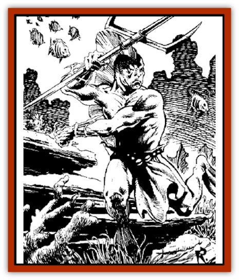
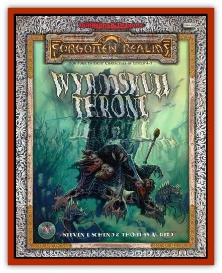

# Shalarin

| Statistic | **Shalarin** |
| --- | --- |
| **Activity Cycle:** | Any |
| **Alignment:** | Neutral |
| **Armor Class:** | 7 |
| **Climate/Terrain:** | Temperate and subtropical salt water |
| **Damage/Attack:** | 1d4+1 or by weapon |
| **Diet:** | Omnivore |
| **Frequency:** | Very rare (Uncommon in Ser�s) |
| **Hit Dice:** | 2+1 |
| **Intelligence:** | Average to High (5-15) |
| **Magic Resistance:** | Nil |
| **Morale:** | Average (8-10) |
| **Movement:** | Sw 15 |
| **No. Appearing:** | 3-30 |
| **No. of Attacks:** | 1 |
| **Organization:** | Caste |
| **Size:** | M (6') |
| **Special Attacks:** | Spells |
| **Special Defenses:** | Nil |
| **THAC0:** | 19 |
| **Treasure:** | Individual: N; G,S,T in lair |
| **XP Value:** | 120 |

Shalarin are a highly developed race that shares many characteristics with both humans and [[Elf|elves]]. On Toril, they are found only in the Sea of Fallen Stars.

Shalarin are graceful swimmers and are adorned with a prominent dorsal fin that runs from the bridge of the nose up the forehead and over, down the back to the tailbone and fanning out approximately two feet at its highest point, between the shoulder blades. They also have gill slits, not at the neck, but rather along the collarbones and ribcage on either side of their torso. They are unable to leave the water and breathe air, as they do not have lungs. Shalarin are similar in size to humans, growing to around six feet in height. Their skin is sleek and scaleless, similar to a dolphins in texture and coloration, ranging as widely as the colors of coral. Shalarin eyes are less like humans and more like those of [[Fish|fish]] and cetaceans.

**Combat:** Shalarin as a rule wear pearl or silverweave armor, although some have tried surface-dwellers. armor, though they avoid armor that interferes with their dorsal fins. Weapons are equally diverse, though they favor tridents and tapals.

**Habitat/Society:** Shalarin live in a rigid caste society, and they consider it very important to find out as quickly as possible what caste other beings belong to, in order to understand how to properly interact with them. Giving a shalarin disparate information (such as warrior that cooks or sings) can cause a great amount of confusion. The four castes of the shalarin culture are the Protectors (the warriors), the Providers (the workers and servants, as well as the rulers), the Scholars (historians, poets, bards, singers etc.), and the Seekers (the explorers).

Shalarin are generally open and polite, although they remain somewhat aloof to [[Elf_Aquatic|sea elves]], due to long-ago persecutions by that race. To many, shalarin seem na�ve, but this is untrue.They are open and trusting, but far from foolish.

**Ecology:** Shalarin are oviparous creatures, laying their eggs externally and incubating them for six months in warm subsea caverns and mud. Shalarin eggs are both colored and textured, flawlessly indicating the caste of the child-to-be. Once an egg is laid, it is transferred to clan hatcheries, and once born the infant shalarin is raised by surrogate parents who are of the same caste as the child.

---
## Discovery & Documentation

**Source Publication:** The Wyrmskull Throne (1994)
**Campaign Setting:** Forgotten Realms
**Author(s):** Steven E. Schend, thomas M. Reid

### Other Creatures Found in This Source Book
   * [[Feeblestar|Feeblestar]]
   * [[Quelzarn|Quelzarn]]
   * [[Slithering_Hoard|Slithering Hoard]]
