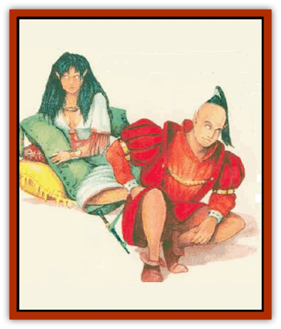

# Shapeshifter

| Statistic | **Adaptor** | **Metamorph** | **Polymar** | **Randara** |
| --- | --- | --- | --- | --- |
| **Activity Cycle:** | Any | Any | Any | Any |
| **Alignment:** | Any | Chaotic neutral | Lawful neutral | Neutral evil |
| **Armor Class:** | 9 | 5 | 9 | 0 |
| **Climate/Terrain:** | Any | Temperate mountains and forests | Any | Any |
| **Damage/Attack:** | By weapon +4 | By weapon | 1d6 each (pseudopods) | As chosen form |
| **Diet:** | Omnivore | Omnivore | Omnivore | Carnivore |
| **Frequency:** | Very rare | Rare | Rare | Very rare |
| **Hit Dice:** | 8 | 3+1 | 10 | 14 |
| **Intelligence:** | <nobr>Genius (17-18)</nobr> | High (13-14) | Low (5-7) | High (13-14) |
| **Magic Resistance:** | Nil | Nil | Nil | Nil |
| **Morale:** | Champion (15) | Average (10) | Steady (11) | Steady (11) |
| **Movement:** | 12 | 12 | 6 | 18 |
| **No. Appearing:** | 1d6 | 1d20 | 1d3 | 1 |
| **No. of Attacks:** | 2 | 1 | 3 | As chosen form |
| **Organization:** | Cell | Clan | Pack | Solitary |
| **Size:** | M (5-6' tall) | M (6-7' tall) | S-L (3-10' across) | S-M (2-7' tall) |
| **Special Attacks:** | See below | Nil | Nil | Spell use |
| **Special Defenses:** | See below | Shapechange | Nil | Hit only by +1 or better weapons |
| **THAC0:** | 13 | 17 | 11 | 7 |
| **Treasure:** | V | W | B | F&times;3 |
| **XP Value:** | 2,000 | 270 / Leader: 650 | 2,000 | 8,000 |

Numerous varieties of creatures are able to significantly alter their shapes; these range from [[Lycanthrope_General_Information|lycanthropes]] (such as [[Lycanthrope_Werewolf|werewolves]] and [[Lycanthrope_Werejaguar_Mystara|werejaguars]]) to amorphous creatures such as the [[Scamille|scamille]] and other oozes, jellies, and puddings.

Certain species also exist whose main feature is the ability to change shape. This ability is common across the species; it cannot be passed on to others; it is the species' primary method of attack and defense; and it is a conscious effort on the creature's part. Creatures meeting these criteria are collectively known as shapeshifters; in addition to the creatures listed here, the [[Doppelganger|doppelganger]] and [[Mimic|mimic]] are shapeshifters.

## Adaptor

Adaptors are an ancient, intelligent race found on all planes of existence. They are a withdrawn race, shunning contact with others and focusing instead on gathering information and exchangmg it among themselves.

In their natural state, adaptors are shiny, a gold, muscular, androgynous humanoids with blank oval faces. Adaptors can change into the form of any creature of human or demihuman size. Unlike doppelgangers, they cannot turn into duplicates of specific people.

Their superior intellect allows adaptors to know any language they are exposed to. Each is fluent in Common and xeveral other languages.

**Combat:** Adaptors are skilled at swordplay, attacking twice per round with a +4 bonus to attack and damage rolls when using swors. Adaptors favor long swords and rapiers.

The powers of the adaptors are formidable. For a limited time, they become immune to magical attacks once exposed. For instance, a fireball would cause full damage to an adaptor (or half if the saving throw is successful) the first time that adaptor is hit by a fireball, but for a short time, the adaptor is immune to all magical fire attacks. The adaption disappears in 1d10 turns if not triggered again. An adaptor may enjoy simultaneous immunities.

**Habitat/Society:** Adaptors are a mysterious, scholarly people. Each member has more accumulated knowledge than any sage. However, their philosophy demands that they not pass any great knowledge to other cultures.

Adaptors are natural observers, and their conversations with individuals or small groups are limited tp discussions of philosophy or asking questions about the people and land around them. If people are polite, an adaptor may answer a single question for them: background on an obscure magical item, perhaps, or information on an old, lost ruin.

The origin of the adaptors has long been lost. The few human and [[Elf|elven]] sages who know of their existence believe that adaptors themselves are searching for answers to their origin.

Adaptors gather in small groups devoted to a certain area of knowledge. These groups, called cells, usually  have little commerce with other cells of adaptors.

**Ecology:** Adaptors are nonintrusive creatures who do their best not to interfere with the natural state of the places they visit.

Adaptors may have odd and fantastic devices beyond the comprehension of those they encounter. Examples might include flame tubes, trance inducers, or energy neutralizers; the precise effects of these and other devices are left to the DM.

## Metamorph

Metamorphs are an ancient species of shapeshifter distantly related to humans. They exist in harmony with nature and creatures close to nature, doing their part to preserve the natural balance.

A metamorph's natural form is that of a handsome human male or female, though its ears are slightly pointed and its eyes are pure white. Metamorphs speak fluent Common, and most (90%) speak the languages of elves and [[Halfling|halflings]].

**Combat:** Normally, metamorphs are nonaggressive, choosing to shapeshift and withdraw rather than engage in a violent confrontation. When pressed, however, they fight seriously.

Metamorphs favor druidic weapons such as daggers, clubs, spears, slings, and sickles. They do not wear armor, as this becomes useless during shapeshifting.

If ten or more metamorphs are encountered, they will be accompanied by a leader with 5+2 Hit Dice. The presence of the leader boosts metamorph morale to 12, but a leader quite often leads others away from combat.

A metamorph makes saving throws as an 11th-level wizard.

**Habitat/Society:** A metamorph can shapeshift as often as 11 times per day, but it's limited to certain forms. This nonmagical shapeshifting power gives metamorphs all the abilities of the new form, including special attacks. Metamorphs cannot take giant-sized or monstrous forms. Forms available to metamorphs are amphibian, [[Bird|bird]], [[Centipede|centipede]], [[Crustacean_Giant|crustacean]], [[Fish|fish]], [[Insect_Giant|insect]], [[Leech|leech]], mammal, reptile, [[Spider|spider]], and [[Worm|worm]].

A metamorph can turn into a category of form only once per day. For example, a metamorph might transform into a [[Dog|dog]] one day and a [[Cat_Small|cat]] the next day, but it can become only one mammal per day. Each form lasts up to an hour, but the metamorph can voluntarily change earlier.

Metamorphs reproduce like normal humans and live in clan strongholds away from normal human society, though they have good relations with elves, harflings, and druids. Each stronghold is led by a leader with 5+2 Hit Dice.

**Ecology:** Metamorphs act as self-appointed protectors of the environment within a five-mile radius of their stronghold.

## Polymar

Polymars are modestly intelligent creatures that can change shape in order to lure prey. In their natural form, they are shapeless brown masses. The polymar is closely related to the mimic, and is apparently a more sociable version of the mimic.

Polvmars cannot communicate verbally, but seem to maintain a constant telepathic contact with other members of their pack. Some very rare packs have reportedly learned silent forms of communication, such as sign language or writing.

**Combat:** Polymars can look like any creature with 10 or fewer Hit Dice or any object smaller than 100 cubic feet. Polymars do not gain the special abilities of their new form. Polymars of the same pack have a psychic rapport with one another and cooperate very closely. The strongest pack member (the one with the most hit points) is the leader; when a polymar leader dies, the strongest living polymar becomes leader.

The form of the leader determines the form of each other pack member; if the leader imitates a piece of wooden furniture, so do the other pack members; if the leader takes the form of a humanoid, so do other pack members. Members of the same pack attempt to "match", so that a pack imitating fumiture might resemble a couch, two chairs, a table, and a coat rack, all of the same apparent style.

A polymar's change is far from perfect; for example, polymars changed into humanoids tend to shamble about in a seemmgly random manner, and the wood grain of a polymar changed into a chair may not look quite right. Opponents notice something unusual on a roll of 1 on 1d6.

Regardless of form, a polymar that enters combat extrudes three pseudopods and attacks with them, causing 1d6 points of damage with each hit. Polymars coordinate their attacks, all striking at the same time; they all attack the same opponent if the leader decides it is appropriate.

A polymar pack feeds by engulfing dead plants or animals. An opponent slain by polymars will be completely dissolved in 2d4 hours, leaving only nonorganic material behind.

**Habitat/Society:** Polymars are very social creatures with others of the same pack. They cooperate completely, following the dictates of their leader.

Polymars reproduce by fission. All members of a pack reproduce at the same time after the pack has taken in sufficient nourishment. If the pack was small, all the polymars stay together; if the habitat cannot support increased numbers, half the polymars form their own pack and seek new territory.

**Ecology:** Alchemists and wizards covet polymar tissue for use in creating magical items and potions that involve shapeshifting or polymorphing.

## Randara

Randaras are evil beings of legendary power. They delight in using their shapeshifting to trap innocent folks as food. Their true appearance is unknown. They most often appear as humans or humanoids, but can also take the shapes of small, cuddly animals. The form of the randara is always size S or M.

**Combat:** A randara's attack varies with its chosen form; for example, in human form, it uses weapons, but in the form of a dog, it bites. Damage is calculated for the creature imitated.

A randara can change its form in one round, but can take no other action in that round. It gains onIy the movement and normal attack abilities of its chosen form; the randara maintains its own natural Armor Class and gains none of the special abilities of its chosen form.

Randaras can cast *charm person* once per day and *ESP* at will, casting at the 11th level of ability. Randaras are immune to 1st through 3rd-level spells. They suffer only half damage from magical weapons. Nomnagical weapons do not harm them.

**Habitat/Society:** Randaras are very fond of human flesh. They often take forms designed to catch humans off-guard.

Usually, a randara seeks out a human settlement and looks for someone with modest power and respect. After stalking the victim for weeks, using ESP to learn about the individual, the randara murders its prey and impersonates the victim. Once established in a respectable position, the randara can use its new identity to lure more prey.

**Ecology:** Randaras are voracious hunters of human and demihuman flesh. They have no known natural enemies.

---
## Discovery & Documentation

**Source Publication:** Mystara Appendix (1994)
**Campaign Setting:** Mystara
**Author(s):** John Nephew, Teeuwynn Woodruff, John Terra, Skip Williams

### Other Creatures Found in This Source Book
   * [[Actaeon|Actaeon]]
   * [[Agarat|Agarat]]
   * [[Ash_Crawler|Ash Crawler]]
   * [[Baldandar|Baldandar]]
   * [[Bargda|Bargda]]
   * [[Bhut|Bhut]]
   * [[Bird_Mystara|Bird (Mystara)]]
   * [[Blackball|Blackball]]
   * [[Choker|Choker]]
   * [[Coltpixie|Coltpixie]]
   * [[Crone_of_Chaos|Crone of Chaos]]
   * [[Darkhood|Darkhood]]
   * [[Darkwing|Darkwing]]
   * [[Decapus|Decapus]]
   * [[Deep_Glaurant|Deep Glaurant]]
   * [[Diabolus|Diabolus]]
   * [[Dimensional_Warper|Dimensional Warper]]
   * [[Dragon_Mystara_Crystalline|Dragon (Mystara), Crystalline]]
   * [[Dragon_Mystara_Jade|Dragon (Mystara), Jade]]
   * [[Dragon_Mystara_Onyx|Dragon (Mystara), Onyx]]
   * [[Dragon_Mystara_Ruby|Dragon (Mystara), Ruby]]
   * [[Drake_Mystara|Drake (Mystara)]]
   * [[Dragonfly|Dragonfly]]
   * [[Dusanu|Dusanu]]
   * [[Elemental_of_Chaos_Air_Earth|Elemental of Chaos, Air/Earth]]
   * [[Elemental_of_Chaos_Fire_Water|Elemental of Chaos, Fire/Water]]
   * [[Elemental_of_Law_Air_Earth|Elemental of Law, Air/Earth]]
   * [[Elemental_of_Law_Fire_Water|Elemental of Law, Fire/Water]]
   * [[Familiar_Mystara|Familiar (Mystara)]]
   * [[Frost_Salamander|Frost Salamander]]
   * [[Fundamental_Air_Earth|Fundamental, Air/Earth]]
   * [[Fundamental_Fire_Water|Fundamental, Fire/Water]]
   * [[Gargantua_Mystara|Gargantua (Mystara)]]
   * [[Geonid|Geonid]]
   * [[Ghostly_Horde|Ghostly Horde]]
   * [[Giant_Athach|Giant, Athach]]
   * [[Giant_Hephaeston|Giant, Hephaeston]]
   * [[Golem_Drolem|Golem, Drolem]]
   * [[Golem_Mystara_I|Golem (Mystara) I]]
   * [[Golem_Mystara_II|Golem (Mystara) II]]
   * [[Golem_Mystara_III|Golem (Mystara) III]]
   * [[Gray_Philosopher|Gray Philosopher]]
   * [[Guardian_Warrior|Guardian Warrior]]
   * [[Gyerian|Gyerian]]
   * [[Herex|Herex]]
   * [[Hivebrood|Hivebrood]]
   * [[Horde|Horde]]
   * [[Hsiao|Hsiao]]
   * [[Huptzeen|Huptzeen]]
   * [[Hutaakan|Hutaakan]]
   * [[Imp_Mystara|Imp (Mystara)]]
   * [[Jellyfish_Giant_Mystara|Jellyfish, Giant (Mystara)]]
   * [[Kna|Kna]]
   * [[Kopru|Kopru]]
   * [[Lizard_Mystara|Lizard (Mystara)]]
   * [[Lizard-kin_Mystara|Lizard-kin (Mystara)]]
   * [[Lupin|Lupin]]
   * [[Lycanthrope_Werejaguar_Mystara|Lycanthrope, Werejaguar (Mystara)]]
   * [[Lycanthrope_Wereswine|Lycanthrope, Wereswine]]
   * [[Magen|Magen]]
   * [[Manikin|Manikin]]
   * [[Mek|Mek]]
   * [[Mujina|Mujina]]
   * [[Nagpa|Nagpa]]
   * [[Neh-thalggu|Neh-thalggu]]
   * [[Nightshade_Mystara|Nightshade (Mystara)]]
   * [[Nuckalavee|Nuckalavee]]
   * [[Pegataur|Pegataur]]
   * [[Phanaton|Phanaton]]
   * [[Plant_Dangerous_Mystara|Plant, Dangerous (Mystara)]]
   * [[Plasm|Plasm]]
   * [[Rakasta|Rakasta]]
   * [[Rock_Man|Rock Man]]
   * [[Sabreclaw|Sabreclaw]]
   * [[Sacrol|Sacrol]]
   * [[Scamille|Scamille]]
   * [[Shargugh|Shargugh]]
   * [[Shark-kin|Shark-kin]]
   * [[Sollux|Sollux]]
   * [[Spectral_Death|Spectral Death]]
   * [[Spectral_Hound|Spectral Hound]]
   * [[Spider-kin|Spider-kin]]
   * [[Spirit_Mystara|Spirit (Mystara)]]
   * [[Statue_Living|Statue, Living]]
   * [[Surtaki|Surtaki]]
   * [[Tabi|Tabi]]
   * [[Thoul|Thoul]]
   * [[Thunderhead|Thunderhead]]
   * [[Tiger_Ebon|Tiger, Ebon]]
   * [[Topi|Topi]]
   * [[Tortle|Tortle]]
   * [[Vampire_Velya|Vampire, Velya]]
   * [[White_Fang|White Fang]]
   * [[Worm_Mystara|Worm (Mystara)]]
   * [[Wyrd|Wyrd]]
   * [[Yowler|Yowler]]
   * [[Zombie_Lightning|Zombie, Lightning]]
