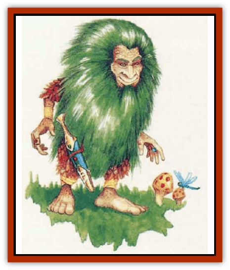

# Shargugh

| Statistic | **Shargugh** |
| --- | --- |
| **Activity Cycle:** | Any |
| **Alignment:** | Neutral |
| **Armor Class:** | 7 |
| **Climate/Terrain:** | Forest |
| **Damage/Attack:** | 1d4 (bite) or by weapon |
| **Diet:** | Omnivore |
| **Frequency:** | Very rare |
| **Hit Dice:** | 3 |
| **Intelligence:** | Average (8-10) |
| **Magic Resistance:** | Nil |
| **Morale:** | Steady (11) |
| **Movement:** | 15 |
| **No. Appearing:** | 1d3 |
| **No. of Attacks:** | 1 |
| **Organization:** | Solitary or clan |
| **Size:** | S (3' tall) |
| **Special Attacks:** | Stone throwing |
| **Special Defenses:** | Concealment, <i>transpon via plants</i> |
| **THAC0:** | 17 |
| **Treasure:** | U |
| **XP Value:** | 175 |

Shargugh (pronounced SHAR-guh) are small hairy humanoids about 3 feet tall. Their long, chronically matted and tangled hair is usually walnut brown, although some very rare individuals have dark-green locks. In addition, males have long, unkempt beards. Shargugh complexions tend to be dark and ruddy, their features coarse but oddly handsome, their eyes amber or deep green.

Shargugh wear ragged clothing made from woven leaves, grass, and scraps of fur and old cloth. They rarely if ever wear shoes.

Adults of either sex weigh between 30 and 40 pounds. A shargugh can live about 250 years.

Shargugh speak their own language and the secret tongue of druids; about 35% also speak Common.

**Combat:** A shargugh can deliver a nasty bite, but 50% of all groups arm themselves with daggers or short swords. At least one member of an armed group will have a silver weapon. All shargugh are expert stone throwers; each typically carries 1d4+1 stones and can hurl one per round (with a range of 20/40/60). These stones inflict 1d4 points of damage; a shargugh gains a +3 bonus to attack rolls when hurling them.

Shargugh are well adapted to their woodland homes and can pass through brambles and undergrowth with ease, just as druids can. Furthermore, they can conceal themselves in wooded areas with a 90% chance of success. They can climb vines and trees just as a thief climbs walls (75% chance) and can move silently 85% of the time. Expert sneak thieves, they have an 85% chance to pick pockets.

Five times a day, a shargugh can use *transport via plants*, though the maximum distance it can travel is 600 yards. The shargugh always has a 100% chance of arriving at the location it desires, so long as the location is within the 600-yard range.

Shargugh are mischievous and tend to steal valuable objects from any outsider they encounter unless the intruder bribes them with food or drink. They aggressively protect their woodland homes and do not tolerate wanton destruction of forests. They use their ability to hide in and move through undergrowth to avoid hand-to-hand combat with stronger creatures. Their pick pocket and *transport via plants* abilities enable them to steal weapons and spell components from their foes, then throw stones from a safe distance.

**Habitat/Society:** Shargugh live singly or in family groups. Families usually number three (two parents and a single offspring). The young shargugh will be a noncombatant infant 25% of the time and a juvenile or young adult with full adult abilities 75% of the time.

Each individual or group claims a section of woodland roughly 24 miles across. Shargugh generally maintain friendly relations with any good or neutral woodland creatures living in their tenitory and will tolerate evil creatures as well, provided that these creatures do not harm the woods or try to subjugate the shargugh. [[Dryad|Dryads]], [[Centaur|centaurs]], [[Unicorn|unicorns]], and [[Treant|treants]] usually can count on the shargugh as allies.

**Ecology:** Shargugh have symbiotic relationships with their territories. The shargugh's life force both draws strength from and gives strength to its woodland home. In addition, shargugh actively care for their territories - pruning the trees, picking the fruit, and fending off external threats.

Shargugh never voluntarily leave their territories. If forced to do so, they sicken and die in only one or two days. If a section of woodland loses its shargugh, it becomes cursed and infertile for seven years. During this time, no new trees or plants will grow. The existing plants don't die, but they produce no fruit or offspring. Only a *remove curse* spell from a druid of at least 12th level or a *wish* can restore fertility to the land before the end of the seven years.

A young shargugh never really leaves its parent's territory. The youngster either remains until its parents die, in which case it inherits their territory, or the youngster and parents move to opposite sides of the parents' territory. Eventually, the two groups form two entirely new territories with a common border.

---
## Discovery & Documentation

**Source Publication:** Mystara Appendix (1994)
**Campaign Setting:** Mystara
**Author(s):** John Nephew, Teeuwynn Woodruff, John Terra, Skip Williams

### Other Creatures Found in This Source Book
   * [[Actaeon|Actaeon]]
   * [[Agarat|Agarat]]
   * [[Ash_Crawler|Ash Crawler]]
   * [[Baldandar|Baldandar]]
   * [[Bargda|Bargda]]
   * [[Bhut|Bhut]]
   * [[Bird_Mystara|Bird (Mystara)]]
   * [[Blackball|Blackball]]
   * [[Choker|Choker]]
   * [[Coltpixie|Coltpixie]]
   * [[Crone_of_Chaos|Crone of Chaos]]
   * [[Darkhood|Darkhood]]
   * [[Darkwing|Darkwing]]
   * [[Decapus|Decapus]]
   * [[Deep_Glaurant|Deep Glaurant]]
   * [[Diabolus|Diabolus]]
   * [[Dimensional_Warper|Dimensional Warper]]
   * [[Dragon_Mystara_Crystalline|Dragon (Mystara), Crystalline]]
   * [[Dragon_Mystara_Jade|Dragon (Mystara), Jade]]
   * [[Dragon_Mystara_Onyx|Dragon (Mystara), Onyx]]
   * [[Dragon_Mystara_Ruby|Dragon (Mystara), Ruby]]
   * [[Drake_Mystara|Drake (Mystara)]]
   * [[Dragonfly|Dragonfly]]
   * [[Dusanu|Dusanu]]
   * [[Elemental_of_Chaos_Air_Earth|Elemental of Chaos, Air/Earth]]
   * [[Elemental_of_Chaos_Fire_Water|Elemental of Chaos, Fire/Water]]
   * [[Elemental_of_Law_Air_Earth|Elemental of Law, Air/Earth]]
   * [[Elemental_of_Law_Fire_Water|Elemental of Law, Fire/Water]]
   * [[Familiar_Mystara|Familiar (Mystara)]]
   * [[Frost_Salamander|Frost Salamander]]
   * [[Fundamental_Air_Earth|Fundamental, Air/Earth]]
   * [[Fundamental_Fire_Water|Fundamental, Fire/Water]]
   * [[Gargantua_Mystara|Gargantua (Mystara)]]
   * [[Geonid|Geonid]]
   * [[Ghostly_Horde|Ghostly Horde]]
   * [[Giant_Athach|Giant, Athach]]
   * [[Giant_Hephaeston|Giant, Hephaeston]]
   * [[Golem_Drolem|Golem, Drolem]]
   * [[Golem_Mystara_I|Golem (Mystara) I]]
   * [[Golem_Mystara_II|Golem (Mystara) II]]
   * [[Golem_Mystara_III|Golem (Mystara) III]]
   * [[Gray_Philosopher|Gray Philosopher]]
   * [[Guardian_Warrior|Guardian Warrior]]
   * [[Gyerian|Gyerian]]
   * [[Herex|Herex]]
   * [[Hivebrood|Hivebrood]]
   * [[Horde|Horde]]
   * [[Hsiao|Hsiao]]
   * [[Huptzeen|Huptzeen]]
   * [[Hutaakan|Hutaakan]]
   * [[Imp_Mystara|Imp (Mystara)]]
   * [[Jellyfish_Giant_Mystara|Jellyfish, Giant (Mystara)]]
   * [[Kna|Kna]]
   * [[Kopru|Kopru]]
   * [[Lizard_Mystara|Lizard (Mystara)]]
   * [[Lizard-kin_Mystara|Lizard-kin (Mystara)]]
   * [[Lupin|Lupin]]
   * [[Lycanthrope_Werejaguar_Mystara|Lycanthrope, Werejaguar (Mystara)]]
   * [[Lycanthrope_Wereswine|Lycanthrope, Wereswine]]
   * [[Magen|Magen]]
   * [[Manikin|Manikin]]
   * [[Mek|Mek]]
   * [[Mujina|Mujina]]
   * [[Nagpa|Nagpa]]
   * [[Neh-thalggu|Neh-thalggu]]
   * [[Nightshade_Mystara|Nightshade (Mystara)]]
   * [[Nuckalavee|Nuckalavee]]
   * [[Pegataur|Pegataur]]
   * [[Phanaton|Phanaton]]
   * [[Plant_Dangerous_Mystara|Plant, Dangerous (Mystara)]]
   * [[Plasm|Plasm]]
   * [[Rakasta|Rakasta]]
   * [[Rock_Man|Rock Man]]
   * [[Sabreclaw|Sabreclaw]]
   * [[Sacrol|Sacrol]]
   * [[Scamille|Scamille]]
   * [[Shapeshifter|Shapeshifter]]
   * [[Shark-kin|Shark-kin]]
   * [[Sollux|Sollux]]
   * [[Spectral_Death|Spectral Death]]
   * [[Spectral_Hound|Spectral Hound]]
   * [[Spider-kin|Spider-kin]]
   * [[Spirit_Mystara|Spirit (Mystara)]]
   * [[Statue_Living|Statue, Living]]
   * [[Surtaki|Surtaki]]
   * [[Tabi|Tabi]]
   * [[Thoul|Thoul]]
   * [[Thunderhead|Thunderhead]]
   * [[Tiger_Ebon|Tiger, Ebon]]
   * [[Topi|Topi]]
   * [[Tortle|Tortle]]
   * [[Vampire_Velya|Vampire, Velya]]
   * [[White_Fang|White Fang]]
   * [[Worm_Mystara|Worm (Mystara)]]
   * [[Wyrd|Wyrd]]
   * [[Yowler|Yowler]]
   * [[Zombie_Lightning|Zombie, Lightning]]
