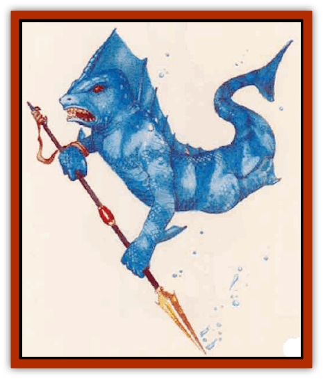

# Shark-kin

| Statistic | **Shark-kin** |
| --- | --- |
| **Activity Cycle:** | Any |
| **Alignment:** | Neutral |
| **Armor Class:** | 5 |
| **Climate/Terrain:** | Any ocean |
| **Damage/Attack:** | 1d3 (claw)/1d3 (claw)/1d6 (bite) or 1d6 (bite) and by weapon |
| **Diet:** | Omnivore |
| **Frequency:** | Common |
| **Hit Dice:** | 2 |
| **Intelligence:** | Average (8-10) |
| **Magic Resistance:** | Nil |
| **Morale:** | Steady (12) |
| **Movement:** | Sw 24 |
| **No. Appearing:** | 1d4&times;20 |
| **No. of Attacks:** | 3 or 2 |
| **Organization:** | Tribal |
| **Size:** | M (6-7' long) |
| **Special Attacks:** | Nil |
| **Special Defenses:** | Nil |
| **THAC0:** | 19 |
| **Treasure:** | U |
| **XP Value:** | 65 / Elder: 120 |

These nomadic marine humanoids have large, staring eyes, fin-crested heads, and scaly skin. Their hands and feet are webbed and clawed. A shark-kin's legs are vestigial; the creature swims by means of its powerful, alligatorlike tail.

Most shark-kin are reddidh brown, though some are dark blue or blue-black. Their skin is usually covered with patterns of spots or bands of lighter color - white or yellow in reddish-brown individuals; silver, light blue, or metallic green in blue or blue-black shark-kin. Each individual's pattern of spots or bands is unique.

A shark-kin's eyes have a reflective laver that concentrates any available light. This allows them to see well even in dark or murky water; it also makes their eyes seem to glow, like a cat's, when bright light strikes them.

Adult shark-kin of both sexes are between 6 and 7 feet long, measured from nose to tail, and weigh 190 to 250 pounds. Most live to be 120 years old, though some individuals have been known to live twice that long.

Shark-kin speak their own tongue; 40% also speak Common or the tongue of another ocean race.

**Combat:** Shark-kin are aggressive hunters but usually avoid combat with intelligent species, attackmg only in self defense or to defend their territory.

Adult shark-kin carry javelins and tridents. One out of every four in a hunting or war party also carries a net. Unarmed shark-kin attack with claws and bite; those carrying a weapon can both attack with the weapon and bite in the same round.

The most important part of any group's defense is its pack of pet [[Shark|sharks]]. Each shark-kin tribe maintains a pack of 4d6 sharks, one for every two or three adult shark-kin: 25% of the sharks in the pack have 7 or 8 Hit Dice, 25% have 5 or 6 Hit Dice, and the remainder have 3 or 4 Hit Dice. If the shark-kin tribe numbers 50 or more, one of their sharks will be a giant specimen with 10 to 12 Hit Dice. Shark-kin have an empathic link with their sharks and can give them basic commands (such as come, go, turn, stop, and attack) at a range of 360 yards.

In battle, shark-kin and their sharks attack on a broad front, trying to surround their foes in all three dimensions. Then, at a sign from their elder, they all converge on a single point in the enemy ranks, trying to fight as few foes as possible with as many allies as possible.

**Habitat/Society:** Shark-kin live in tribal groups led by an elder with 3 Hit Dice. Each tribe claims a territory covering about 120 square miles, which they vigorously defend from all other ocean races. They tend to be hospitable to stranpen, but visitors are not encouraged to stay long. No outsider is allowed to hunt in their territory or to take anything from it without permission from the tribal elder. Shark-kin tend to be very possessive of any shipwrecks in their territory, as these usually act as artificial reefs teeming with sea life. Adventurers seeking salvage rights must be prepared to bargain well or fight hard.

Shark-kin spend their time foraging and hunting for food or caring for their sharks, who serve them much as hunting dogs serve humans. If the hunting in an area is particularly good, such as near a spawning ground for fish, a shark-kin tribe will construct temporary homes out of whatever materials are at hand and settle down as long as the bounty lasts. Otherwise they never stay in one area within their territory for long.

If a tribe's elder is killed or dies, the surviving adults undergo a mysterious change. Over the next few weeks, their legs grow and their gills change to allow them to breathe both air and water. This change (which sages believe is a throwback to the race's ancient terrestrial origins) allows the shark-kin to move on land as easily as a human. The tribe's senior adults (10+1d10 individuals of both sexes) walk ashore and head to a traditional site, usually a hilltop or mountain, where they conduct an age-old ceremony to select a new elder. Thereafter, the group returns to the sea and all the shark-kin revert to their normal forms.

**Ecology:** Shark-kin eat whatever seafood they can catch. Fish and mollusks form the basis of their diest, though they also prey upon sea mammals when they are available.

---
## Discovery & Documentation

**Source Publication:** Mystara Appendix (1994)
**Campaign Setting:** Mystara
**Author(s):** John Nephew, Teeuwynn Woodruff, John Terra, Skip Williams

### Other Creatures Found in This Source Book
   * [[Actaeon|Actaeon]]
   * [[Agarat|Agarat]]
   * [[Ash_Crawler|Ash Crawler]]
   * [[Baldandar|Baldandar]]
   * [[Bargda|Bargda]]
   * [[Bhut|Bhut]]
   * [[Bird_Mystara|Bird (Mystara)]]
   * [[Blackball|Blackball]]
   * [[Choker|Choker]]
   * [[Coltpixie|Coltpixie]]
   * [[Crone_of_Chaos|Crone of Chaos]]
   * [[Darkhood|Darkhood]]
   * [[Darkwing|Darkwing]]
   * [[Decapus|Decapus]]
   * [[Deep_Glaurant|Deep Glaurant]]
   * [[Diabolus|Diabolus]]
   * [[Dimensional_Warper|Dimensional Warper]]
   * [[Dragon_Mystara_Crystalline|Dragon (Mystara), Crystalline]]
   * [[Dragon_Mystara_Jade|Dragon (Mystara), Jade]]
   * [[Dragon_Mystara_Onyx|Dragon (Mystara), Onyx]]
   * [[Dragon_Mystara_Ruby|Dragon (Mystara), Ruby]]
   * [[Drake_Mystara|Drake (Mystara)]]
   * [[Dragonfly|Dragonfly]]
   * [[Dusanu|Dusanu]]
   * [[Elemental_of_Chaos_Air_Earth|Elemental of Chaos, Air/Earth]]
   * [[Elemental_of_Chaos_Fire_Water|Elemental of Chaos, Fire/Water]]
   * [[Elemental_of_Law_Air_Earth|Elemental of Law, Air/Earth]]
   * [[Elemental_of_Law_Fire_Water|Elemental of Law, Fire/Water]]
   * [[Familiar_Mystara|Familiar (Mystara)]]
   * [[Frost_Salamander|Frost Salamander]]
   * [[Fundamental_Air_Earth|Fundamental, Air/Earth]]
   * [[Fundamental_Fire_Water|Fundamental, Fire/Water]]
   * [[Gargantua_Mystara|Gargantua (Mystara)]]
   * [[Geonid|Geonid]]
   * [[Ghostly_Horde|Ghostly Horde]]
   * [[Giant_Athach|Giant, Athach]]
   * [[Giant_Hephaeston|Giant, Hephaeston]]
   * [[Golem_Drolem|Golem, Drolem]]
   * [[Golem_Mystara_I|Golem (Mystara) I]]
   * [[Golem_Mystara_II|Golem (Mystara) II]]
   * [[Golem_Mystara_III|Golem (Mystara) III]]
   * [[Gray_Philosopher|Gray Philosopher]]
   * [[Guardian_Warrior|Guardian Warrior]]
   * [[Gyerian|Gyerian]]
   * [[Herex|Herex]]
   * [[Hivebrood|Hivebrood]]
   * [[Horde|Horde]]
   * [[Hsiao|Hsiao]]
   * [[Huptzeen|Huptzeen]]
   * [[Hutaakan|Hutaakan]]
   * [[Imp_Mystara|Imp (Mystara)]]
   * [[Jellyfish_Giant_Mystara|Jellyfish, Giant (Mystara)]]
   * [[Kna|Kna]]
   * [[Kopru|Kopru]]
   * [[Lizard_Mystara|Lizard (Mystara)]]
   * [[Lizard-kin_Mystara|Lizard-kin (Mystara)]]
   * [[Lupin|Lupin]]
   * [[Lycanthrope_Werejaguar_Mystara|Lycanthrope, Werejaguar (Mystara)]]
   * [[Lycanthrope_Wereswine|Lycanthrope, Wereswine]]
   * [[Magen|Magen]]
   * [[Manikin|Manikin]]
   * [[Mek|Mek]]
   * [[Mujina|Mujina]]
   * [[Nagpa|Nagpa]]
   * [[Neh-thalggu|Neh-thalggu]]
   * [[Nightshade_Mystara|Nightshade (Mystara)]]
   * [[Nuckalavee|Nuckalavee]]
   * [[Pegataur|Pegataur]]
   * [[Phanaton|Phanaton]]
   * [[Plant_Dangerous_Mystara|Plant, Dangerous (Mystara)]]
   * [[Plasm|Plasm]]
   * [[Rakasta|Rakasta]]
   * [[Rock_Man|Rock Man]]
   * [[Sabreclaw|Sabreclaw]]
   * [[Sacrol|Sacrol]]
   * [[Scamille|Scamille]]
   * [[Shapeshifter|Shapeshifter]]
   * [[Shargugh|Shargugh]]
   * [[Sollux|Sollux]]
   * [[Spectral_Death|Spectral Death]]
   * [[Spectral_Hound|Spectral Hound]]
   * [[Spider-kin|Spider-kin]]
   * [[Spirit_Mystara|Spirit (Mystara)]]
   * [[Statue_Living|Statue, Living]]
   * [[Surtaki|Surtaki]]
   * [[Tabi|Tabi]]
   * [[Thoul|Thoul]]
   * [[Thunderhead|Thunderhead]]
   * [[Tiger_Ebon|Tiger, Ebon]]
   * [[Topi|Topi]]
   * [[Tortle|Tortle]]
   * [[Vampire_Velya|Vampire, Velya]]
   * [[White_Fang|White Fang]]
   * [[Worm_Mystara|Worm (Mystara)]]
   * [[Wyrd|Wyrd]]
   * [[Yowler|Yowler]]
   * [[Zombie_Lightning|Zombie, Lightning]]
