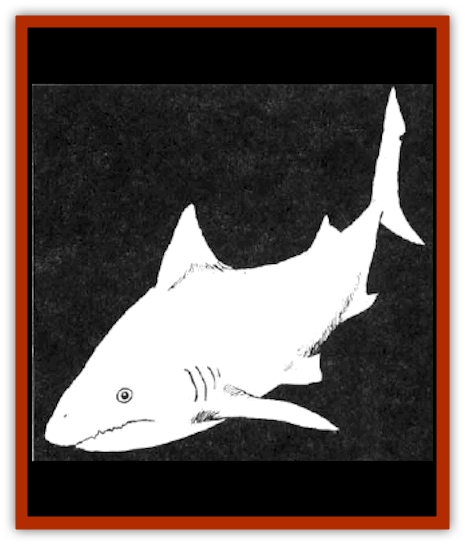

# Shark

| Statistic | **Common** | **Giant (Megalodon)** |
| --- | --- | --- |
| **Activity Cycle:** | Any | Any |
| **Alignment:** | Neutral | Neutral |
| **Armor Class:** | 6 | 5 |
| **Climate/Terrain:** | All oceans and seas | All oceans and seas |
| **Damage/Attack:** | 2-5, 2-8, or 3-12 | 4-16, 5-20, or 6-24 |
| **Diet:** | Carnivore | Carnivore |
| **Frequency:** | Common | Rare |
| **Hit Dice:** | 3-8 | 10-15 |
| **Intelligence:** | Non- (0) | Non- (0) |
| **Magic Resistance:** | Nil | Nil |
| **Morale:** | Average (10) | Steady (11) |
| **Movement:** | Sw 24 | Sw 18 |
| **No. Appearing:** | 3-12 | 1-3 |
| **No. of Attacks:** | 1 | 1 |
| **Organization:** | School | Solitary |
| **Size:** | M-L (5-15' long) | L-G (20-50' long) |
| **Special Attacks:** | Nil | Swallows whole |
| **Special Defenses:** | Nil | Nil |
| **THAC0:** | 3-4 HD: 17 / 5-6 HD: 15 / 7-8 HD: 13 | 10 HD: 11 / 11-12 HD: 9 / 13-14 HD: 7 / 15 HD: 5 |
| **Treasure:** | Nil | Nil |
| **XP Value:** | 3 HD: 65 / 4 HD: 120 / 5 HD: 175 / 6 HD: 270 / 7 HD: 420 / 8 HD: 650 | 10 HD: 2,000 / 11 HD: 3,000 / 12 HD: 5,000 / 13 HD: 6,000 / 14 HD: 7,000 / 15 HD: 8,000 |

Sharks are large, finned, voracious carnivores that inhabit all known oceans and seas. They are perhaps the most aggressive eating machines found in the murky deeps.

**Combat:** Sharks sense pressure changes underwater, most often caused by noises from other creatures. Thrashing about in the water always attracts sharks, since usually only wounded [[Fish|fish]] behave like that. Sharks can sense these motions from up to a mile away and once one shark discovers prey, more are soon to follow. Sharks also attack mercilessly at the scent of blood, which they can likewise detect at distances of a mile or more.

When a number of sharks gather around a bleeding victim, the scent of the blood and the thrill of the kill send all sharks into a feedng frenzy. Nothing escapes from such an attack, not even some sharks. Sharks eat anything living, even each other, during a feeding frenzy. Since sharks move up, take a bite of flesh, and retreat very quickly, up to ten normal-sized sharks can attack a man-sized opponent in the water every round.

Note that the huge megalodons (giant sharks) almost never reach a frenzy, since they are capable of swallowing most creatures whole on an attack roll that is 4 or more above the minimum number to hit. For example, a 15-Hit Die megalodon shark hits an AC 0 creature on an attack roll of 8 or more, but swallows that same creature on an attack roll of 12 or greater. Swallowed creatures suffer 20 points of damage for every round they remain inside the shark. A creature trapped within a megalodon can attack the beast from within, but with a cumulative -1 penalty to damage per round (i.e.. the first round attack has a -1 penalty, the second round attack has a -2 penalty, etc.). The victim must take the shark to 0 points or less before the shark's digestive juices finish their work.

Since most creaturees are swallowed quickly by a megalodon there is usually not enough blood in the vicinity to precipate a feeding frenzy. On occasion, however, fisherman out hunting for [[Whale|whales]] and other large water creatures have wounded their prey, only to have a swarm of huge prehistoric-sized megalodon sharks strip it to thebone within seconds. Few fishermen argue the point.

**Habitat/Society:** Sharks are pure eating and killing machines, evolving quite naturally into superior predators, and then remaining unchanged for millions of years. They are primarily scavengers, preying on the sick and wounded, but attack fresh meat if tempted to do so. They are very territorial and solitary.

The only friends the sharks have are the [[Sahuagin|sahuagin]], who appreciate the predators for their bloody, ruthless, and efficient natures. They often use sharks as guardians, mounts, sacrifices, and personal pets. The king of all sahuagin is rumored to possess a megalodon shark of largest size, which he apparently feeds quite often. Sahuagin priestesses offer all of their sacrifices to pure white great white sharks of largest size, that are often decorated in collars of gold and silver.

Sahuagin are the only known race to have successfully trained sharks as mounts and the process is secret. What is known is that a shark and its rider can both attack the same enemy with startling agility, making the combination one of the most fearsome in the deeps. The harness used to mount a sahuagin warrior on the back of a shark is apparently made of a special kind of seaweed, unknown to those of the surface world.

**Ecology:** Sharks have only two natural weaknesses. The first one is that their internal organs are only poorly protected by a thick, flexible layer of gristle instead of a hard skeleton. Some creatures, such as [[Dolphin|dolphins]], take advantage of this by ramming sharks from the side. Because of their highly intelligent nature, dolphins are the only true enemies of sharks. They are the only known species that actively hunts down and kills these otherwise greatly feared and respected monsters.

Sharks are also forced to continuously move through the water in order to force sufficient volumes of oxygen-rich water past their primitive gills. Therefore, a shark that is held immobile for 2-5 hours will die of suffocation. Common spells useful against sharks are *hold monster*, paralyzation attacks and poisons, and all normal damage causing spells (subject to underwater casting limitations, of course).

---
## Discovery & Documentation

**Source Publication:** MC2 Volume II (1993)
**Campaign Setting:** Advanced Dungeons & Dragons 2nd Edition
**Author(s):** Jay Batista, Scott Bennie, Grant Boucher, William W. Connors, Steve Gilbert, Heike Kubasch, James Lowder, David Edward Martin, Bruce Nesmith, Jean Rabe, Rick Swan, John J. Terra, Gary L. Thomas

### Other Creatures Found in This Source Book
   * [[Ant|Ant]]
   * [[Ant_Lion_Giant|Ant Lion, Giant]]
   * [[Ape_Carnivorous|Ape, Carnivorous]]
   * [[Baboon|Baboon]]
   * [[Badger|Badger]]
   * [[Barracuda|Barracuda]]
   * [[Beetle_Giant|Beetle, Giant]]
   * [[Bulette|Bulette]]
   * [[Bullywug|Bullywug]]
   * [[Dwarf_Duergar|Dwarf, Duergar]]
   * [[Dwarf_Gully|Dwarf, Gully]]
   * [[Eagle|Eagle]]
   * [[Eel|Eel]]
   * [[Elemental_Air_Kin|Elemental, Air Kin]]
   * [[Elemental_Water_Kin|Elemental, Water Kin]]
   * [[Elemental_Water_Kin_Water_Weird|Elemental, Water Kin, Water Weird]]
   * [[Firestar|Firestar]]
   * [[Firetail|Firetail]]
   * [[Fish_Giant|Fish, Giant]]
   * [[Frog|Frog]]
   * [[Gorgon|Gorgon]]
   * [[Hawk|Hawk]]
   * [[Heucuva|Heucuva]]
   * [[Hippocampus|Hippocampus]]
   * [[Hippogriff|Hippogriff]]
   * [[Kelpie|Kelpie]]
   * [[Kenku|Kenku]]
   * [[Killmoulis|Killmoulis]]
   * [[Kuo-Toa|Kuo-Toa]]
   * [[Lamia|Lamia]]
   * [[Lammasu|Lammasu]]
   * [[Lamprey|Lamprey]]
   * [[Leech|Leech]]
   * [[Leprechaun|Leprechaun]]
   * [[Leucrotta|Leucrotta]]
   * [[Locathah|Locathah]]
   * [[Lycanthrope_Wereboar|Lycanthrope, Wereboar]]
   * [[Lycanthrope_Werefox|Lycanthrope, Werefox]]
   * [[Mammal_Minimal|Mammal, Minimal]]
   * [[Mammal_Small|Mammal, Small]]
   * [[Mimic|Mimic]]
   * [[Morkoth|Morkoth]]
   * [[Muckdweller|Muckdweller]]
   * [[Myconid|Myconid]]
   * [[Naga|Naga]]
   * [[Obliviax|Obliviax]]
   * [[Octopus_Giant|Octopus, Giant]]
   * [[Otyugh|Otyugh]]
   * [[Piranha|Piranha]]
   * [[Plant_Dangerous_I|Plant, Dangerous I]]
   * [[Plant_Intelligent|Plant, Intelligent]]
   * [[Poltergeist|Poltergeist]]
   * [[Porcupine|Porcupine]]
   * [[Rat_Osquip|Rat, Osquip]]
   * [[Roc|Roc]]
   * [[Roper|Roper]]
   * [[Rot_Grub|Rot Grub]]
   * [[Rust_Monster|Rust Monster]]
   * [[Sahuagin|Sahuagin]]
   * [[Sea_Lion|Sea Lion]]
   * [[Sea_Horse_Giant|Sea Horse, Giant]]
   * [[Shambling_Mound|Shambling Mound]]
   * [[Sphinx|Sphinx]]
   * [[Squid_Giant|Squid, Giant]]
   * [[Stirge|Stirge]]
   * [[Swanmay|Swanmay]]
   * [[Tarrasque|Tarrasque]]
   * [[Tasloi|Tasloi]]
   * [[Triton|Triton]]
   * [[Troglodyte|Troglodyte]]
   * [[Urchin|Urchin]]
   * [[Urd|Urd]]
   * [[Weasel|Weasel]]
   * [[Wolverine|Wolverine]]
   * [[Yellow_Musk_Creeper|Yellow Musk Creeper]]
