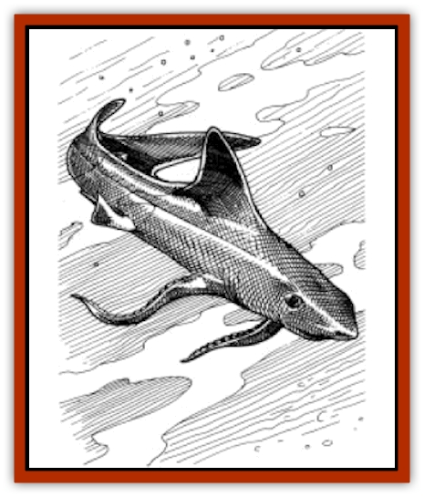

# Shark - Athas

| Statistic | **Shark (Athas)** |
| --- | --- |
| **Activity Cycle:** | Any |
| **Alignment:** | Any evil |
| **Armor Class:** | 4 |
| **Climate/Terrain:** | The Last Sea |
| **Damage/Attack:** | 2-8 |
| **Diet:** | Carnivore |
| **Frequency:** | Uncommon |
| **Hit Dice:** | 5 |
| **Intelligence:** | Semi (4) |
| **Magic Resistance:** | Nil |
| **Morale:** | Average (10) |
| **Movement:** | Sw 24 |
| **No. Appearing:** | 3-12 |
| **No. of Attacks:** | 1 |
| **Organization:** | School |
| **Size:** | L (10'+ long) |
| **Special Attacks:** | Nil |
| **Special Defenses:** | Nil |
| **THAC0:** | 15 |
| **Treasure:** | Nil |
| **XP Value:** | 300 |

Athasian sharks are similar to [[Shark|sharks]] of other worlds in many ways. They are large, cartilaginous, seagoing invertebrates that are basically cold-hearted eating machines. They are long and gray, and their mouths are filled with row after row of sharp, vicious teeth. The skin of an Athasian shark is fairly tough, and it is from this material that most [[Lizard_Man_Athas|lizard man]] shields are made.

**Combat:** In a battle, sharks are deadly foes. They tend to hunt in packs, and a person floundering about in the water is usually easy prey. They are fast, striking like lightning, often hitting and darting away before the victim is even aware of what has happened. Because of this, up to 10 sharks can attack a man-sized opponent in a single round.

**Habitat/Society:** Sharks tend to travel in packs for purposes of both hunting and safety. There is very little that can stand up to a school of hungry sharks in their element. The one thing that poises a certain danger for them, though, is a [[Dolphin_Athas|dolphin]]. Make a morale check each time a group of sharks is outnumbered by dolphins. If the sharks fail, they immediately scatter and flee, leaving their wounded behind in their single-minded desire to escape the dolphins' wrath.

Athasian sharks (of which only a single species remains) are brighter than other sharks, but this translates more into animal cunning than any raw intelligence. They have been in constant conflict with the Last Sea's dolphin population since the valley's isolation nine millennia ago. Although they are bigger and stronger than their mammalian foes, they have no psionic abilities. Due mostly to this fact and their inability to formulate and stick to a decent battle plan, they have remained on the losing side of the majority of their battles with the dolphins. Occasionally they manage to victimize a lone dolphin, but rarely if ever are they able to sustain a serious attack against an entire pod.

**Ecology:** Little matters to sharks except where their next meal is coming from. While their favorite meal is undoubtedly dolphin, they are the ultimate omnivores, willing to eat pretty much anything. They can smell blood in the sea from up to a mile away, and once they get its scent, they will pursue it until either they find the source or discover that it has somehow gotten away.

---
## Discovery & Documentation

**Source Publication:** Monstrous Compendium, 1997 Annual, Volume 4 (1995)
**Campaign Setting:** Advanced Dungeons & Dragons 2nd Edition
**Author(s):** Jon Pickens

### Other Creatures Found in This Source Book
   * [[Anemone_Giant_Sea|Anemone, Giant Sea]]
   * [[Asperii|Asperii]]
   * [[Bainligor|Bainligor]]
   * [[Beast_of_Chaos|Beast of Chaos]]
   * [[Blindheim|Blindheim]]
   * [[Bloodsipper_Far_Realm|Bloodsipper (Far Realm)]]
   * [[Bulette_Gohlbrorn|Bulette, Gohlbrorn]]
   * [[Child_of_the_Sea|Child of the Sea]]
   * [[Clockwork_Horror|Clockwork Horror]]
   * [[Clockwork_Swordsman|Clockwork Swordsman]]
   * [[Coral|Coral]]
   * [[Darklore|Darklore]]
   * [[Dharculus|Dharculus]]
   * [[Dolphin_Athas|Dolphin (Athas)]]
   * [[Dragon_Neutral_Moonstone|Dragon, Neutral, Moonstone]]
   * [[Dragon_Prismatic|Dragon, Prismatic]]
   * [[Dream_Stalker|Dream Stalker]]
   * [[Dragon-kin_Albino_Wyrm|Dragon-kin, Albino Wyrm]]
   * [[Echyan|Echyan]]
   * [[Firestar|Firestar]]
   * [[Firetail|Firetail]]
   * [[Fish_Ascallion|Fish, Ascallion]]
   * [[Fish_Deep_Ocean|Fish, Deep Ocean]]
   * [[Fish_Tropical|Fish, Tropical]]
   * [[Fish_Vurgens|Fish, Vurgens]]
   * [[Fogwarden|Fogwarden]]
   * [[Fraal|Fraal]]
   * [[Giant_Crag|Giant, Crag]]
   * [[Gibberling_Brood|Gibberling, Brood]]
   * [[Glutton_Sea|Glutton, Sea]]
   * [[Golden_Ammonite|Golden Ammonite]]
   * [[Golem_Brass_Minotaur|Golem, Brass Minotaur]]
   * [[Golem_Gemstone|Golem, Gemstone]]
   * [[Golem_Maggot|Golem, Maggot]]
   * [[Groundling|Groundling]]
   * [[Hermit_Sea|Hermit, Sea]]
   * [[Hound_of_Law|Hound of Law]]
   * [[Human_Amazon|Human, Amazon]]
   * [[Human_Pygmy|Human, Pygmy]]
   * [[Inquisitor|Inquisitor]]
   * [[Kercpa|Kercpa]]
   * [[Kreel|Kreel]]
   * [[Lycanthrope_Lythari|Lycanthrope, Lythari]]
   * [[Mercurial|Mercurial]]
   * [[Mold_Chromatic|Mold, Chromatic]]
   * [[Mummy_Bog|Mummy, Bog]]
   * [[Neh-thalggu|Neh-thalggu]]
   * [[Nymph_Grain|Nymph, Grain]]
   * [[Nymph_Unseelie|Nymph, Unseelie]]
   * [[Octopus_Octo-Jelly|Octopus, Octo-Jelly]]
   * [[Puddingfish|Puddingfish]]
   * [[Sea_Demon|Sea Demon]]
   * [[Shade|Shade]]
   * [[Shadowrath|Shadowrath]]
   * [[Siren_Ravenloft|Siren (Ravenloft)]]
   * [[Skeleton_Variant|Skeleton, Variant]]
   * [[Skyfish|Skyfish]]
   * [[Spectral_Scion|Spectral Scion]]
   * [[Spyder_Fiend|Spyder Fiend]]
   * [[Squid_Squark|Squid, Squark]]
   * [[Tanar'ri_Lesser_Uridezu|Tanar'ri, Lesser, Uridezu]]
   * [[Troll_Mutate|Troll Mutate]]
   * [[Vaati|Vaati]]
   * [[Vampire_Cerebral|Vampire, Cerebral]]
   * [[Varkha|Varkha]]
   * [[Wizshade|Wizshade]]
   * [[Worm_Lukhorn|Worm, Lukhorn]]
   * [[Wyste|Wyste]]
   * [[Yugoloth_Lesser_Gacholoth|Yugoloth, Lesser, Gacholoth]]
   * [[Zombie_Mud|Zombie, Mud]]
