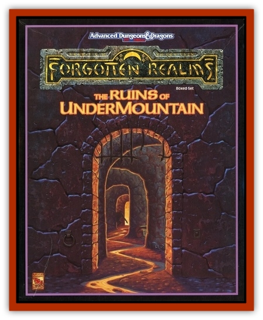

# Sharn

| Statistic | **Sharn** |
| --- | --- |
| **Activity Cycle:** | Any |
| **Alignment:** | Chaotic neutral |
| **Armor Class:** | 2/6 (portal/tentacles or body) |
| **Climate/Terrain:** | Any/Land |
| **Damage/Attack:** | 2-5 &times;3 (heads)/1-2 or by weapon type &times;9 (3 tri-hands) |
| **Diet:** | Omnivore |
| **Frequency:** | Very rare |
| **Hit Dice:** | 6+6 |
| **Intelligence:** | Genius (17-18) |
| **Magic Resistance:** | 30% |
| **Morale:** | Fanatic (18) |
| **Movement:** | 4, Fl 14 (C) |
| **No. Appearing:** | 1-12 |
| **No. of Attacks:** | 12 |
| **Organization:** | Clan |
| **Size:** | H (16' long) |
| **Special Attacks:** | <i>Ethereal portal</i> attacks |
| **Special Defenses:** | Regeneration |
| **THAC0:** | 15 |
| **Treasure:** | Nil |
| **XP Value:** | 7,000 |

An enigma little understood by sages or adventurers of the Realms, these curious creatures are resident in several large underground complexes, including Undermountain. The sharn seem to feed on adventurers and will repeatedly menace PCs exploring the dungeon's lower levels.

Sharn appear as glossy black teardrops of somewhat amorphous flesh, studded with many tiny eyes and surrounded by a nimbus of purple light. Opponents rarely get to see these vulnerable central bodies, as surviving encounters with a sharn is a rare feat indeed. Attempts to mentally contact a sharn by psionic or other means result in success only if the sharn wishes it. Sharn share a peculiar form of short-range group telepathy among themselves.

**Combat:** Sharn can create miniature �portals' - *ethereal windows* - up to 400' away from their bodies. The sharn can create and maintain up to 6 portals at once, using all to attack from any variety of angles. A sharn can extend three heads with fanged maws and three trihand arms to attack opponents and prey at a distance. Each of these six appendages is studded with many tiny eyes which have 60' infravision, and each appendage has its own independent portal. Each appendage has an armor class of 4.

A portal appears as a nimbus or spiral of winking, moving points of purple radiance and is MV 6. When opening or closing, portals look like tiny spots or whirling rings of purple light. Consider a portal to be AC2; damage from attacks which hit the portal is transmitted to the central body.

The trihand arms are snake-like, flexible trunks that end in an �elbow' where three human-like forearms split apart from each other. Each arm ends in a human-like hand which can punch or rake for 1-2 points of damage, snatch items, or wield weapons.

Consider both arms and snake-heads to have the same armor class as the central body of a sharn. Attacks on a particular hand need to hit an armor class of 3 because of the close proximity of two other forearms in a trihand. Attacks against a specific hand can shatter a held item, disarm the hand, or sever a finger wearing a magical ring.

Sharn have uniquely peculiar minds; they are immune to all enchantment/charm spells, and are never fooled by illusions. A sharn can psionically *scramble* a mind in contact with it, reaching through the mental link as a special, additional attack. The victim must make an Intelligence check with a penalty of +3, or suffer effects equal to a *feeblemind* spell.

Sharn regenerate one lost hit point every two turns as long as they have access to heat or sunlight and water, whether in liquid form or in snow, ice, or blood.

**Habitat/Society:** Sharn reproduce by budding when they reach a certain size - 55 hit points or greater. Sharn are sophisticated, farsighted creatures, and are known to be interested in magic, planar travel, and mastery of a variety of environments on the Prime Material Plane and beyond. All sharn within a particular area are part of a large family, or clan. Each clan holds particular aims, decided upon and modified by the entire clan in council, but these aims remain mysterious to outsiders. Sharn try to remain apart from the daily workings of these transient surroundings. One human sage, Orblyn of Zazesspur, called the sharn "The Great Aloof Ones", an accurate, telling description.

The sharn clan in Undermountain worships the Drowned Queen, a mysterious creature who lives in the depths of the Sargauth. The Queen is thought by some to be an [[Aboleth|aboleth]] with unusual magical abilities akin to those of the sharn. Other sharn clans appear to worship a variety of deities, including human, elven, and even goblinish gods.

**Ecology:** Sharn eat lichens, green plants, and roots as well as mammalian prey.

---
## Discovery & Documentation

**Source Publication:** Ruins of Undermountain I (1994)
**Campaign Setting:** Forgotten Realms
**Author(s):** Ed Greenwood

### Other Creatures Found in This Source Book
   * [[Automaton_Scaladar|Automaton, Scaladar]]
   * [[Beholder-kin_Death_Kiss|Beholder-kin, Death Kiss]]
   * [[Beholder_Elder_Orb|Beholder, Elder Orb]]
   * [[Darktentacles|Darktentacles]]
   * [[Ibrandlin|Ibrandlin]]
   * [[Slithermorph|Slithermorph]]
   * [[Snake_Flying|Snake, Flying]]
   * [[Steel_Shadow|Steel Shadow]]
   * [[Watchghost|Watchghost]]
