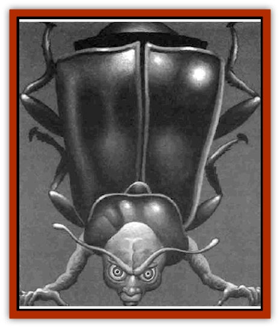

# Shattered Brethren

| Statistic | **Shattered Brethren** |
| --- | --- |
| **Activity Cycle:** | Any |
| **Alignment:** | Neutral evil |
| **Armor Class:** | Varies |
| **Climate/Terrain:** | Subterranean |
| **Damage/Attack:** | Varies |
| **Diet:** | Varies |
| **Frequency:** | Rare |
| **Hit Dice:** | 3 |
| **Intelligence:** | Low (5-7) |
| **Magic Resistance:** | Nil |
| **Morale:** | Unsteady (5-7) |
| **Movement:** | 5-30 |
| **No. Appearing:** | Varies |
| **No. of Attacks:** | Varies |
| **Organization:** | Fraternal |
| **Size:** | M (4-7' tall) |
| **Special Attacks:** | See below |
| **Special Defenses:** | Regeneration/psionics |
| **THAC0:** | 17 |
| **Treasure:** | I,K,M |
| **XP Value:** | 250 |

The Shattered Brethren are largely the same as common [[Broken_One|broken ones]] - they are the result of the cruel experiments of [[Mind_Flayer|mind flayers]]. The main difference between Bluetspur's broken ones and their cousins is that the Bluetspur brethren have developed innate defenses that prevent psionic intrusions. They also possess random wild talents (see *The Complete Psionics Handbook* or assign a random wizard spell from the *Player's Handbook* as an innate mental power). Not all Shattered Brethren are so endowed, but those who fail to develop these defenses usually die under the stress of slavery.

Bluetspur's broken ones resemble the animals that they have been magically and genetically linked with; they favor their animal half over their human half. They include a wide variety of animal types because the mind flayers are constantly looking for combinations that make useful slaves. Common animal forms useful to the illithids include: the [[Bat|bat]], for sonic navigation and flight; the [[Horse|horse]], for its speed and strength; any rodent, for breeding more slaves.

The broken ones know the languages they spoke before their conversions, but they also speak a secret language peculiar to them, a mesh of all the members' languages, plus terms they have adopted to describe things in their closed environment. The broken ones' conversation sounds like a mixture of street slang and foreign languages, incomprehensible to even the most talented linguist.

**Habitat/Society:** Bluetspur's broken ones are the lucky few who have developed ways to avoid the mind flayers' psionic means of control over them. They escaped their former masters and fled into the fissures that honeycomb the walls around the complex, where they have formed their fraternity. The only tenet that binds them together is a mutual desire to survive. Their shared skills allow them to steal goods and scavenge sustenance from the [[Mind_Flayer|illithids]].

Their mutual hatred of their former captors also brings them together. Given the chance, they will ambush a lone illithid and murder him, but whether they derive more pleasure from exacting revenge or from having a good dinner is hard to tell. The broken ones aid enemies of the mind flayers as they can, but they will remain fearful and distrustful of all strangers.

Thirty broken ones live in the fissures of Mt. Makab - their numbers shift as more escape from the mind flayers and others die in numerous ways.

Bluetspur's broken ones tend to forget their former lives and take new names that reflect their condition. For example, a lionlike broken one might be named "Snarler."

**Ecology:** The dietary needs of Bluetspur's broken ones are largely dictated by their animal natures. The limited access to vegetables in the caves results in better survival rates and thus larger numbers for carnivores. They eat anything they can steal, but a captured illithid is considered a delicacy.

---
## Discovery & Documentation

**Source Publication:** Ravenloft Appendix III (1991)
**Campaign Setting:** Ravenloft
**Author(s):** Kirk Botulla

### Other Creatures Found in This Source Book
   * [[Akikage|Akikage]]
   * [[Animator_Common|Animator, Common]]
   * [[Animator_Greater|Animator, Greater]]
   * [[Animator_Minor|Animator, Minor]]
   * [[Animator_General_Information|Animator, General Information]]
   * [[Bakhna_Rakhna|Bakhna Rakhna]]
   * [[Baobhan_Sith|Baobhan Sith]]
   * [[Beetle_Scarab|Beetle, Scarab]]
   * [[Boneless|Boneless]]
   * [[Boowray|Boowray]]
   * [[Bruja|Bruja]]
   * [[Carrionette|Carrionette]]
   * [[Carrion_Stalker|Carrion Stalker]]
   * [[Cat_Midnight|Cat, Midnight]]
   * [[Cat_Skeletal|Cat, Skeletal]]
   * [[Cloaker_Resplendent|Cloaker, Resplendent]]
   * [[Cloaker_Shadow|Cloaker, Shadow]]
   * [[Cloaker_Undead|Cloaker, Undead]]
   * [[Corpse_Candle|Corpse Candle]]
   * [[Death's_Head_Tree|Death's Head Tree]]
   * [[Doppelganger_Ravenloft|Doppelganger (Ravenloft)]]
   * [[Familiar_Pseudo-|Familiar, Pseudo-]]
   * [[Familiar_Undead|Familiar, Undead]]
   * [[Feathered_Serpent|Feathered Serpent]]
   * [[Fenhound|Fenhound]]
   * [[Figurine_Ceramic|Figurine, Ceramic]]
   * [[Figurine_Crystal|Figurine, Crystal]]
   * [[Figurine_Ivory|Figurine, Ivory]]
   * [[Figurine_Obsidian|Figurine, Obsidian]]
   * [[Figurine_Porcelain|Figurine, Porcelain]]
   * [[Figurine_General_Information|Figurine, General Information]]
   * [[Fleas_of_Madness|Fleas of Madness]]
   * [[Furies|Furies]]
   * [[Geist|Geist]]
   * [[Ghost_Animal|Ghost, Animal]]
   * [[Golem_Flesh_Ravenloft|Golem, Flesh (Ravenloft)]]
   * [[Golem_Mist_Ravenloft|Golem, Mist (Ravenloft)]]
   * [[Golem_Wax_Ravenloft|Golem, Wax (Ravenloft)]]
   * [[Gremishka|Gremishka]]
   * [[Hag_Spectral|Hag, Spectral]]
   * [[Head_Hunter|Head Hunter]]
   * [[Hearth_Fiend|Hearth Fiend]]
   * [[Hebi-No-Onna|Hebi-No-Onna]]
   * [[Hound_Phantom|Hound, Phantom]]
   * [[Hound_Skeletal|Hound, Skeletal]]
   * [[Imp_Wishing|Imp, Wishing]]
   * [[Ivy_Crawling|Ivy, Crawling]]
   * [[Jack_Frost|Jack Frost]]
   * [[Jolly_Roger|Jolly Roger]]
   * [[Kizoku|Kizoku]]
   * [[Lashweed|Lashweed]]
   * [[Leech_Magical|Leech, Magical]]
   * [[Leech_Psionic|Leech, Psionic]]
   * [[Lich_Defiler|Lich, Defiler]]
   * [[Lich_Drow|Lich, Drow]]
   * [[Lich_Elemental|Lich, Elemental]]
   * [[Lich_Psionic|Lich, Psionic]]
   * [[Living_Tattoo|Living Tattoo]]
   * [[Lycanthrope_Loup-garou|Lycanthrope, Loup-garou]]
   * [[Lycanthrope_Werejackal|Lycanthrope, Werejackal]]
   * [[Lycanthrope_Werejaguar_Ravenloft|Lycanthrope, Werejaguar (Ravenloft)]]
   * [[Lycanthrope_Wereleopard|Lycanthrope, Wereleopard]]
   * [[Lycanthrope_Wereray|Lycanthrope, Wereray]]
   * [[Mist_Ferryman|Mist Ferryman]]
   * [[Moor_Man|Moor Man]]
   * [[Obedient|Obedient]]
   * [[Odem|Odem]]
   * [[Paka|Paka]]
   * [[Plant_Blood_Rose|Plant, Blood Rose]]
   * [[Plant_Fearweed|Plant, Fearweed]]
   * [[Radiant_Spirit|Radiant Spirit]]
   * [[Recluse|Recluse]]
   * [[Remnant_Aquatic|Remnant, Aquatic]]
   * [[Rushlight|Rushlight]]
   * [[Sea_Spawn_Master|Sea Spawn, Master]]
   * [[Sea_Spawn_Minion|Sea Spawn, Minion]]
   * [[Shadow_Asp|Shadow Asp]]
   * [[Skeleton_Archer|Skeleton, Archer]]
   * [[Skeleton_Insectoid|Skeleton, Insectoid]]
   * [[Skin_Thief|Skin Thief]]
   * [[Spirit_Psionic|Spirit, Psionic]]
   * [[Strahd_Skeleton|Strahd Skeleton]]
   * [[Strahd_Zombie|Strahd Zombie]]
   * [[Unicorn_Shadow|Unicorn, Shadow]]
   * [[Vampire_Drow|Vampire, Drow]]
   * [[Vampire_Nosferatu|Vampire, Nosferatu]]
   * [[Vampire_Oriental|Vampire, Oriental]]
   * [[Virus_General_Information|Virus, General Information]]
   * [[Virus_I|Virus I]]
   * [[Virus_II|Virus II]]
   * [[Virus_III|Virus III]]
   * [[Vorlog|Vorlog]]
   * [[Will_O'Dawn|Will O'Dawn]]
   * [[Will_O'Deep|Will O'Deep]]
   * [[Will_O'Mist|Will O'Mist]]
   * [[Will_O'Sea|Will O'Sea]]
   * [[Zombie_Cannibal|Zombie, Cannibal]]
   * [[Zombie_Desert|Zombie, Desert]]
   * [[Zombie_Wolf|Zombie Wolf]]
   * [[Zombie_Fog|Zombie Fog]]
