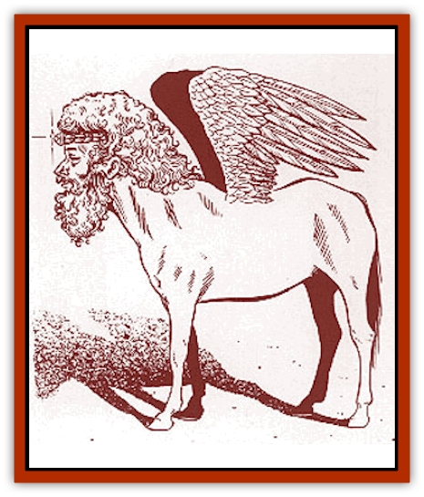

# Shedu - Greater - Savage Coast

| Statistic | **Shedu, Greater (Savage Coast)** |
| --- | --- |
| **Activity Cycle:** | Any |
| **Alignment:** | Lawful good |
| **Armor Class:** | -2 |
| **Climate/Terrain:** | Any |
| **Damage/Attack:** | 4d6/4d6 |
| **Diet:** | Herbivore |
| **Frequency:** | Unique |
| **Hit Dice:** | 20 (160 hp) |
| **Intelligence:** | Supra-Genius (20) |
| **Magic Resistance:** | 95% |
| **Morale:** | Fearless (20) |
| **Movement:** | 18, Fl 36 (B) |
| **No. Appearing:** | Unique |
| **No. of Attacks:** | 2 (front hooves) |
| **Organization:** | Leader |
| **Size:** | L (6' high at shoulder) |
| **Special Attacks:** | See below |
| **Special Defenses:** | See below |
| **THAC0:** | 3 |
| **Treasure:** | Nil |
| **XP Value:** | 22,000 |

Only one greater [[Shedu|shedu]] exists on the Savage Coast. The avatar of the Immortal Idu appears as a greater shedu to his [[Enduk|enduk]] servants. The greater shedu avatar is very similar in appearance to other greater shedu. It has a powerful, stocky equine body with short, powerful feathered wings. It has a large, vaguely dwarven head with a bristly, curly beard and mustache.

All shedu wear a simple headband made of braided cloth or rope, with a single button indicating the wearer's status. The greater shedu avatar of Idu wears a glowing diamond.

In addition to the language of the enduks, the greater shedu avatar of Idu speaks [[Lammasu|lammasu]], shedu, common, and all human and demihuman tongues. It can also speak telepathically with animals, monsters, and even plants.

The greater shedu avatar wanders the Prime Material, Astral, and Ethereal planes. It furthers the cause of law and goodness, helps allied creatures in need, and combats evil.

**Combat:** The physical attacks of the greater shedu avatar are powerful blows with the forehooves. However, the avatar prefers to use its spell-like powers if possible.

The greater shedu avatar has the following abilities related to the mage or priest spells of the same name (where applicable, all abilities are considered 20th level):

<ul><li>radiates constant *protection from evil* within a 30' radius</li><li>becomes ethereal or invisible at will</li><li>travels through the Astral or Ethereal planes at will</li><li>can use following abilities once per day: *clairaudience*, *clairvoyance*, *detect evil*, *detect magic*, *disintegrate*, *domination*, *foresight*, *hypnosis*, *improved invisibility*, *know alignment*, *major creation*, *mass domination*, *mind bar*, *plane shift*, *quest*, *suggestion*, *shape change*, *telekinesis*, *teleport without error*, and *wish*</li></ul>The greater shedu avatar also has the spell-casting abilities of a 20th level priest.

The avatar can discern many details about a person or creature merely by touching an item that belongs to that creature. It can discern the race, sex, age, alignment, and some personal background of the item's owner.

In addition to its formidable magic resistance, the avatar is immune to acid, cold, electrical, fire, and poison attacks. It is also immune to all illusions, charms, and other mind-affecting spells.

The greater shedu avatar will attack [[Utukku|utukku]] or [[Manscorpion_Nimmurian|manscorpions]] if the opportunity presents itself. It is a known fact that the greater shedu avatar of Idu and the extraplanar utukku are eternal enemies, but no one outside the high enduk temples is quite sure of the reasons.

**Habitat/Society:** The greater shedu avatar of Idu wanders the Arm of the Immortals, primarily concerned with protecting and furthering the enduk society. It is friendly with most sentient creatures.

The avatar rarely appears, usually only if Idu has some great task or warning to give to the enduks.

**Ecology:** The avatar attempts to have very little impact on the world's ecology.

---
## Discovery & Documentation

**Source Publication:** Monstrous Compendium Savage Coast Appendix (Online Exclusive) (1995)
**Campaign Setting:** Mystara
**Author(s):** Loren L Coleman, Ted James, Thomas Zuvich, Cindi M. Rice

### Other Creatures Found in This Source Book
   * [[Aranea_Savage_Coast|Aranea (Savage Coast)]]
   * [[Arashaeem|Arashaeem]]
   * [[Batracine|Batracine]]
   * [[Cat_Marine|Cat, Marine]]
   * [[Cinnavixen|Cinnavixen]]
   * [[Clockwork_Swordsman|Clockwork Swordsman]]
   * [[Critter_Temple|Critter, Temple]]
   * [[Cursed_One|Cursed One]]
   * [[Deathmare|Deathmare]]
   * [[Dragon_Savage_Coast_Crimson|Dragon (Savage Coast), Crimson]]
   * [[Dragon_Savage_Coast_Red_Hawk|Dragon (Savage Coast), Red Hawk]]
   * [[Echyan|Echyan]]
   * [[Ee'aar|Ee'aar]]
   * [[Enduk|Enduk]]
   * [[Fachan_Savage_Coast|Fachan (Savage Coast)]]
   * [[Feliquine|Feliquine]]
   * [[Fiend_Narvaezan|Fiend, Narvaezan]]
   * [[Frelôn|Frelôn]]
   * [[Ghriest|Ghriest]]
   * [[Glutton_Sea|Glutton, Sea]]
   * [[Goatman|Goatman]]
   * [[Golem_Naâruk|Golem, Naâruk]]
   * [[Golem_Savage_Coast|Golem (Savage Coast)]]
   * [[Grudgling|Grudgling]]
   * [[Heraldic_Servant_I|Heraldic Servant I]]
   * [[Heraldic_Servant_II|Heraldic Servant II]]
   * [[Heraldic_Servant_III|Heraldic Servant III]]
   * [[Heraldic_Servant_IV|Heraldic Servant IV]]
   * [[Heraldic_Servant_V|Heraldic Servant V]]
   * [[Heraldic_Servant_General_Information|Heraldic Servant, General Information]]
   * [[Hermit_Sea|Hermit, Sea]]
   * [[Jorri|Jorri]]
   * [[Juhrion|Juhrion]]
   * [[Kla'a-tah|Kla'a-tah]]
   * [[Leech_Legacy|Leech, Legacy]]
   * [[Lich_Inheritor|Lich, Inheritor]]
   * [[Lizard_Kin_Savage_Coast|Lizard Kin (Savage Coast)]]
   * [[Lupasus|Lupasus]]
   * [[Lupin|Lupin]]
   * [[Lyra_Bird_Saragón|Lyra Bird, Saragón]]
   * [[Malfera|Malfera]]
   * [[Manscorpion_Nimmurian|Manscorpion, Nimmurian]]
   * [[Mythuínn_Folk|Mythuínn Folk]]
   * [[Neshezu|Neshezu]]
   * [[Nikt'oo|Nikt'oo]]
   * [[Nosferatu|Nosferatu]]
   * [[Omm-wa|Omm-wa]]
   * [[Omshirim|Omshirim]]
   * [[Parasite_Savage_Coast|Parasite (Savage Coast)]]
   * [[Phanaton|Phanaton]]
   * [[Plant_Savage_Coast|Plant (Savage Coast)]]
   * [[Pudding_Vermilion|Pudding, Vermilion]]
   * [[Rakasta|Rakasta]]
   * [[Ray_Forest|Ray, Forest]]
   * [[Shimmerfish|Shimmerfish]]
   * [[Skinwing|Skinwing]]
   * [[Spawn_of_Nimmur|Spawn of Nimmur]]
   * [[Spider-spy|Spider-spy]]
   * [[Spirit_Heroic|Spirit, Heroic]]
   * [[Spirit_Walleran|Spirit, Walleran]]
   * [[Succulus|Succulus]]
   * [[Swampmare|Swampmare]]
   * [[Symbiont_Shadow|Symbiont, Shadow]]
   * [[Tortle|Tortle]]
   * [[Troll_Legacy|Troll, Legacy]]
   * [[Trosip|Trosip]]
   * [[Tyminid|Tyminid]]
   * [[Utukku|Utukku]]
   * [[Voat|Voat]]
   * [[Voat_Herathian|Voat, Herathian]]
   * [[Vulturehound|Vulturehound]]
   * [[Wallara|Wallara]]
   * [[Wurmling|Wurmling]]
   * [[Wynzet|Wynzet]]
   * [[Yeshom|Yeshom]]
   * [[Zombie_Red|Zombie, Red]]
