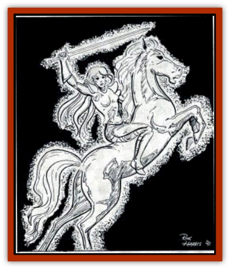
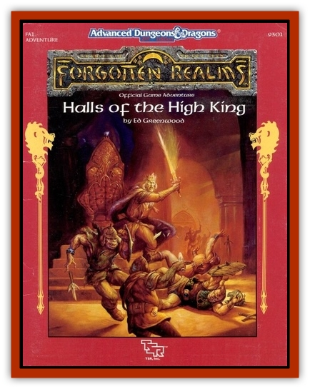

# Shee

| Statistic | **Shee** |
| --- | --- |
| **Activity Cycle:** | Any |
| **Alignment:** | Neutral evil |
| **Armor Class:** | 0 |
| **Climate/Terrain:** | Any/any |
| **Damage/Attack:** | 2d8 + 2/2d6 |
| **Diet:** | Nil |
| **Frequency:** | Rare |
| **Hit Dice:** | 9 |
| **Intelligence:** | Highly (13-14) |
| **Magic Resistance:** | Nil |
| **Morale:** | Fanatic (17) |
| **Movement:** | (mounted) 24, Fl 18 (C) |
| **No. Appearing:** | 1 |
| **No. of Attacks:** | 1 or 2 |
| **Organization:** | Solitary (always mounted) |
| **Size:** | M (but always mounted, on an L) |
| **Special Attacks:** | Death wail, Trample (mount) |
| **Special Defenses:** | See below |
| **THAC0:** | 11 |
| **Treasure:** | Nil |
| **XP Value:** | 7,000 |

The rare undead "Banshee Rider" is seen only at night, always appearing as an eyeless, glowing white elven maiden with long, streaming white hair. Clad in ornate plate armor, she rides a long-maned, eyeless horse and attacks beings she encounters with the lance she bears. The shee slays those she can catch.

Rider and mount can both see (with 90' infravisionl despite their empty, dark eyesockets. They will turn towards and chase most creatures they encounter (ignoring a target on a 2 in 6 chance))

**Combat:** The translucent shee will never dismount from her shadow horse, cannot be unhorsed, and will try to ride down any beings who stand in her path. Unless they move with her to continue combat, the Shee will attack a creature only once before galloping on into the night. The strike of a shee's shadowy, insubstantial lance does 2d8 + 2 damage and causes a l-point Strength loss (strength so lost will return in an hour). Such losses are cumulative. A shee's lance cannot be grasped, nor can it impale, catch on anything, or be turned aside by shield or armor

If a lance attack misses, or the Shee is attacking another being, the shadow horse will trample opponents. Anyone so trampled is flung to the ground (fragile carried items may have to make saving throws) and suffers 2d6 points damage. The horse is not related to the undead being known as a shadow, despite its name, and is AC0 and THAC0 11. Some bards and sages believe it is not a separate creature at all, but part of the shee.

Shee may be struck by any sort of weapons and do not exude magical *fear*. Their touch is said to be cold, but not magically chilling. Shee are considered as "Special" when priests attempt to turn them; a successful turning merely causes the shee to avoid attacking the priest and gallop towards another target.

Like other undead, shee are immune to *sleep*, *hold*, *charm* and related spells and magical effects. Shee cannot be commanded by other undead or by any known magic and are immune to illusions, hypnotic effects, and other forms of mental influence. Shee regenerate 1 lost hit point per turn

Any successful attack on a shee will cause her to vanish. As she fades away, she will scream. Beings within 60' of her disappearance must save vs. death magic or perish.

A "vanishing" shee is actually slowly shifting to another random locale on the same plane. This transfer requires an entire round to complete. In both places, while "vanishing,"" a shee can be readily attacked and is AC7

A shee only vanishes when struck; it cannot travel about at will by this means, but must otherwise gallop. Shee are known to usually head towards the maximum number of targets nearby, but it is not known if they can control their teleports to arrive in specific lands, or deliberately gallop in certain directions-if they have any concept of locations or destinations as living creatures do.

Undead are unaffected by the wail of a shee, but all other shee attacks will affect them, and shee often attack undead. Shee seem immune to special undead abilities and attacks. If a shee is not attacked, she will gallop away after attacking every being present once, and will not wail.

**Habitat/Society:** Shee seem to gallop continuously in dark regions, hunting living beings to attack. They have been encountered at sea, galloping across the sky low over the waves. 

Some sages of the Realms believe that shee are the creations of the god Bhaal, Lord of Murder (a process continued by Cyric, The Dark Sun) or by Malar, who creates shee as his "Ghost Hunt," Shee are always solitary and no instances have ever been reported of one shee attacking another. Two or even three shee may appear in the same area at once, typically galloping in the air low across a huge battlefield and attacking combatants of both (or all) sides indiscriminately.

**Ecology:**  shee's appearances seem related to disasters or important events. Shee may be attracted to great gatherings or outpourings of magical energy.

pourings of magical energy. A being that has been struck (but not killed) by a shee or her mount gives off a faint, pearly luminescence in darkness. This is known as "The Mark of the Shee," and those who bear it are regarded with great respect by intelligent beings native to the Moonshaes. A marked creature will not be attacked by common bandits, villagers, and the like; lesser undead the Realms over will avoid attacking a marked creature. This condition is permanent, unless removed by a *limited wish* (*dispel magic* will not suffice).

---
## Discovery & Documentation

**Source Publication:** FA1 Halls of the High King (1990)
**Campaign Setting:** Forgotten Realms
**Author(s):** Ed Greenwood

### Other Creatures Found in This Source Book
   * [[Bat_Bonebat|Bat, Bonebat]]
   * [[Helmed_Horror|Helmed Horror]]
   * [[Nishruu|Nishruu]]
   * [[Nyth|Nyth]]
   * [[Peltast|Peltast]]
   * [[Weredragon|Weredragon]]
