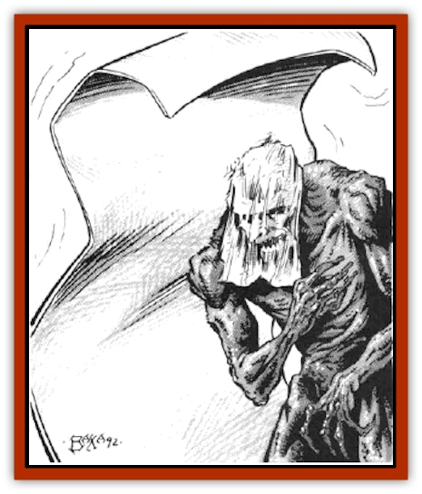

# Sheet Ghoul - Sheet Phantom

| Statistic | **Sheet Ghoul** | **Sheet Phantom** |
| --- | --- | --- |
| **Activity Cycle:** | Any | Night |
| **Alignment:** | Chaotic evil | Chaotic evil |
| **Armor Class:** | 2 | 3 |
| **Climate/Terrain:** | Any | Buildings |
| **Damage/Attack:** | 1-3/1-3/1-6 | 1-4 |
| **Diet:** | Corpses | Nil |
| **Frequency:** | Very rare | Very rare |
| **Hit Dice:** | 4+2 | 3 |
| **Intelligence:** | Average (8-10) | Average (8-10) |
| **Magic Resistance:** | Nil | Nil |
| **Morale:** | Very Steady (14) | Very steady (13) |
| **Movement:** | 9 | 6, Fl 6 (C) |
| **No. Appearing:** | 1 | 1 |
| **No. of Attacks:** | 3 | 1 |
| **Organization:** | Solitary | Solitary |
| **Size:** | M (5-7') | See below |
| **Special Attacks:** | Acid squirt | Suffocation |
| **Special Defenses:** | See below | See below |
| **THAC0:** | 17 | 18 |
| **Treasure:** | Nil | Nil |
| **XP Value:** | 650 | 270 |

Sheet [[Ghoul|ghouls]] are created when sheet [[Phantom|phantoms]] kill their victims. Under normal circumstances, sheet ghouls are indistinguishable from normal ghouls. Upon close inspection, many sheet ghouls appear to have wispy, spiderweb-like strands of white material clinging to their faces, or carry what look like burial shrouds. These characteristics are the remains of the sheet phantom's form.

Sheet phantoms appear as a nearly transparent, rectangular sheet. Their color ranges from snow white to dull grey, and their dimensions vary: 11' to 16' wide, 7' to 12' long. and a quarter of an inch thick. They have no facial features, save for two glowing green spots which function as their eyes. These spots are only visible when the creature has found a victim and is about to attack.

**Combat:** A sheet ghoul attacks with its two claws, each doing 1-3 hit points of damage, and its fangs, which cause 1-6 hit points of damage.

Unlike the conventional ghoul, the shert ghoul's touch does not cause paralysis. However, the sheet ghoul can squirt a fine jet of corrosive acid out of its mouth, which causes 1d8+1 hit points of damage; a successful save vs. breath weapons halves this amount. The acid stream has a range of 10'.

Sheet ghouls are treated as spectres for turning purposes, and they are subject to all attack forms except *sleep*, *charm*, and similar mind-affecting spells.

Sheet phantoms move along the wails and ceilings of a house or other building, and drop on potential victims. If the sheet phantom hits the intended target, it envelops the victim, causing suffocation for 1-4 hit points of damage each round subsequent to the initial attack. Note that no damage is done the first round.

Victims enveloped by a sheet phantom cannot move, and if the sheet phantom is hit while it is enveloping a captive, the victim suffers the same amount of damage. Only one man-sized (or two dwarf-sized or smaller) victims may be enveloped at one time, since the creature wraps itself tightly around the victim. The victim cannot fight back unless the weapon is dagger-sized or smaller and was actually in the victim's hand when he/she was enveloped. Sheet phantoms have an effective Strength of 15, and a successful Bend Bars/Lift Gates attempt made by the victim will free him/her. Only one such attempt may be made per round.

If the victim dies enveloped within the sheet phantom, the sheet phantom merges with the body, creating a sheet ghoul. This process takes 12 hours to complete.

Sheet phantoms are vulnerable to all attack forms except *sleep*, *charm*, and other mind-affecting spells, and are treated as wraiths for purposes of turning.

**Habitat/Society:** Sheet ghouls enjoy haunting old castles, manors, and houses, especially if these structures have a family crypt or cemetery. Corpses are the preferred meal for sheet ghouls, though they are not above eating a living victim. Normal ghouls and [[Ghoul|ghasts]] can instinctively differentiate between their counterparts and a sheet ghoul. Sheet ghouls are reviled by normal ghouls and ghasts, and are often driven away by them.

Sheet phantoms dwell inside structures that have beds. The building may be abandoned, or one that is little used. There have even been occasions when sheet phantoms have taken up residance in the little-used guest rooms of prosperous manors.

There are sufficient similarities between the sheet phantom and the [[Lurker|lurker above]] for some scholars to speculate that the former is an undead form of the latter. However, other sages and scholars claim that sheet phantoms are actual sheets that have absorbed the life-essence of an evil person who died in their bed. The evil soul is trapped in the sheet, and forced to wander about as a sheet phantom.

**Ecology:** Though undead, sheet ghouls enjoy devouring both carrion and freshly killed prey.

Sheet phantoms do not need to eat, so there is no overriding need to merge with their victims. Sheet phantoms kill for the simple evil pleasure of it.

---
## Discovery & Documentation

**Source Publication:** MC14 Fiend Folio Appendix (1992)
**Campaign Setting:** Fiends Folio
**Author(s):** Don Bingle, John Terra, Wes Nicholson, Tim Beach, Steve Hardinger, Kris Hardinger, Rob Nicholls, Greg Swedberg, Al Boyce, Vince Garcia, Norm Ritchie

### Other Creatures Found in This Source Book
   * [[Aballin|Aballin]]
   * [[Achaierai|Achaierai]]
   * [[Adherer|Adherer]]
   * [[Algoid|Algoid]]
   * [[Al-Mi'raj|Al-Mi'raj]]
   * [[Apparition|Apparition]]
   * [[Caterwaul|Caterwaul]]
   * [[Coffer_Corpse|Coffer Corpse]]
   * [[Crabman|Crabman]]
   * [[Dark_Creeper|Dark Creeper]]
   * [[Dark_Stalker|Dark Stalker]]
   * [[Darter|Darter]]
   * [[Denzelian|Denzelian]]
   * [[Dune_Stalker|Dune Stalker]]
   * [[Dwarf_Urdunnir|Dwarf, Urdunnir]]
   * [[Falcon_Fire|Falcon, Fire]]
   * [[Faux_Faerie|Faux Faerie]]
   * [[Flawder|Flawder]]
   * [[Fyrefly|Fyrefly]]
   * [[Gambado|Gambado]]
   * [[Garbug|Garbug]]
   * [[Giant_Fhoimorien|Giant, Fhoimorien]]
   * [[Gibberling|Gibberling]]
   * [[Gorbel|Gorbel]]
   * [[Grimlock|Grimlock]]
   * [[Hellcat|Hellcat]]
   * [[Ice_Lizard|Ice Lizard]]
   * [[Iron_Cobra|Iron Cobra]]
   * [[Khargra|Khargra]]
   * [[Mantari|Mantari]]
   * [[Penanggalan|Penanggalan]]
   * [[Pernicon|Pernicon]]
   * [[Phantom_Stalker|Phantom Stalker]]
   * [[Retriever|Retriever]]
   * [[Ruve|Ruve]]
   * [[Scathe|Scathe]]
   * [[Shocker|Shocker]]
   * [[Spanner|Spanner]]
   * [[Stwinger|Stwinger]]
   * [[Sussurus|Sussurus]]
   * [[Symbiotic_Jelly|Symbiotic Jelly]]
   * [[Terithran|Terithran]]
   * [[Thunder_Children|Thunder Children]]
   * [[Troll_Ice|Troll, Ice]]
   * [[Tween|Tween]]
   * [[Umpleby|Umpleby]]
   * [[Volt|Volt]]
   * [[Xill|Xill]]
   * [[Xvart|Xvart]]
   * [[Zygraat|Zygraat]]
