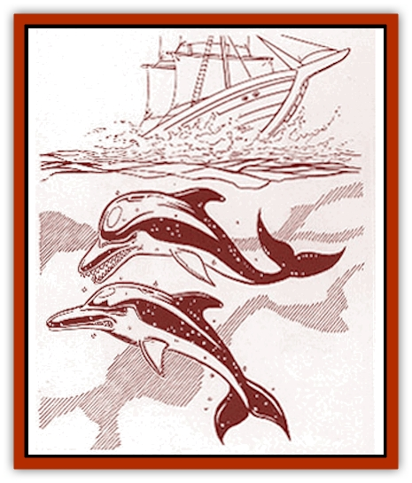

# Shimmerfish

| Statistic | **Shimmerfish** |
| --- | --- |
| **Activity Cycle:** | Any |
| **Alignment:** | Neutral evil |
| **Armor Class:** | 5 |
| **Climate/Terrain:** | Any saltwater |
| **Damage/Attack:** | 2d4 |
| **Diet:** | Carnivore |
| **Frequency:** | Uncommon |
| **Hit Dice:** | 2+2 |
| **Intelligence:** | Very (11-12) |
| **Magic Resistance:** | Nil |
| **Morale:** | Steady (11-12) |
| **Movement:** | Sw 30 |
| **No. Appearing:** | 2d10 |
| **No. of Attacks:** | 1 |
| **Organization:** | School |
| **Size:** | M (6-7' long) |
| **Special Attacks:** | Nil |
| **Special Defenses:** | Saves as 4th-level fighter |
| **THAC0:** | 19 |
| **Treasure:** | Nil |
| **XP Value:** | 270 |

Shimmerfish are deadly, evil relatives of the friendly [[Dolphin|dolphins]]. These sleek and powerful swimmers are found in warm seas. Shimmerfish, unlike dolphins, are never found in fresh water. Both dolphins and shimmerfish often appear in open waters, making their characteristic arched bounds, frequently before the bow waves of ships.

**Combat:** Shimmerfish can form rough, shimmering images underwater with their glowing bodies, sometimes appearing like golden, sunken treasure or even luminescent humanoid forms. A group of four or more shimmerfish acts as a magical lure. A victim who sees a group of shimmerfish using their lure must make a successful saving throw vs. spell or become entranced. The victim will jump into the water to retrieve the treasure unless forcibly restrained. Once the victim is in the water, the shimmerfish will close in for the kill, biting with their hundreds of razor-sharp teeth. Fisherfolk, sailors, and others who spend most of their lives at sea are resistant to the lure of the shimmerfish (+4 bonus on saving throws). New mariners have the most difficulty.

If it becomes clear that their attempts at luring are ineffective, shimmerfish will ram small boats. Each shimmerfish in the group will ram the boat at high speed, one after the other. The boat must make a successful saving throw vs. crushing blow with each attack or spring a leak, which will cause it to sink in 1d4+6 rounds. Shimmerfish can also leap up to 6' in the air to knock victims into the water. The shimmerfish must roll to hit, and then the victim must make a successful saving throw vs. paralyzation or get knocked into the water.

Shimmerfish love to prolong a victim's death, teasing, drawing out the terror. Shimmerfish sometimes "rescue" victims of a shipwreck, carry them heartbreakingly close to shore, and then attack, just to watch the victims' rising hopes come crashing down in a rising tide of desperation.

**Habitat/Society:** Shimmerfish follow schools of fish in groups of varying size. Most groups contain only a few members, although occasionally larger groups will form temporarily.

Shimmerfish can sustain speeds of up to 19 miles per hour, with short bursts of more than 25 miles per hour. Their lungs are adapted to allow them to dive to depths of more than 1,000 feet for short periods of time.

**Ecology:** In one day, a shimmerfish eats nearly one-third of its weight, mostly in fish and squid.

Shimmerfish reach maturity at about six years old, at which time their previously dull skin becomes shimmery. They mate in the spring and have a gestation period of eleven or twelve months. Calves swim and breathe minutes after birth.

Shimmerfish have a language composed primarily of clicking sounds and whistles. These also act as part of an echolocation system, similar to that of a bat, enabling the shimmerfish to navigate and detect prey.

Shimmerfish have a gland in the head that holds a small quantity of valuable oil, which is used to lubricate delicate mechanisms. Each shimmerfish gland holds about one ounce of oil, which sells for between one and five gold pieces. Also, raw, uncured hide sells for about two gold pieces, and a cured shimmerfish hide is a beautiful thing worth at least 10 gold pieces.

---
## Discovery & Documentation

**Source Publication:** Monstrous Compendium Savage Coast Appendix (Online Exclusive) (1995)
**Campaign Setting:** Mystara
**Author(s):** Loren L Coleman, Ted James, Thomas Zuvich, Cindi M. Rice

### Other Creatures Found in This Source Book
   * [[Aranea_Savage_Coast|Aranea (Savage Coast)]]
   * [[Arashaeem|Arashaeem]]
   * [[Batracine|Batracine]]
   * [[Cat_Marine|Cat, Marine]]
   * [[Cinnavixen|Cinnavixen]]
   * [[Clockwork_Swordsman|Clockwork Swordsman]]
   * [[Critter_Temple|Critter, Temple]]
   * [[Cursed_One|Cursed One]]
   * [[Deathmare|Deathmare]]
   * [[Dragon_Savage_Coast_Crimson|Dragon (Savage Coast), Crimson]]
   * [[Dragon_Savage_Coast_Red_Hawk|Dragon (Savage Coast), Red Hawk]]
   * [[Echyan|Echyan]]
   * [[Ee'aar|Ee'aar]]
   * [[Enduk|Enduk]]
   * [[Fachan_Savage_Coast|Fachan (Savage Coast)]]
   * [[Feliquine|Feliquine]]
   * [[Fiend_Narvaezan|Fiend, Narvaezan]]
   * [[Frelôn|Frelôn]]
   * [[Ghriest|Ghriest]]
   * [[Glutton_Sea|Glutton, Sea]]
   * [[Goatman|Goatman]]
   * [[Golem_Naâruk|Golem, Naâruk]]
   * [[Golem_Savage_Coast|Golem (Savage Coast)]]
   * [[Grudgling|Grudgling]]
   * [[Heraldic_Servant_I|Heraldic Servant I]]
   * [[Heraldic_Servant_II|Heraldic Servant II]]
   * [[Heraldic_Servant_III|Heraldic Servant III]]
   * [[Heraldic_Servant_IV|Heraldic Servant IV]]
   * [[Heraldic_Servant_V|Heraldic Servant V]]
   * [[Heraldic_Servant_General_Information|Heraldic Servant, General Information]]
   * [[Hermit_Sea|Hermit, Sea]]
   * [[Jorri|Jorri]]
   * [[Juhrion|Juhrion]]
   * [[Kla'a-tah|Kla'a-tah]]
   * [[Leech_Legacy|Leech, Legacy]]
   * [[Lich_Inheritor|Lich, Inheritor]]
   * [[Lizard_Kin_Savage_Coast|Lizard Kin (Savage Coast)]]
   * [[Lupasus|Lupasus]]
   * [[Lupin|Lupin]]
   * [[Lyra_Bird_Saragón|Lyra Bird, Saragón]]
   * [[Malfera|Malfera]]
   * [[Manscorpion_Nimmurian|Manscorpion, Nimmurian]]
   * [[Mythuínn_Folk|Mythuínn Folk]]
   * [[Neshezu|Neshezu]]
   * [[Nikt'oo|Nikt'oo]]
   * [[Nosferatu|Nosferatu]]
   * [[Omm-wa|Omm-wa]]
   * [[Omshirim|Omshirim]]
   * [[Parasite_Savage_Coast|Parasite (Savage Coast)]]
   * [[Phanaton|Phanaton]]
   * [[Plant_Savage_Coast|Plant (Savage Coast)]]
   * [[Pudding_Vermilion|Pudding, Vermilion]]
   * [[Rakasta|Rakasta]]
   * [[Ray_Forest|Ray, Forest]]
   * [[Shedu_Greater_Savage_Coast|Shedu, Greater (Savage Coast)]]
   * [[Skinwing|Skinwing]]
   * [[Spawn_of_Nimmur|Spawn of Nimmur]]
   * [[Spider-spy|Spider-spy]]
   * [[Spirit_Heroic|Spirit, Heroic]]
   * [[Spirit_Walleran|Spirit, Walleran]]
   * [[Succulus|Succulus]]
   * [[Swampmare|Swampmare]]
   * [[Symbiont_Shadow|Symbiont, Shadow]]
   * [[Tortle|Tortle]]
   * [[Troll_Legacy|Troll, Legacy]]
   * [[Trosip|Trosip]]
   * [[Tyminid|Tyminid]]
   * [[Utukku|Utukku]]
   * [[Voat|Voat]]
   * [[Voat_Herathian|Voat, Herathian]]
   * [[Vulturehound|Vulturehound]]
   * [[Wallara|Wallara]]
   * [[Wurmling|Wurmling]]
   * [[Wynzet|Wynzet]]
   * [[Yeshom|Yeshom]]
   * [[Zombie_Red|Zombie, Red]]
