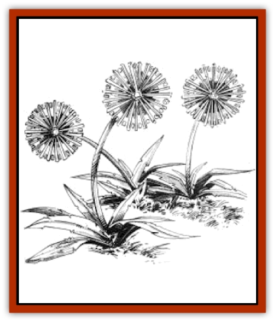

# Shimmerweed

| Statistic | **Shimmerweed** |
| --- | --- |
| **Activity Cycle:** | Moonlit nights |
| **Alignment:** | Nil |
| **Armor Class:** | 8 |
| **Climate/Terrain:** | Temperate / Forest and plain |
| **Damage/Attack:** | Nil |
| **Diet:** | Special |
| **Frequency:** | Rare |
| **Hit Dice:** | 1 hit point |
| **Intelligence:** | Non- (0) |
| **Magic Resistance:** | Nil |
| **Morale:** | Fearless (20) |
| **Movement:** | Nil |
| **No. Appearing:** | 6-36 |
| **No. of Attacks:** | Nil |
| **Organization:** | Patch |
| **Size:** | T (6-18&rdquo; tall) |
| **Special Attacks:** | Confusion |
| **Special Defenses:** | Nil |
| **THAC0:** | Not applicable |
| **Treasure:** | Nil |
| **XP Value:** | 35 |

Shimmerweed is a most unusual, and beautiful, variety of plant that is found in temperate regions throughout the world. Although it is wholly inoffensive and has few natural enemies, shimmerweed can be one of the most dangerous things a party encounters as it strolls through the wilds of Krynn.

Shimmerweed is a type of wildflower that grows in small patches. Although on first inspection it looks much like a dandelion gone to seed, a closer look reveals that the plant consists of a crystalline material much like fine spun glass. Its beautiful and delicate appearance is enhanced by the way it catches rays of moonlight and refracts them through its petals, unleashing a dazzling spray of brilliant colors on the area around it. An average plant stands six to 18 inches tall.

**Combat:** Shimmerweed is unable to engage in any form of combat. It cannot move, has no means of inflicting damage on opponents, and is so delicate that the slightest of attacks instantly destroys it. Indeed, it has no motive at all to cause harm to other living things, as it feeds on moonlight.

The defense mechanism a shimmerweed patch has is its dazzling light show. When the moonlight that feeds the plant is caught in its crystalline petals, it is enchanted and becomes so brilliant as to affect all creatures who gaze upon it with a *confusion* spell (as if cast by a 10th-level Red Robed wizard). The number of plants in the patch determines the effectiveness of this defense mechanism, with each plant able to affect 1 Hit Dice worth of opponents. Thus a patch of 12 plants can bewilder up to 12 Hit Dice of creatures.

Shimmerweed cannot tolerate bright sunlight on its delicate petals, thus it opens only at night. Those who come across it by day, in fact, are unlikely to take notice of the patch, for it looks like nothing more than a grove of common weeds. The plant's sensitivity to light is, however, a great weakness for it. Sudden exposure to a bright light source, such as a *continual light* spell, overloads its ability to draw nourishment with its petals, causing it to instantly shatter into fine dust. A patch destroyed in this manner is forever dead and cannot sprout again. Plants destroyed by any other means grow back in about one month.

The dangerous thing about shimmerweed patches is that many creatures use them to hunt prey. It is not uncommon for an intelligent monster or animal to set its lair near a patch of shimmerweed and wait for it to confuse travelers. Once the travelers are helpless, these lurking hunters spring to the attack and slaughter their prey.

**Habitat/Society:** Shimmerweed flowers are found in patches of 6d6 plants. Each patch grows from a single seedpod and all of the plants in it are linked together beneath the surface by fine tendrils that enable them to pool their stores of energy so that each may teed equally.

**Ecology:** Shimmerweed is unique on the Prime Material plane for its unusual crystalline structure and its ability to feed directly on moonlight without use of photosynthesis.

As might be expected, a plant as unusual as this has a most interesting means of reproduction. When a patch of shimmerweed reaches full growth (36 plants that are 18 inches tall), it begins to form a seedpod at its heart. The seedpod takes roughly 14 days to form and, when complete, is a spherical, rainbow-hued crystal roughly four inches in diameter. When fully formed and charged with energy, the seedpod bursts with a flash of light and a loud crack, sending fragments of itself as far as 15 yards from the parent plant. Only the larger portions of the shattered pod (1d6 in number) are viable and begin to grow. A patch of shimmerweed grows from podlings to mature adults in about eight months. The patch that spawned the seedpod withers and dies within days of the pod's explosion.

Shimmerweed seedpods are often used by wizards who are crafting magical palantirs such as *crystal balls* or *crystal hypnosis balls*. The petals of the flower, when ground into a fine sand, are used in the creation of inks and other materials that relate to light or hypnosis (such as a *gem of brightness*.)

---
## Discovery & Documentation

**Source Publication:** MC4 Dragonlance Appendix (w/binder #2) (1989)
**Campaign Setting:** Dragonlance
**Author(s):** Rick Swan

### Other Creatures Found in This Source Book
   * [[Anemone_Giant_Sea|Anemone, Giant Sea]]
   * [[Bear_Ice|Bear, Ice]]
   * [[Beast_Undead|Beast, Undead]]
   * [[Bird_Krynn|Bird (Krynn)]]
   * [[Disir|Disir]]
   * [[Draconian_Aurak|Draconian, Aurak]]
   * [[Draconian_Baaz|Draconian, Baaz]]
   * [[Draconian_Bozak|Draconian, Bozak]]
   * [[Draconian_Kapak|Draconian, Kapak]]
   * [[Draconian_General_Information|Draconian, General Information]]
   * [[Draconian_Sivak|Draconian, Sivak]]
   * [[Draconian_Proto-_Traag|Draconian, Proto-, Traag]]
   * [[Dragon_Amphi|Dragon, Amphi]]
   * [[Dragon_Astral|Dragon, Astral]]
   * [[Dragon_Kodragon|Dragon, Kodragon]]
   * [[Dragon_Krynn_Othlorx_General_Information|Dragon (Krynn), Othlorx, General Information]]
   * [[Dragon_Krynn_General_Information|Dragon (Krynn), General Information]]
   * [[Dragon_Sea|Dragon, Sea]]
   * [[Dreamshadow|Dreamshadow]]
   * [[Dreamwraith|Dreamwraith]]
   * [[Dwarf_Daergar|Dwarf, Daergar]]
   * [[Dwarf_Hill_Neidar|Dwarf, Hill, Neidar]]
   * [[Dwarf_Mountain_Hylar|Dwarf, Mountain, Hylar]]
   * [[Dwarf_Theiwar|Dwarf, Theiwar]]
   * [[Dwarf_Zakhar|Dwarf, Zakhar]]
   * [[Elf_Half-|Elf, Half-]]
   * [[Elf_High_Qualinesti|Elf, High, Qualinesti]]
   * [[Elf_High_Silvanesti|Elf, High, Silvanesti]]
   * [[Elf_Sea_Dargonesti|Elf, Sea, Dargonesti]]
   * [[Elf_Sea_Dimernesti|Elf, Sea, Dimernesti]]
   * [[Elf_Wild_Kagonesti|Elf, Wild, Kagonesti]]
   * [[Eyewing|Eyewing]]
   * [[Fetch|Fetch]]
   * [[Fire_Minion|Fire Minion]]
   * [[Fireshadow|Fireshadow]]
   * [[Gnome_Tinker|Gnome, Tinker]]
   * [[Gurik_Cha'ahl|Gurik Cha'ahl]]
   * [[Haunt_Knight|Haunt, Knight]]
   * [[Horax|Horax]]
   * [[Human_Krynn|Human (Krynn)]]
   * [[Imp_Blood_Sea|Imp, Blood Sea]]
   * [[Kalothagh|Kalothagh]]
   * [[Kani_Doll|Kani Doll]]
   * [[Kender|Kender]]
   * [[Kyrie|Kyrie]]
   * [[Lizard_Man_Krynn|Lizard Man (Krynn)]]
   * [[Minotaur_Krynn|Minotaur, Krynn]]
   * [[Ogre_High|Ogre, High]]
   * [[Ogre_Krynn|Ogre (Krynn)]]
   * [[Phaethon|Phaethon]]
   * [[Saqualaminoi|Saqualaminoi]]
   * [[Shadowperson|Shadowperson]]
   * [[Skrit|Skrit]]
   * [[Spectral_Minion|Spectral Minion]]
   * [[Spider_Krynn|Spider (Krynn)]]
   * [[Stag|Stag]]
   * [[Tayling|Tayling]]
   * [[Thanoi|Thanoi]]
   * [[Tylor|Tylor]]
   * [[Wichtlin|Wichtlin]]
   * [[Wyndlass|Wyndlass]]
   * [[Yaggol|Yaggol]]
