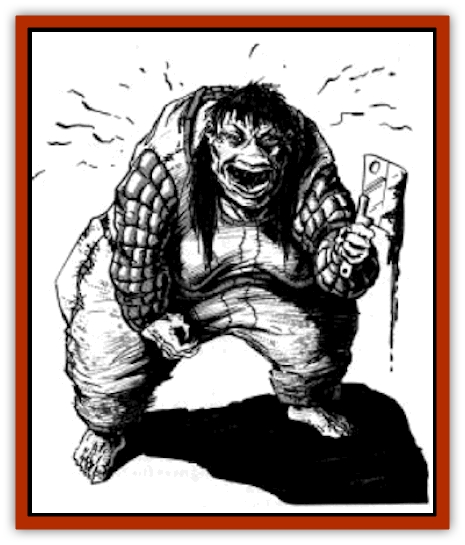

# Shimnus - Greater Spirit

| Statistic | **Shimnus, Greater Spirit** |
| --- | --- |
| **Activity Cycle:** | Day |
| **Alignment:** | Chaotic evil |
| **Armor Class:** | -3 |
| **Climate/Terrain:** | Arid mountains |
| **Damage/Attack:** | 2-12/2-12 |
| **Diet:** | Omnivore |
| **Frequency:** | Very rare |
| **Hit Dice:** | 9+4 |
| **Intelligence:** | Average (8-10) |
| **Magic Resistance:** | Nil |
| **Morale:** | Elite (15) |
| **Movement:** | 12 |
| **No. Appearing:** | 1-2 |
| **No. of Attacks:** | 2 |
| **Organization:** | Solitary |
| **Size:** | M (5-7') |
| **Special Attacks:** | Breath weapon, enlarge |
| **Special Defenses:** | +2 or better weapon to hit |
| **THAC0:** | 11 |
| **Treasure:** | V (G) |
| **XP Value:** | 3,000 |

The shimnus is a fearful denizen that once dwelt on some outer plane. Through unfortunate circumstance, the race found its way to the Prime Material plane and has decided to make its home here.

In its natural form, the shimnus appears as an [[Ogre|ogre]]-sized crone, passably human in appearance. Its hair is long and loose, wildly matted and caked with filth. Its teeth are sharp and black. The hands end in long, cracked nails. It dresses in rags of poverty. No male shimnus has ever been seen.

**Combat:** The shimnus is a fearsome creature in battle, but usually fights as a last resort. It far prefers trickery and guile to combat, although it is not cowardly or weak. Often it will pose as a bizarre old woman, attempting to dupe its victims.

When it does fight, the shimnus uses its claws or magical weapons (50%). These weapons are usually a large set of iron pincers (+1 to hit, 2-16 points of damage) and an iron hammer (+2, 1-8 +2 points of damage).

Its bizarre weapons are not what make the shimnus fearsome. In addition to its physical attacks, the shimnus can breath fire. The gout of flame is a cone 10 feet long and 3 feet wide. It causes five dice of damage. If the creature chooses to breathe, it cannot make any other attacks in the round. There is no limit to the number of flaming breaths it can use in a day.

Finally, once per day, the shimnus can enlarge itself to the size of a [[Giant_Storm|storm giant]]. When enlarged, it gains a +5 to its THAC0 and +8 to damage. It can hurl boulders for 2-20 points of damage to a range of 200 yards. (It does not gain the full benefits of storm giant size since this is not its natural form.) This enlargement lasts for only one turn (10 rounds).

Because of its extraplanar origins, the shimnus has special defenses and weaknesses. It is immune to all mind control and hold spells. It can be hit only by weapons of +2 enchantment or better. It is, however, susceptible to spells that affect extraplanar creatures, in particular *holy word*.

**Habitat/Society:** Shimnuses are solitary creatures and are never found in numbers greater than a pair. Only apparent females have been seen, but this may be because males and females are identical in all ways. Another possibility put forth by scholars is that the males still reside on the home plane and have not yet invaded the Prime Material plane.

Whatever the nature of their social lives, the shimnus prefers to live in barren wilderness at the very fringe of human society. The creatures are omnivorous and have developed a taste for human food, cheeses and milks in particular. As far as is known, they do not eat human, demihuman, or humanoid flesh.

The shimnuses view humans and their like not so much as threats but as dupes and nuisances. They like the Prime Material plane for its pleasant conditions and easy prey. The current inhabitants are minor irritants they must endure. They contemptuously scorn all attempts by the "little things" (humans, etc.), to rule or regulate them. Indeed, such attempts usually result in fearful retaliation.

**Ecology:** As noted before, the shimnuses have developed a taste for human food. They eat prodigious quantities when they do eat, and finding food is one of their major concerns. Whenever possible they try to trick humans into feeding them, but they have been known to offer portions of their treasure hoards for a good meal.

---
## Discovery & Documentation

**Source Publication:** The Horde (boxed set) (1990)
**Campaign Setting:** The Horde (Forgotten Realms)
**Author(s):** David Cook

### Other Creatures Found in This Source Book
   * [[Centaur_Nomadic|Centaur, Nomadic]]
   * [[Horse_Endless_Waste|Horse (Endless Waste)]]
   * [[Manggus|Manggus]]
   * [[Monkey_Greater_Spirit|Monkey (Greater Spirit)]]
   * [[Shatjan|Shatjan]]
