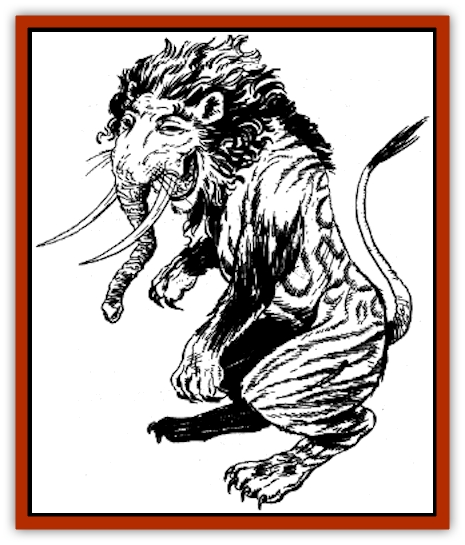

# Shirokinukatsukami

| Statistic | **Shirokinukatsukami** |
| --- | --- |
| **Activity Cycle:** | Night |
| **Alignment:** | Lawful good |
| **Armor Class:** | -2 |
| **Climate/Terrain:** | Any |
| **Damage/Attack:** | 2-5/2-5/3-18 |
| **Diet:** | Special |
| **Frequency:** | Very rare |
| **Hit Dice:** | 12 |
| **Intelligence:** | Genius (17-18) |
| **Magic Resistance:** | 50% |
| **Morale:** | Champion (15) |
| **Movement:** | 18, Fl 18 (A) |
| **No. Appearing:** | 1 |
| **No. of Attacks:** | 3 |
| **Organization:** | Solitary |
| **Size:** | L (8' tall) |
| **Special Attacks:** | See below |
| **Special Defenses:** | See below |
| **THAC0:** | 9 |
| **Treasure:** | Nil |
| **XP Value:** | 11,000 |

A powerful and kindly greater spirit, the shirokinukatsukami is a nemesis of evil and a protector of worthy humans.

Also known as the Eater of Dreams, the appearance of the shirokinukatsukami is perhaps the most bizarre of any spirit creature. It has the thick body of a [[Horse|horse]], standing on the oversized legs of a [[Cat_Great|tiger]]. Fine brown or golden hair covers its body, accented with bold, bright patterns in a variety of colors. Its face is that of a [[Cat_Great|lion]], complete with a thick mane of coarse hair. But it has the eyes of a human, the trunk and tusks of an [[Elephant|elephant]], and the tail of a cow. In addition, it has the arms of an ape, ending in tiger's paws that are equipped with long, purple talons.

The shirokinukatsukami speaks the languages of all humans, humanoids, animals, and spirits. It also speaks the language of the Celestial Court. Its laugh, which frequently punctuates its conversation, resembles the cawing of a [[Raven_Crow|crow]].

**Combat:** This greater spirit is a fearless, skilled, and courteous fighter. Unless ambushed, it precedes its attacks with a polite offer: the spirit creature informs its potential victims of the foolishness of their actions, and gives them the opportunity to withdraw. At times, the shirokinukatsukami may offer its opponents an alternative course of action. For instance, a shirokinukatsukami might suggest that an evil spirit take refuge in a temple and ask the Celestial Court for mercy, in order to change its evil, criminal ways.

If an opponent attacks a shirokinukatsukami, or assaults a human protected by the strange creature, the shirokinukatsukami fights without mercy. It attacks with its front paws and its goring tusks. If both paws score a hit, it rakes its victims with its rear paws for 2-8 (2d4) hit points of damage each. Normal attack rolls must be made for these two additional attacks.

The shirokinukatsukami also has the following abilities: *detect evil*, *detect shapechanger*, *detect charm*, *detect harmony*, and *ESP* - all at will; *invisibility*, *become astral*, *dream sight*, *dream vision*, *protection from evil, 10' radius*, *teleport without error*, *smoke form* - all useable once per round; *dispel evil*, *cloud trapeze*, *pacify*, *exorcise*, *obedience* - all useable three times per day; *restore spirit* and *heal* - each useable once per day.

The shirokinukatsukami only can be hit by +3 weapons or better. It is immune to all air-based attacks, and suffers half (or no) damage from fire-based attacks. It is immune to all poisons. The shirokinukatsukami regenerates 2 hit points of damage per round.

**Habitat/Society:** The shirokinukatsukami is a staunch enemy of evil spirits and often arrives at night in the homes of humans who are tormented by such spirits. Though humans can petition the spirit creature for aid, usually by praying to the full moon or leaving offerings of flowers and gifts on a window sill, it is sometimes sent by the Celestial Emperor to specifically protect some deserving or noted person. For those who have successfully beseeched its aid or who have been selected by the Celestial Emperor for special protection, the shirokinukatsukami enters through a window at night, usually invisible or in *smoke form*. Slipping into the bed chamber, it takes a position at the head of the bed, guarding over its charge. During the night, it uses its powers to destroy or drive away any encroaching evil spirits, leaving at the first light of dawn. The shirokinukatsukami is never seen during the daytime.

The shirokinukatsukami has no permanent lair. Instead, it roams the world and the Celestial lands searching for evil spirits. It is quite likely that no more than four shirokinukatsukami exist.

**Ecology:** This spirit creature gains sustenance from the dreams of a human it deems worthy of its protection. The shirokinukatsukami can freely enter the human's dreams, while still maintaining its vigilance against evil spirits. Such activity has no ill effect on the human whatsoever; if the human experiences a dream where a shirokinukatsukami is dancing, gardening, or engaging in some other recreational activity, he knows that his dreams have been visited by a friendly shirokinukatsukami.

---
## Discovery & Documentation

**Source Publication:** MC6 Kara-Tur Appendix (1990)
**Campaign Setting:** Kara-Tur (Forgotten Realms)
**Author(s):** Rick Swan

### Other Creatures Found in This Source Book
   * [[Bajang|Bajang]]
   * [[Bakemono|Bakemono]]
   * [[Bisan|Bisan]]
   * [[Buso|Buso]]
   * [[Carp_Giant|Carp, Giant]]
   * [[Centipede_Spirit|Centipede, Spirit]]
   * [[Chu-u|Chu-u]]
   * [[Con-tinh|Con-tinh]]
   * [[Doc_cu'o'c|Doc cu'o'c]]
   * [[Duruch'i-lin|Duruch'i-lin]]
   * [[Flame_Spirit|Flame Spirit]]
   * [[Foo_Creature|Foo Creature]]
   * [[Gaki|Gaki]]
   * [[Gargantua|Gargantua]]
   * [[Goblin_Rat|Goblin Rat]]
   * [[Hai_Nu|Hai Nu]]
   * [[Hannya|Hannya]]
   * [[Hengeyokai|Hengeyokai]]
   * [[Hsing-sing|Hsing-sing]]
   * [[Hu_Hsien|Hu Hsien]]
   * [[Human_Kara-Tur|Human (Kara-Tur)]]
   * [[Ikiryo|Ikiryo]]
   * [[Jishin_Mushi|Jishin Mushi]]
   * [[Kala|Kala]]
   * [[Kaluk|Kaluk]]
   * [[Kappa|Kappa]]
   * [[Korobokuru|Korobokuru]]
   * [[Krakentua|Krakentua]]
   * [[Kuei|Kuei]]
   * [[Memedi|Memedi]]
   * [[Men-shen|Men-shen]]
   * [[Nat|Nat]]
   * [[Ningyo|Ningyo]]
   * [[Oni|Oni]]
   * [[P'oh|P'oh]]
   * [[P'oh_Gohei|P'oh, Gohei]]
   * [[Shan_Sao|Shan Sao]]
   * [[Spirit_Folk|Spirit Folk]]
   * [[Spirit_Nature|Spirit, Nature]]
   * [[Spirit_Stone|Spirit, Stone]]
   * [[Tako|Tako]]
   * [[Tengu|Tengu]]
   * [[Wang-Liang|Wang-Liang]]
   * [[Yuan-ti_Histachii|Yuan-ti, Histachii]]
   * [[Yuki-on-na|Yuki-on-na]]
