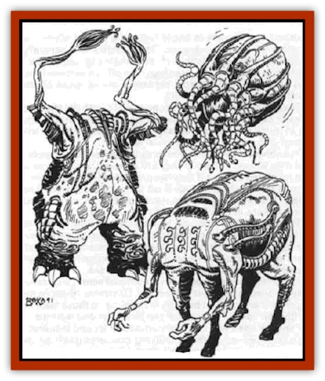
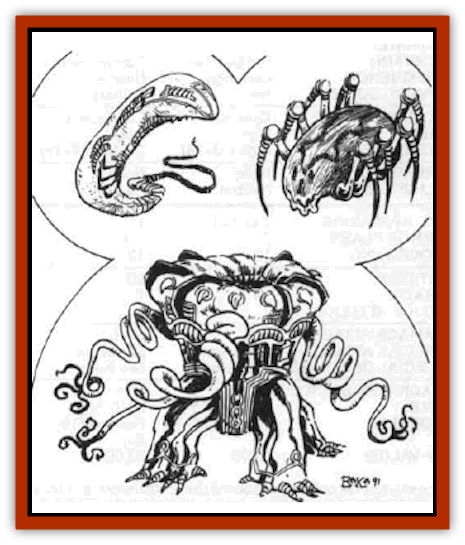
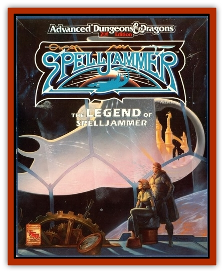

# Shivak

| Statistic | **Common** | **Guardian** |
| --- | --- | --- |
| **Activity Cycle:** | Continuous | Continuous |
| **Alignment:** | Neutral | Neutral |
| **Armor Class:** | 3 | -3 |
| **Climate/Terrain:** | <i>Spelljammer</i> | Control room |
| **Damage/Attack:** | 1-8 | 3-18 |
| **Diet:** | None | None |
| **Frequency:** | Common | Unique |
| **Hit Dice:** | 5 | 20 |
| **Intelligence:** | High (13-14) | Genius (17-18) |
| **Magic Resistance:** | 40% | 60% |
| **Morale:** | Fanatic (17-18) | Fearless (19-20) |
| **Movement:** | 12 | 12 |
| **No. Appearing:** | 1 or 1-8 | 1 |
| **No. of Attacks:** | 2 | 2 |
| **Organization:** | Squad | Solitary |
| **Size:** | S or M (3-5') | L (10' high) |
| **Special Attacks:** | See below | See below |
| **Special Defenses:** | See below | See below |
| **THAC0:** | 16 | 1 |
| **Treasure:** | Nil | Nil |
| **XP Value:** | 5,000 | 23,000 |

The shivaks are only found aboard the *Spelljammer*, and they are constructed (grown) in a manner similar to the smalljammers. In the shivaks' case, they are constructed in the shivak terminal (Area #15) rather than In the gardens (Area #2) llke the smalljammers. The shivak grow in pods out of the lifeless corridors.

When shivaks are destroyed or wear out, more are constructed. Those that are not immediatly needed are kept in storage, where they are maintained on small amounts of energy from the shlp. There are about 500 shivaks on board the ship at any one time.

Shivaks resemble headless ellipsoids that have limbs. The limbs are arranged in such a manner that varieties of shivaks resemble various races aboard the ship.

The surface of a shivak appears to be covered by a thick gray leather. However, this leatherlike exterior extends fully to the core of a shivak - in other words, shivaks lack organs in the known sense. The limbs are made of similar material, and they are what allow the shivaks to maneuver. (Shivaks move forward, backward, and sideways at will, much as if they were on rollers.)

Each variety of shivak also has a special attack form that it may use at will as described below.

The types of common shivak include the followlng:

<ul><li>*Humanoid* - This shivak has humanoid limbs that consist of two stumplike legs and two multlhinged arms, each arm ending in a delicate bundle of tapered coils. The coils allow the humanoid shivak to perform delicate work, but the humanoid's chief attribute is incredible strength. At will, they may raise their strength to that of [[Giant_Fire|fire giant]] level, gaining +4 to hit and + 10 to damage.</li><li>*Centaurian* - The [[Centaur|centaurian]] shivaks ellptical body is horizontal rather then upright. It is supportad by four horse-like limbs, and it has a set of multijointed humanoid arms mounted at what is presumed to be the forward end of the shivak. The centaurian's chief attribute is speed, and it can increase its movement to 24 at will.</li><li>*Beholdarian* - The beholderian shivak is a floating egg-shape that has a bundle of tentacles nestled around its crown. It does not have the eyes of a [[Beholder_and_Beholder-kin_I|beholder]], but its coils are incredibly strong (STR = 19). More importantly, this shivak can fly at its normal movement speed, and it has an MC of A.</li><li>*Serpentine* - The [[Snake|serpentine]] shivak Is a narrow ellipsoid that has an extended tail, which the shivak uses to coil arround its opponents. It constricts its target, then crawls off with the creature still in its coils. The serpentine shivak has the ability to compress its body as well, allowing it to squeeze into spaces no more than 1 foot across in pursuit of its opponent.</li><li>*Spiderian* - Also catled [[Neogi|neogian]], this shivak is a horizontal ellipsoid much like the centaurian's body. This shivak's body, however, is supported by eight movable legs and is slung upward like a [[Spider|spider]]. Spiderian shivaks have the ability to spit a paralyzing poison up to 20 feet away, This poison can freeze an opponent for 1-3 rounds - enough time for the spiderian (and the other shivaks as well) to overwhelm and remove the intruder.</li><li>Enigmatic - The enigmatlc shivak is a mystery because it does not resemble any of the currently known major races of space. This shivak has a triform body, with three stump-like limbs and three arms coiled like rope and ending in trilateral "hands". While it resembles both the [[Xorn|xorn]] and the triphegs, neither of those races have been known to have had a major impact in space outside their home worlds. The enigmatic shivak has a nasty ability in that it may produce a shocking grasp (as per the spell) for 2-12 points of additional damage when grappling with an opponent. This is only used to shock its opponents into submission.</li></ul>**Combat:** 

The shivaks in battle fight as a unified whole, regardless of their appearance. Their tactics are generally straightforward, consisting of overwhelming their opponents with numbers, then carting them off. Their main function seems to be to keep trespassers out of areas of the Spelljammer that are off limits.

The shivaks are apparently connected to both the ship and to each other, for attacking one shivak typically brings others in quick succession (usually 1-8 additional shivaks will appear 3-6 rounds after the initial attack).

The shivaks have been given only limited orders, however, and they will only attack if they are attacked, if a creature is in a restricted area, or if they are prevented from doing their normal tasks, which include food delivery and dismantling ships. Otherwise they tend to leave the other races on board alone and are in turn left alone by other races.

The shivaks are immune to illusion and light-based attacks. They cannot be poisoned, *polymorphed*, or paralyzed, nor may they be *charmed* or otherwise affected by enchantment spells, including *sleep*. They are immune to their own attack forms, including those of other shivaks.

The shivaks do not see in the traditional sense, but rather they emanate a continuai *detect life*. Otherwise invisible living creatures stand out brightly to them, as do those masked by illusion spells. They know the buildings and warrens of the ship by heart and can move smoothly around inanimate objects. However, animate, unliving creatures (such as undead, [[Golem_General_Information|golems]], and [[Clockwork_Horror|clockwork horrors]]) are invisible to them. They cannot attack what they cannot see, though they may flail around at -4 to hit.

**Habitat/Society:** The shivaks have no real society and are little more than extensions of the wlll of the Spelljammer itself. Unless specifically commanded otherwise by the captain, they will continue to perform their normal duties.

When under the control of the captain, they will respond to his or her orders as long as those orders do not directly contradict the shivaks' functions. (For instance, the captain cannot order the shivaks to not attack a trespasser found in the warrens.)

**Ecology:** The shivaks are "grown" in the shivak terminal, far from the light of the gardens, in great pods hanging from the wall. Unlike the smalljammers, the shivaks' only requirement for development is the presence of a spelljamming helm, whlch will create 1-10 new shlvaks. Any spelljammlng helms that are found will be taken back to the terminal for future use.

It takes only a few days for the terminal to create these shivaks once it has a new helm. The process is simllar to the creation of the smalljammers upon the arrival of a new captain. The spelljamming helms, however, are consumed in the process and cannot be regained.

**Guardlan Shivak**

  The guardian shivak is the largest of the shivaks and is found only in the control room. (The control room is an area that appears on the Spelljammer only when a prospective captain comes on board; the area randomly shifts position throughout the ship and is seldom found in the same place twice in a row. The adventurer must defeat the guardian shivak to bond with the ship and become captain.)

The guardian shivak is built to encompass the worst fears of the previous captain. As such, it strongly resembles the physical form those fears take (as opposed to the elliptical shape of the other shivaks). The current guardian shivak resembles a gigantic [[Mind_Flayer|mind flayer]]. It Is equipped with a psionic blast similar to that of a mind flayer.

The guardian shivak is made of the same leathery material as are the common shivak, however, and it too has no apparent internal organs. The guardian has all the resistances and immunities of the other shivaks.

The guardian shivak exists only when an ultimate helm is carried on board the *Spelljammer*. This shivak is developed specifically for the purpose of challenging the possessor of the helm.

If the helm is destroyed or carried off the ship, the guardian shivak is absorbed back into the ship itself. It will reform each time an ultimate helm is present, and It will continue to be in the form that encompasses the fears of the previous captain, regardless of how many times the guardian shivak is called upon to appear.

---
## Discovery & Documentation

**Source Publication:** Legend of the Spelljammer (1991)
**Campaign Setting:** Spelljammer
**Author(s):** Jeff Grub

### Other Creatures Found in This Source Book
   * [[Beholder_Kasharin|Beholder, Kasharin]]
   * [[K'r'r'r|K'r'r'r]]
   * [[Lich_Master|Lich, Master]]
