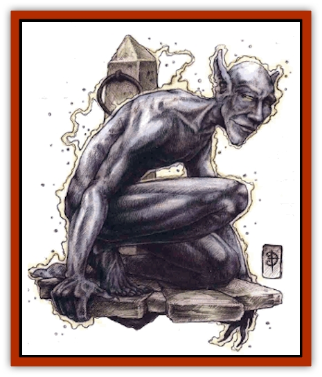

# Shocker

| Statistic | **Contented One** | **Sojourner** |
| --- | --- | --- |
| **Activity Cycle:** | Any | Any |
| **Alignment:** | Chaotic neutral | Chaotic neutral |
| **Armor Class:** | 10 or 0 | 10 or 0 |
| **Climate/Terrain:** | Quasiplane of Lightning | Quasiplane of Lightning |
| **Damage/Attack:** | 2d4 | 3d4 |
| **Diet:** | None | None |
| **Frequency:** | Common | Rare |
| **Hit Dice:** | 1+2 | 5-10 |
| **Intelligence:** | Semi- (2-4) | Average (8-10) |
| **Magic Resistance:** | 20% | 50% |
| **Morale:** | Average (8-10) | Champion (15-16) |
| **Movement:** | 9 | 15 |
| **No. Appearing:** | 6d4 | 2d4 |
| **No. of Attacks:** | 1 | 1 |
| **Organization:** | Varies | Varies |
| **Size:** | M (6' tall) | M (6' tall) |
| **Special Attacks:** | See below | See below |
| **Special Defenses:** | See below | See below |
| **THAC0:** | 19 | 5-6 HD: 15 / 7-8 HD: 13 / 9-10 HD: 11 |
| **Treasure:** | Q | Q |
| **XP Value:** | 270 | 5 HD: 2,000 / 6 HD: 3,000 / 7 HD: 4,000 / 8 HD: 5,000 / 9 HD: 6,000 / 10 HD: 7,000 |

Shockers are energy creatures of the Quasielemental Plane of Lightning. They're composed entirely of electricity and thus quite alien to most other life forms. On their own quasiplane, all shockers look like amorphous masses of energy-ball lightning. But through unknown means (perhaps a method similar to the *astral* spell, but with marked differences), some shockers can extend a portion of themselves onto other planes. That's how they've become known - and feared - throughout the multiverse.

Shockers come in two distinct varieties. Those that seek to leave the quasiplane of Lightning and explore are known simply as sojourners (in their own language). They extend themselves onto the Prime, the Ethereal, or any other Inner Plane, adopting a form that resembles a suit of humanoid armor imbued with great energy that crackles and sparks when they move.

The rest of the shockers are called contented ones, apparently because they're happy to stay on their home plane. 'Course, they can still extend themselves to other planes if they choose to do so. When this happens, they appear as indistinct humanoids made of bluish electricity, and they constantly give off sparks.

**Combat:** Both types of shockers attack simply by touching their foes; the contented ones inflict 2d4 points of electrical damage, and the sojourners cause 3d4 points. Any sod who fights a shocker while wearing metal armor or carrying a metal shield is treated as if he had Armor Class 10 (though Dexterity and magical bonuses still apply). Shockers gain a +2 attack bonus against foes in plate mail, +3 versus those in field plate, and +4 against victims in full plate.

Further, if struck by a hand-held, metallic weapon, a shocker automatically discharges its electrical attack. Against such blows the shocker is treated as AC 10. Against nonmetallic or missile weapons, the creature has an AC of 0. In any case, however, the weapon must be of +1 or greater enchantment in order to harm the shocker.

If a contented one discharges its attack (either by striking or being struck) while on a plane other than Lightning, its essence on that plane dissipates, leaving nothing but a minor bit of gray, metallic dust. Sojourners don't face that limitation, nor do contented ones while on their home quasiplane.

What's more, sojourner shockers can unleash *chain lightning* attacks similar to those of the wizard spell. When the lightning bolt strikes its first target, it causes 1d8 points of damage for each or the shocker's Hit Dice. Then it arcs to another victim within 40 yards, this time causing 1d8 fewer points of damage. The bolt keeps striking new sods, inflicting 1d8 fewer points of damage each time, until its charge is exhausted (or until there are no more targets). Each victim can make a saving throw versus spell, with success indicating that he suffers only half damage from the bolt. Note that each time a shocker looses a bolt of chain lightning, it loses one of its Hit Dice, including the accompanying hit points.

Both kinds of shockers are immune to poison, paralysis, and mind-affecting spells such as *charm*, *hold*, and *sleep*.Both kinds sustain half damage from fire- and cold-based attacks (and can make the appropriate saving throws to negate the damage entirely). And both are immune to electricity - the sojourners especially so. Fact is, each successful electrical attack gives a sojourner one extra Hit Die (including the additional hit points), to a maximum of 10 HD. In this manner, a sojourner can regain any Hit Dice it lost by using its *chain lightning* power. Sometimes, in dire situations, a group of sojourners will blast one or two of their number with chain lightning bolts, sacrificing some of their own strength in order to create a few super-defenders.

Because shockers extend only a portion of themselves when traveling, they can be slain only while on the quasiplane of Lightning. If "killed" on any other plane, they don't die - their extended portion just turns to gray, metallic dust.

**Habitat/Society:** Because of the shockers' exploratory nature, a basher's more likely to encounter one on the streets of Sigil than almost any other creature from the Inner Planes. Shocker've been reported on nearly every known plane - they've even found their way to the Outer Planes by extending themselves onto the Prime and then through the Astral or a portal. Such expeditions are extraordinarily rare, though, due to the difficulties involved.

On any plane other than their own, shockers are inquisitive and curious, observing living organisms, the environment, and energy patterns invisible to most other creatures. On Lightning, though, it's harder to tumble to a shocker's motivations. They live in communities within the quasiplane's stormy atmosphere, communicating in their buzzing, frantic language. These creatures sometimes learn the tongues of other races, but they still never call themselves "shockers". Instead, they always use their name from their own language: vrrxlzk (or some approximation thereof).

Contented ones are either the very oldest or youngest or the race. However, shockers apparently observe time in a manner different from most mortals, for they see it as a variable - something that literally speeds up and slows down. Therefore, shockers that converse with other races have difficulty talking in terms of age or the passage of time in a way that anyone else can understand.

Inner-planar scholars theorize that all shockers spend a great deal of their existence as lightning bolts arcing through the infinite expanse of their home quasiplane at the speed of light. Such would explain, perhaps, their unusual view of time.

**Ecology:** On the Quasielemental Plane of Lightning, vrrxlzk are relatively peaceful creatures that attack only in self-defense. While traveling elsewhere, though, shockers probe and explore and often test other species by attacking or acting in strange, unpredictable manners. Because they can't truly be killed, these planewalking shockers rarely worry about danger. (When the creatures "die" off their home plane, the resultant dust occasionally contains a few rare minerals or gemstones.)

A handful of wizards know the dark of spells to summon shockers. Unfortunately, these poorly researched summonings have an equal chance of conjuring either a contented one or a sojourner.

---
## Discovery & Documentation

**Source Publication:** MC14 Fiend Folio Appendix (1992)
**Campaign Setting:** Fiends Folio
**Author(s):** Don Bingle, John Terra, Wes Nicholson, Tim Beach, Steve Hardinger, Kris Hardinger, Rob Nicholls, Greg Swedberg, Al Boyce, Vince Garcia, Norm Ritchie

### Other Creatures Found in This Source Book
   * [[Aballin|Aballin]]
   * [[Achaierai|Achaierai]]
   * [[Adherer|Adherer]]
   * [[Algoid|Algoid]]
   * [[Al-Mi'raj|Al-Mi'raj]]
   * [[Apparition|Apparition]]
   * [[Caterwaul|Caterwaul]]
   * [[Coffer_Corpse|Coffer Corpse]]
   * [[Crabman|Crabman]]
   * [[Dark_Creeper|Dark Creeper]]
   * [[Dark_Stalker|Dark Stalker]]
   * [[Darter|Darter]]
   * [[Denzelian|Denzelian]]
   * [[Dune_Stalker|Dune Stalker]]
   * [[Dwarf_Urdunnir|Dwarf, Urdunnir]]
   * [[Falcon_Fire|Falcon, Fire]]
   * [[Faux_Faerie|Faux Faerie]]
   * [[Flawder|Flawder]]
   * [[Fyrefly|Fyrefly]]
   * [[Gambado|Gambado]]
   * [[Garbug|Garbug]]
   * [[Giant_Fhoimorien|Giant, Fhoimorien]]
   * [[Gibberling|Gibberling]]
   * [[Gorbel|Gorbel]]
   * [[Grimlock|Grimlock]]
   * [[Hellcat|Hellcat]]
   * [[Ice_Lizard|Ice Lizard]]
   * [[Iron_Cobra|Iron Cobra]]
   * [[Khargra|Khargra]]
   * [[Mantari|Mantari]]
   * [[Penanggalan|Penanggalan]]
   * [[Pernicon|Pernicon]]
   * [[Phantom_Stalker|Phantom Stalker]]
   * [[Retriever|Retriever]]
   * [[Ruve|Ruve]]
   * [[Scathe|Scathe]]
   * [[Sheet_Ghoul_Sheet_Phantom|Sheet Ghoul/Sheet Phantom]]
   * [[Spanner|Spanner]]
   * [[Stwinger|Stwinger]]
   * [[Sussurus|Sussurus]]
   * [[Symbiotic_Jelly|Symbiotic Jelly]]
   * [[Terithran|Terithran]]
   * [[Thunder_Children|Thunder Children]]
   * [[Troll_Ice|Troll, Ice]]
   * [[Tween|Tween]]
   * [[Umpleby|Umpleby]]
   * [[Volt|Volt]]
   * [[Xill|Xill]]
   * [[Xvart|Xvart]]
   * [[Zygraat|Zygraat]]
