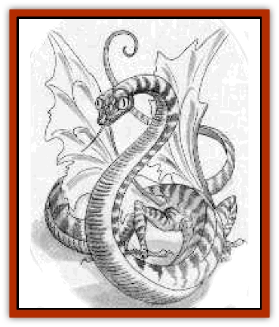
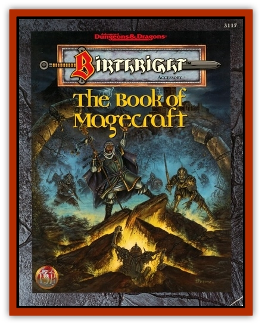

# Siddwynd

| Statistic | **Siddwynd** |
| --- | --- |
| **Activity Cycle:** | Any |
| **Alignment:** | Lawful neutral |
| **Armor Class:** | -1 |
| **Climate/Terrain:** | Any |
| **Damage/Attack:** | 2d4/1d12 |
| **Diet:** | Special |
| **Frequency:** | Mythical |
| **Hit Dice:** | 13 |
| **Intelligence:** | High (13-14) |
| **Magic Resistance:** | 30% |
| **Morale:** | Fearless (19-20) |
| **Movement:** | 9, Fl 18 (B), Br 6 |
| **No. Appearing:** | 1 |
| **No. of Attacks:** | 2 |
| **Organization:** | Solitary |
| **Size:** | L(10-12' long) |
| **Special Attacks:** | Electricity, lightning bolt |
| **Special Defenses:** | Immune to 1st- and 2nd-level wizard and priest spells |
| **THAC0:** | 7 |
| **Treasure:** | R&times;2,S&times;2,T |
| **XP Value:** | 8,000 |

The siddwynd (SITH-wind) is the least intelligent of the [[Garradalaigh_General_Information|garradalaighs]]. It is said to look like a long [[Snake|snake]], but it is actually a long, thin [[Lizard|lizard]]. It has four clawed feet, a formidable toothed jaw, and a whiplike tail that crackles with energy. It is greenish brown in color, a camouflage that allows it to blend in with it surroundings. Translucent wings sprout from the point where its legs join the trunk. These lay back against the creature's sides whet it is moving along the ground or burrowing; they balloon like sails as the siddwynd takes flight.

This garradalaigh is reported to be familiar with many human and demihuman tongues. It can communicate telepathically with lizards and snakes. A wizard in the company of a siddwynd enjoys protection from attacks by reptiles and snakes.

Twice a day, while airborne, the siddwynd can release a *lightning bolt* (per the spell), inflicting 6d6 points of damage. The target can attempt a saving throw vs. spell for half damage.

**Combat:** The siddwynd fights only if it or its companions are in danger. It begins combat by rising into the air and letting loose its *lightning bolts*. Next, it dives on a chosen target, attempting to bite. A successful strike made at the culmination of a dive inflicts maximum damage of 8 points. Once on the ground, it continues to bite and to strike with its tail. A successful tail slap inflicts 1d12 of electrical damage. Victims wearing metal armor or who are standing n water suffer an additional 1d4 points of damage.

This fearless garradalaigh will fight to the death (it does not believe it can be defeated). However, if the siddwynd is with humanoid friends and witnesses some of them withdrawing, it may do the same. It retreats by burrowing. Because the creatures considers itself an easy target in the air, it will fly away only as a last resort.

**Habitat/Society:** The siddwynd calls no place home. This garradalaigh appears in the folklore of all five of Cerilia's human tribes, as well in elven and dwarven legends. The creature reputedly loves traveling - no matter what the terrain or climate. It is as much at home in the mountains as on the plains, in temperate zones and the frozen north. Particularly frigid, arctic areas are another matter, however. After a day of traveling across cold ground, the garradalaigh will burrow deep beneath the surface to warm up and sleep.

**Ecology:** The creature treasures spent wands, used feather tokens, and other burned-out magical items for select dining. When these are not available, it feeds upon insects and small rodents.

---
## Discovery & Documentation

**Source Publication:** Book of Magecraft (1994)
**Campaign Setting:** Birthright
**Author(s):** Carrie A. Bebris, Anne Brown, Jean Rabe, Steven Schend, Ed Stark

### Other Creatures Found in This Source Book
   * [[Audreeana|Audreeana]]
   * [[Breiryn|Breiryn]]
   * [[Cabhaigh|Cabhaigh]]
   * [[Daegandal|Daegandal]]
   * [[Garigal|Garigal]]
   * [[Garradalaigh_General_Information|Garradalaigh, General Information]]
   * [[Rhoeghn|Rhoeghn]]
   * [[Tualleiaght|Tualleiaght]]
