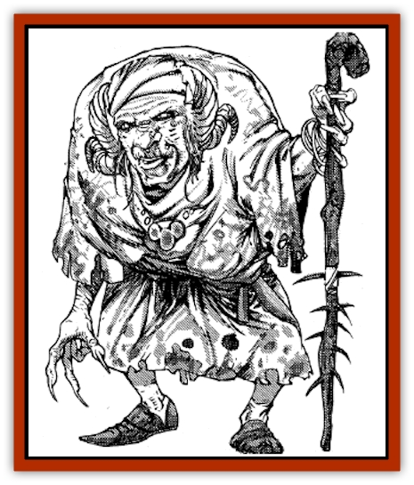

# Silat

| Statistic | **Adult** | **Young** |
| --- | --- | --- |
| **Activity Cycle:** | Night | Night |
| **Alignment:** | Any chaotic | Any chaotic |
| **Armor Class:** | 0 / Matriarch: -3 | 3 |
| **Climate/Terrain:** | Any land | Any land |
| **Damage/Attack:** | 8-11/8-11/9-15 | 8-11/8-11/9-15 |
| **Diet:** | Carnivore | Carnivore |
| **Frequency:** | Rare to very rare | Uncommon |
| **Hit Dice:** | 9 / Matriarch: 12 | 7 |
| **Intelligence:** | High to Exceptional (13-16) | Very (11-12) |
| **Magic Resistance:** | 55% | 30% |
| **Morale:** | Elite (14) | Elite (14) |
| **Movement:** | 15 | 15 |
| **No. Appearing:** | 1 or 3-9 | 1 |
| **No. of Attacks:** | 3 | 3 |
| **Organization:** | Solitary or family | Solitary |
| **Size:** | L-G (12-15' tall) | L (10' tall) |
| **Special Attacks:** | See below | See below |
| **Special Defenses:** | See below | See below |
| **THAC0:** | 8 (11) / Matriarch: 6 (9) | 10 (13) |
| **Treasure:** | W (D) | R |
| **XP Value:** | 10,000 / Matriarch: 17,000 | 5,000 |

Silats are a race of female, shapeshifting [[Hag|hags]] that roam both the wilderness and cities of Zakhara in magical disguise, searching for food.

In their true form, a silat appears to be a giant female humanoid with pale green or blue skin and curved ram's horns curling from each side of her head. The size of the horns depends on the silat's age, growing a complete spiral every century or so. The hair is usually the same color as the skin, but of a darker hue. Their teeth and nails look like yellowed ivory, but are harder and sharper than obsidian.

In both their polymorphed and their natural shape, silats wear rags that barely cover their bent and wrinkled forms.

**Combat:** Although the shapeshifting abilities of silats vary with age, all possess strong magic resistance and superhuman Strength (19). They attack physically with their daggerlike claws and a vicious bite. Silats can only be affected by magical or iron weapons and regenerate at a rate of 1 hp/round. They are unaffected by poison or mind-influencing spells (illusions, charms, *ESP*, and the like).

Younger silats (up to a century old) can *polymorph* all but one part of their form (usually the feet) three times/day. They will always take great pains to hide these appendages by covering them with rags. Once silats reach adulthood (one to five centuries old), they can fully *polymorph self* at will. In addition, adult silats can cast polymorph other three times/day. The most ancient of silats (over five centuries old) are revered as matriarchs. They can *polymorph self* and *polymorph other* (-4 on opponent's save) at will and can *polymorph any object* three times/day.

Neutral and good silats use their polymorphing abilities to move unnoticed and unbothered through human and demihuman society, where they are most commonly (and unknowingly) encountered. Evil silats use their powers to attract victims, frequently posing as helpless old women in need (or flirtatious maidens) in order to lure unsuspecting youths to a deserted location

**Habitat/Society:** Silats are typically solitary creatures. They can be found just about anywhere in Zakharan society. While hunting for food, silats will pose as hideously ugly human females to discourage encounters.

In the wilderness, adult silats may be encountered alone, or with their family. Silats propagate their species by mating with [[Ogre|ogre magi]]. Male offspring of such a union are ogre magi, while the female offspring are silats. Should a family be encountered, it will consist of an adult or matriarch silat with 1-4 sons (ogre magi) and 1-4 daughters (young silats).

Common to all silats is a desire to be left alone, and failing that, to be treated with respect. Every village or town has a story of a braggart who insulted a decrepit crone one day and was found sporting a donkey's tail the next. Even an evil silat will not attack one who bows respectfully and hails her politely with a friendly greeting. Those displaying refined manners and proper etiquette are rarely eaten and more often are helped on a quest or journey.

**Ecology:** Much of a silat's nocturnal activity cycle is spent in search of food. Neutral and good silats dine only on animal meat, while evil silats prefer human or demihuman flesh. In spite of their parasitic or predatory relationship with human society, many humans and demihumans regard them with ambivalence, partly out of fear, but mostly because they are known to be extremely helpful to those approaching them in the proper manner.

Unfortunately, the "proper manner" of greeting a silat varies from individual to individual. With some, a polite salutation, such as "Peace upon you and your family!" may suffice. For others, a visitor might be required to perform a few minor chores, like tidying the silat's lair or combing her tangled hair. A few eccentric silats are known to only help visitors who perform the exact opposite of what was requested, polymorphing others into an embarrassing or ugly shape.

---
## Discovery & Documentation

**Source Publication:** MC13 Al-Qadim Appendix (1992)
**Campaign Setting:** Al-Qadim (Forgotten Realms)
**Author(s):** C. Terry Phillips

### Other Creatures Found in This Source Book
   * [[Ammut|Ammut]]
   * [[Ashira|Ashira]]
   * [[Asuras|Asuras]]
   * [[Black_Cloud_of_Vengeance|Black Cloud of Vengeance]]
   * [[Buraq|Buraq]]
   * [[Camel|Camel]]
   * [[Camel_of_the_Pearl|Camel of the Pearl]]
   * [[Centaur_Desert|Centaur, Desert]]
   * [[Copper_Automaton|Copper Automaton]]
   * [[Debbi|Debbi]]
   * [[Elephant_Bird|Elephant Bird]]
   * [[Gen|Gen]]
   * [[Genie_Noble_Dao|Genie, Noble Dao]]
   * [[Genie_Noble_Djinni|Genie, Noble Djinni]]
   * [[Genie_Noble_Efreeti|Genie, Noble Efreeti]]
   * [[Genie_Noble_Marid|Genie, Noble Marid]]
   * [[Genie_Tasked_Architect_Builder|Genie, Tasked, Architect/Builder]]
   * [[Genie_Tasked_Artist|Genie, Tasked, Artist]]
   * [[Genie_Tasked_Guardian|Genie, Tasked, Guardian]]
   * [[Genie_Tasked_Herdsman|Genie, Tasked, Herdsman]]
   * [[Genie_Tasked_Slayer|Genie, Tasked, Slayer]]
   * [[Genie_Tasked_Warmonger|Genie, Tasked, Warmonger]]
   * [[Genie_Tasked_Winemaker|Genie, Tasked, Winemaker]]
   * [[Ghost_Mount|Ghost Mount]]
   * [[Ghul|Ghul]]
   * [[Giant_Desert|Giant, Desert]]
   * [[Giant_Jungle|Giant, Jungle]]
   * [[Giant_Reef|Giant, Reef]]
   * [[Giant_Zakhara_General_Information|Giant (Zakhara), General Information]]
   * [[Hama|Hama]]
   * [[Heway|Heway]]
   * [[Living_Idol|Living Idol]]
   * [[Lycanthrope_Werehyena|Lycanthrope, Werehyena]]
   * [[Lycanthrope_Werelion|Lycanthrope, Werelion]]
   * [[Markeen|Markeen]]
   * [[Maskhi|Maskhi]]
   * [[Mason_Wasp_Giant|Mason Wasp, Giant]]
   * [[Nasnas|Nasnas]]
   * [[Pahari|Pahari]]
   * [[Rom|Rom]]
   * [[Sabu_Lord|Sabu Lord]]
   * [[Sakina|Sakina]]
   * [[Serpent_Lord|Serpent Lord]]
   * [[Serpent_Winged|Serpent, Winged]]
   * [[Simurgh|Simurgh]]
   * [[Stone_Maiden|Stone Maiden]]
   * [[Vishap|Vishap]]
   * [[Zaratan|Zaratan]]
   * [[Zin|Zin]]
