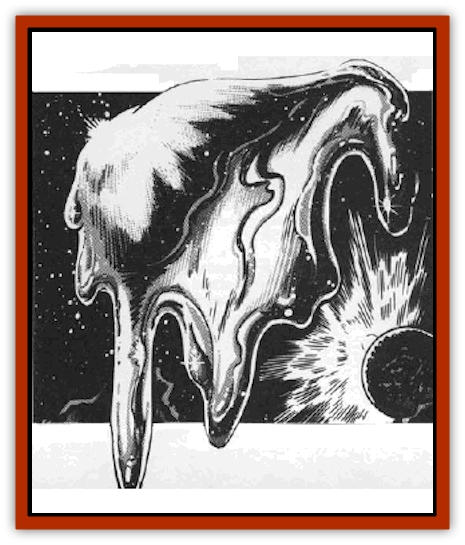

# Silatic

| Statistic | **Gold** | **Iron** | **Platinum** |
| --- | --- | --- | --- |
| **Activity Cycle:** | Any | Any | Any |
| **Alignment:** | Neutral | Neutral | Neutral |
| **Armor Class:** | 9 | 5 | 3 |
| **Climate/Terrain:** | Space | Space | Space |
| **Damage/Attack:** | 1d6+4 | 1d6+7 | 1d6+7 |
| **Diet:** | See below | See below | See below |
| **Frequency:** | Rare | Rare | Rare |
| **Hit Dice:** | 9+1 | 6+1 | 10+1 |
| **Intelligence:** | Low (5) | Low (5) | Low (5) |
| **Magic Resistance:** | 30% | 75% | 30% |
| **Morale:** | Steady (12) | Steady (12) | Steady (12) |
| **Movement:** | 12 | 6 | 6 |
| **No. Appearing:** | 1 | 1 | 1 |
| **No. of Attacks:** | 3 | 3 | 2 |
| **Organization:** | Solitary | Solitary | Solitary |
| **Size:** | M (6') | M (6') | M (6') |
| **Special Attacks:** | See below | See below | See below |
| **Special Defenses:** | +1 or better weapons to hit | +1 or better weapons to hit | +1 or better weapons to hit |
| **THAC0:** | 11 | 15 | 11 |
| **Treasure:** | M&times;10 | J&times;10 | L&times;10 |
| **XP Value:** | 3,000 | 975 | 4,000 |

Silatics are amorphous blobs, 5-7' in diameter, that eat metal. Continuously shifting and quivering, they use their two pseudopods to test substances for edibility. The silatic's diet consists solely of the metal they are made of. For example, a platinum silatic eats only platinum. Silatics innately detect the metal they eat within a 100' range.

Silatics hide well, for they can stretch as thin as 1" thick. They need no air to survive and prefer wildspace to planets. In wildspace they are almost graceful, fanning their thinned bodies to move slowly. As soon as gravity takes hold, though, gracefulness disappears; their pseudopods pull them along the ground.

**Combat:** The silatic's two pseudopods administer bludgeoning damage of 1d6+4. Each adult silatic's pseudopod can extend to 50'. They attack only if disturbed while eating or prevented from feeding. Usually, one pseudopod remains attached to the food while the other attacks an opponent. If injured, the silatic detaches from the food source and attacks the offender with both pseudopods.

There are three known types of sciatics: gold, platinum, and iron. (A fourth, silver, is rumored.) Each has a special attack:

<ul><li>*Iron* - +2 bonus to damage; high magic resistance.</li><li>*Gold* - moves faster than other sciatics, gaining one extra attack per round.</li><li>*Platinum* - +3 bonus to damage; also, the platinum silatic coats its pseudopod with acid. If it hits, the character takes an additional 2d8 damage (save vs. poison fur half damage).</li></ul>A silatic eats by attaching a pseudopod to its meal, excreting a liquid that dissolves the metal, and absorbing it through the skin. It takes three rounds to administer the liquid and three to absorb the liquefied metal. The liquid is harmless to living beings. Metal of the silatic's type saves vs. acid at -5. Metal not of the silatic's type saves at -2.

If a silatic senses metal within a wooden-hulled ship, it first tries to sneak aboard. If this fails, it batters a hole in the ship near the metal inside. Against metal ships, a silatic inflicts 1 hull point per turn, against wood, it inflicts normal combat damage.

**Habitat/Society:** Silatics are solitary, avoiding other beings by hinding in "uninhabitable" places. Silatics of the same type exhibit instant hostility and fight to the death.

[[Grav|Gravs]] and most space miners kill silatics on sight. Residents of inhabited worlds hunt down silatics relentlessly. Once a gold silatic got into the gold reserves of a major city, reproduced, and soon dozens were oozing around, searching for more gold to devour. The entire city's economy collapsed because gold became too scarce - all because of one hungry silatic.

**Ecology:** Silatics have no spelljamming ability. To move from world to world, they stow away on ships, often on the outer hull.

When a silatic absorbs enough metal (around 100 lbs), it seeks out an uninhabited area and splits in two. The two new silatics, each 3½' wide, are dazed and instinctively move in opposite directions. Five hours after splitting, they regain their senses and search for food. If the reproduction occurs in a confined space, the two silatics fight to the death upon regaining their senses.

If a silatic is killed, only the metal eaten in the last week can be recovered (usually 1d10 lbs per Hit Die). All other material dissolves into a jelly-like substance.

---
## Discovery & Documentation

**Source Publication:** MC9 Spelljammer Appendix II (1991)
**Campaign Setting:** Planescape
**Author(s):** Scott Davis, Newton Ewell, John Terra

### Other Creatures Found in This Source Book
   * [[Alchemy_Plant|Alchemy Plant]]
   * [[Allura|Allura]]
   * [[Aperusa|Aperusa]]
   * [[Autognome|Autognome]]
   * [[Bionoid|Bionoid]]
   * [[Bloodsac|Bloodsac]]
   * [[Buzzjewel|Buzzjewel]]
   * [[Constellate|Constellate]]
   * [[Contemplator|Contemplator]]
   * [[Dohwar|Dohwar]]
   * [[Dragon_Moon|Dragon, Moon]]
   * [[Dragon_Stellar|Dragon, Stellar]]
   * [[Dragon_Sun|Dragon, Sun]]
   * [[Dreamslayer|Dreamslayer]]
   * [[Dweomerborn|Dweomerborn]]
   * [[Fal|Fal]]
   * [[Feesu|Feesu]]
   * [[Fire_Bat|Fire Bat]]
   * [[Firebird|Firebird]]
   * [[Firelich|Firelich]]
   * [[Flowfiend|Flowfiend]]
   * [[Gadabout|Gadabout]]
   * [[Gammaroid|Gammaroid]]
   * [[Gonn|Gonn]]
   * [[Gossamer|Gossamer]]
   * [[Grav|Grav]]
   * [[Great_Dreamer|Great Dreamer]]
   * [[Greatswan|Greatswan]]
   * [[Grell_Colonial|Grell, Colonial]]
   * [[Gullion|Gullion]]
   * [[Insectare|Insectare]]
   * [[Lhee|Lhee]]
   * [[Mercurial_Slime|Mercurial Slime]]
   * [[Meteorspawn|Meteorspawn]]
   * [[Monitor|Monitor]]
   * [[Owl_Space|Owl, Space]]
   * [[Pristatic|Pristatic]]
   * [[Scro|Scro]]
   * [[Selkie_Star|Selkie, Star]]
   * [[Skullbird|Skullbird]]
   * [[Sleek|Sleek]]
   * [[Sluk|Sluk]]
   * [[Space_Swine|Space Swine]]
   * [[Sphinx_Astro-|Sphinx, Astro-]]
   * [[Spirit_Warrior|Spirit Warrior]]
   * [[Starfly_Plant|Starfly Plant]]
   * [[Stargazer|Stargazer]]
   * [[Undead_Stellar|Undead, Stellar]]
   * [[Witchlight_Marauder|Witchlight Marauder]]
   * [[Xixchil|Xixchil]]
   * [[Yitsan|Yitsan]]
   * [[Zurchin|Zurchin]]
