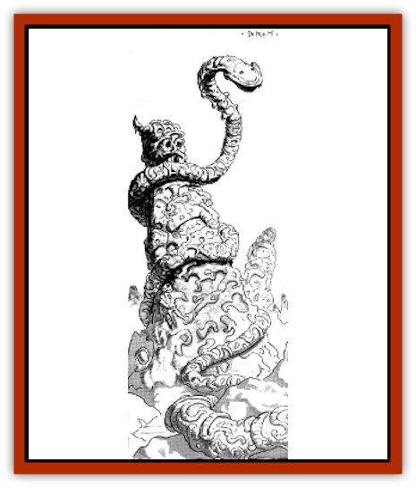

# Silk Wyrm

| Statistic | **Silk Wyrm** |
| --- | --- |
| **Activity Cycle:** | Any |
| **Alignment:** | Neutral |
| **Armor Class:** | 3 |
| **Climate/Terrain:** | Badlands |
| **Damage/Attack:** | 1d6 |
| **Diet:** | Carnivore |
| **Frequency:** | Uncommon |
| **Hit Dice:** | 6 |
| **Intelligence:** | Low (5-7) |
| **Magic Resistance:** | Nil |
| **Morale:** | Steady (11-12) |
| **Movement:** | 12, Fl 12 (C) |
| **No. Appearing:** | 1 |
| **No. of Attacks:** | 1 |
| **Organization:** | Solitary |
| **Size:** | L (50' long) |
| **Special Attacks:** | See below |
| **Special Defenses:** | Nil |
| **THAC0:** | 15 |
| **Treasure:** | (W) |
| **XP Value:** | 1,400 |

**Psionics Summary**

| Level | Dis/Sci/Dev | Attack/Defense | Score | PSPs |
| --- | --- | --- | --- | --- |
| 6 | 1/1/0 | Nil/Nil | 15 | 45 |

**Psychometabolism -** *Science:* shadow form; *Devotions:* nil.

The silk wyrm is a [[Snake|snake]] with a hard, chitinous shell that measures over 50' in length. They are commonly seen flying through the air during the day searching for prey, but rarely attack until dusk, when they assume their shadow form and sneak into a camp to attack.

Any creature bitten by a silk wyrm must save vs. poison or be paralyzed for 1d4 days (a restore or remove curse will reverse this effect). Psionic powers can still be used while in this state, as long as the body itself is not required to move.

The silk wyrm will drag its paralyzed prey away and encase it in a sheath of silk, inside which the unfortunate victim will linger for up to two weeks. During this time, the silk wyrm will occasionally stick its head into the protective cocoon and bite the victim's neck, draining a little bit of blood and paralyzing him for another 1d4 days. Each time this occurs, the victim loses one point of Constitution. When his constitution reaches 0, all of his blood has been drained and he dies.

The silk casing manufactured by the silk wyrm is valued in many cities for use in expensive clothing. It is flame resistant (+4 bonus on any saves vs. normal fires, +2 bonus vs. magical fires) and very tough. Cutting a captured victim free can be quite time consuming.

---
## Discovery & Documentation

**Source Publication:** Dark Sun Campaign Setting (original) (1991)
**Campaign Setting:** Dark Sun
**Author(s):** Timothy B. Brown, Troy Denning, William W. Connors, J. Robert King, Brom and Tom Baxa,

### Other Creatures Found in This Source Book
   * [[Animal_Domestic_Athas_I|Animal, Domestic (Athas) I]]
   * [[Belgoi|Belgoi]]
   * [[Braxat|Braxat]]
   * [[Dragon_of_Tyr|Dragon of Tyr]]
   * [[Dune_Freak|Dune Freak]]
   * [[Gaj|Gaj]]
   * [[Giant_Athach|Giant, Athach]]
   * [[Gith|Gith]]
   * [[Jozhal|Jozhal]]
   * [[Kluzd|Kluzd]]
   * [[Tembo|Tembo]]
   * [[Wezer|Wezer]]
