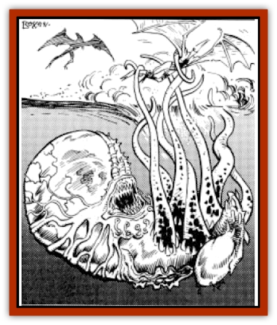

# Silt Horror

| Statistic | **Brown Horror** | **Gray Horror** | **White Horror** |
| --- | --- | --- | --- |
| **Activity Cycle:** | Any | Any | Any |
| **Alignment:** | Neutral | Neutral | Neutral |
| **Armor Class:** | 7 | 7 | 8 |
| **Climate/Terrain:** | Any Silt | Any Silt | Any Silt |
| **Damage/Attack:** | 1-6 (&times;8) | 1-8 (&times;12) | 1-8 (&times;10) |
| **Diet:** | Carnivore | Carnivore | Carnivore |
| **Frequency:** | Very rare | Rare | Uncommon |
| **Hit Dice:** | 9 | 12 | 14 |
| **Intelligence:** | Semi- (2-4) | Semi- (2-4) | Animal (1) |
| **Magic Resistance:** | Nil | Nil | Nil |
| **Morale:** | Very Steady (12-13) | Elite (14-15) | Average (10) |
| **Movement:** | 3 | 6 | 3 |
| **No. Appearing:** | 1 | 1 | 1 |
| **No. of Attacks:** | 8 | 12 | 10 |
| **Organization:** | Solitary | Solitary | Solitary |
| **Size:** | H (20') | H (25') | G (50') |
| **Special Attacks:** | Constriction | Constriction | Constriction |
| **Special Defenses:** | Air jet | Air jet | Air jet |
| **THAC0:** | 11 | 9 | 7 |
| **Treasure:** | Nil | Nil | Nil |
| **XP Value:** | 5,000 | 9,000 | 7,000 |

Silt Horror is the name given a group of predators that dwell in the sea of sand. While they vary in size and color, all of them are characterized by a large number of tentacles, and an unending hunger. Few are the creatures that escape once a silt horror has its tentacles around them.

## White Horror

The white horror is the most common, and usually the largest, of the silt horrors. Its tentacles can grow up to 50' long, and it uses them to drag prey below the silt.

**Combat:** The white horror lies in wait below the silt. It is very sensitive to the vibrations caused by beings moving through the silt. Because of this, it is very hard to surprise (+2 bonus to surprise rolls). It also lies very still, granting it an increased chance to surprise opponents. (-2 penalty to all opponent's surprise rolls).

When an opponent gets in range, (50. or less), the white horror attacks with all of its tentacles. It will attack multiple targets, but only if they are all in range. The horror usually attacks as soon as a target gets in range, rather than waiting for a larger group to approach. On an attack roll that exceeds the required score to hit by 4 or more, the victim is held by a tentacle. A hit causes 1d8 points of damage. If the victim is held, he suffers an additional 1d8 each succeeding round. The white horror also tries to drag the victim under the silt. Only creatures with a firm footing or a place to anchor themselves are allowed an Open Doors roll to resist this.

Once a horror grasps a victim, the tentacle must be severed to allow release. Very strong creatures (Strength 21 or better) have a chance equal to a Bend Bars roll to pull free. Otherwise, each tentacle takes 10 points of damage before being severed. Blunt weapons do half damage, but can eventually crush a tentacle. The white horror does not usually fight to the death.

On the rare occasions when a horror is losing a fight, it uses its air jet to escape. It moves by jetting out a large gust of air, sliding itself backwards through the silt at a rate of 50 yards per round. This also raises a small cloud of silt, making it almost impossible to follow, at least for those using sight. On the round after fleeing, the horror is completely hidden under the silt, and those who want to finish it off had better be able to fight under the silt. The horror's mouth is located next to the sensitive air sac, and is not used in combat.

A white horror waits until its food has suffocated before it begins to feed.

**Habitat/Society:** The white horror is found anywhere in silt basins and the Sea of Silt. They move very slowly, and usually don't make the effort. They can sense vibrations in the silt up to 3 miles away, and gradually move towards any regular wading path that is used. The white horror does not like the sun, and if it must move out of the silt (to crawl over a sunken wall, for instance) it prefers to wait for dark.

**Ecology:** The white horror eats anything except other horrors. It is always hungry, and usually attacks anything that comes in range. It can exist for years on one meal, lying dormant underneath the silt. It lives about 40 years, usually mating only once in its life. This occurs only after a rain, and only if there is a male/female pair in the area. The female waits until she has found a new victim, and lays thousands of eggs in the body. These eventually hatch and jet off through the silt to begin eating. The white horror is said to be good eating by the few [[Giant_Athas|giants]] who have ever killed one.

If a horror has tentacles severed, it can replace them at the rate of one per month.

## Brown Horror

**Psionics Summary**

| Level | Dis/Sci/Dev | Attack/Defense | Score | PSPs |
| --- | --- | --- | --- | --- |
| 2 | 2/2/4 | -/M- | 12 | 54 |

**Clairsentience -** *Science:* precognition; *Devotions:* feel sound, feel light.

**Telepathy -** *Science:* domination; *Devotions:* contact, mind blank.

The brown horror is a very feared form of silt horror, since it can force its victims to come to it. It is not actually brown, its skin is more of a dirty white color. Against the pearly silt, the tentacles flailing in the air often appear brown.

**Combat:** The brown horror lies in wait beneath the silt, like all varieties of silt horror. Its unique features include using precognition to determine the strength of the opposition, and the best time to attack. If it senses that the opponent is too strong for it, it tries to use its domination power to take over the victim. The brown horror is blind and deaf, so it uses its ability to feel sound and light to sense its prey. A brown horror always has at least one tentacle just a fraction below the surface. It uses this "sensing tentacle" to find out what is going on around it.

When it attacks, it attempts to grasp an opponent with its tentacles and drag them below the silt. A hit causes 1d6 points of damage, and if it exceeds the attack roll by four or more, the opponent has been grabbed. Grabbing an opponent causes 1d6 points of damage each successive round, and the victim must make a Strength roll or be pulled under the surface. Resisting assumes that the victim has somewhere to get a firm footing, or is anchored to something. Victims pulled under the silt suffocate as listed under the white horror entry. Creatures with a 19 Strength may pull free by making a successful Bend Bars roll, although this is the only action allowed that round. Each tentacle takes 8 points of damage before being destroyed. Tentacle damage does not count towards the total hit points of the creature, although severing 4 or more tentacles causes it to flee, if able. It flees by using its air jet, which is the same as that of the white horror.

**Habitat/Society:** The brown horror is a solitary creature, found only in the silt. It is the most active of the horrors, ranging far in search of food. A brown horror lives about 45 years, and must eat at least once a month. Brown horrors are actually the products of cross breeding between the two other types of horrors listed.

**Ecology:** The brown horror is always hungry. It even attacks other horrors. It always attempts to dominate other horrors, being smaller and unable to stand up to the larger horrors in physical combat. The brown horror has no natural enemies except the other horrors. It can be eaten, but the few giants who have tried it said that the taste left much to be desired.

Any severed tentacles take two weeks to grow back, each.

## Gray Horror

**Psionics Summary**

| Level | Dis/Sci/Dev | Attack/Defense | Score | PSPs |
| --- | --- | --- | --- | --- |
| 1 | 1/0/3 | -/- | 0 | 34 |

**Psychokinesis -** *Sciences:* nil; *Devotions:* control sound, create sound, control winds.

The gray horror is perhaps the worst of the silt horrors. It is a sickly gray in color, and has a multitude of sharp-edged tentacles. It is the most intelligent of the horrors, and fears nothing that moves.

**Combat:** The gray horror attempts to lure its victim to it. It is skilled at creating and controlling sound. It is not intelligent enough to imitate a person's voice, but it can make whimpering sounds and the sounds of water. It uses its control winds and control sound powers to make it seem that there is water only a few steps away. When the intended victim is close enough, the horror strikes. A full dozen tentacles whip out of the silt and attack. If the victim is really looking for the water, he receives a -4 penalty to his surprise roll, otherwise the horror surprises its victims as listed for the white horror.

The tentacles are barbed, and a successful hit roll means that the victim is grabbed and held. A hit causes 1d8 points of damage, and the victim is pulled under the silt to suffocate. In addition to the problem of the silt, the horror keeps squeezing, doing 1d8 points of damage each additional round. Only a strength of 23 or better allows a Bend Bars roll attempt to break free. Each tentacle can take 12 points of damage before it is severed. The horror is very protective of its central body, and flees if it takes a direct hit to the body. It moves by jetting itself through the silt, raising a small cloud of silt in the area. It can "jet" itself up to 50 yards in one round. Unlike the other horrors, this one comes back a few rounds later, at least if the victim(s) do not move off immediately. It will continue these "hit and run" attacks until it has suffocated as many victims as possible, or until it takes over 50% damage to its body. If one or more tentacles are severed, they regrow at the rate of one per month.

**Habitat/Society:** Gray horrors are solitary, hungry, aggressive creatures. They only use their air sacs for emergencies, preferring to "swim" through the silt. They range far through the silt in search of prey.

**Ecology:** Gray horrors consider anything that they can sense as prey. They sense the vibrations of someone moving through or on the silt for up to 3 miles, and usually try to move towards it. Gray horrors mate with any other kind of horrors. Their favorite food is giant, and once a gray horror discovers a giant's path, the giants usually have to find a new path.

---
## Discovery & Documentation

**Source Publication:** MC12 Dark Sun Appendix I - Terrors of the Desert (1991)
**Campaign Setting:** Dark Sun
**Author(s):** Tom Prusa, Louis J. Prosperi, Walter M. Baas

### Other Creatures Found in This Source Book
   * [[Animal_Herd_Athas|Animal, Herd (Athas)]]
   * [[Animal_Household_Athas|Animal, Household (Athas)]]
   * [[Antloid_Desert|Antloid, Desert]]
   * [[Banshee_Dwarf|Banshee, Dwarf]]
   * [[Beetle_Agony|Beetle, Agony]]
   * [[Bog_Wader|Bog Wader]]
   * [[Brambleweed|Brambleweed]]
   * [[B'rohg|B'rohg]]
   * [[Burnflower|Burnflower]]
   * [[Cat_Psionic|Cat, Psionic]]
   * [[Cha'thrang|Cha'thrang]]
   * [[Cistern_Fiend|Cistern Fiend]]
   * [[Clam_Giant|Clam, Giant]]
   * [[Cloud_Ray|Cloud Ray]]
   * [[Drake_Athas_Air|Drake (Athas), Air]]
   * [[Drake_Athas_Earth|Drake (Athas), Earth]]
   * [[Drake_Athas_Fire|Drake (Athas), Fire]]
   * [[Drake_Athas_Water|Drake (Athas), Water]]
   * [[Dune_Runner|Dune Runner]]
   * [[Dune_Trapper|Dune Trapper]]
   * [[Elemental_Athas_Greater_Air|Elemental (Athas), Greater, Air]]
   * [[Elemental_Athas_Greater_Earth|Elemental (Athas), Greater, Earth]]
   * [[Elemental_Athas_Greater_Fire|Elemental (Athas), Greater, Fire]]
   * [[Elemental_Athas_Greater_Water|Elemental (Athas), Greater, Water]]
   * [[Elemental_Athas_Lesser_Air_Earth|Elemental (Athas), Lesser, Air/Earth]]
   * [[Elemental_Athas_Lesser_Fire_Water|Elemental (Athas), Lesser, Fire/Water]]
   * [[Elemental_Athas_General_Information|Elemental (Athas), General Information]]
   * [[Erdland|Erdland]]
   * [[Esperweed|Esperweed]]
   * [[Flailer|Flailer]]
   * [[Floater|Floater]]
   * [[Giant_Athas|Giant (Athas)]]
   * [[Golem_Athas_I|Golem (Athas) I]]
   * [[Golem_Athas_II|Golem (Athas) II]]
   * [[Golem_Athas_III|Golem (Athas) III]]
   * [[Golem_Athas_General_Information|Golem (Athas), General Information]]
   * [[Halfling_Renegade|Halfling, Renegade]]
   * [[Hej-kin|Hej-kin]]
   * [[Id_Fiend|Id Fiend]]
   * [[Insect_Swarm_Athas|Insect Swarm (Athas)]]
   * [[Kank_Wild|Kank, Wild]]
   * [[Kirre|Kirre]]
   * [[Megapede|Megapede]]
   * [[Mul_Wild|Mul, Wild]]
   * [[Nightmare_Beast|Nightmare Beast]]
   * [[Plant_Carnivorous_Athas|Plant, Carnivorous (Athas)]]
   * [[Pterran|Pterran]]
   * [[Pterrax|Pterrax]]
   * [[Pulp_Bee|Pulp Bee]]
   * [[Pyreen|Pyreen]]
   * [[Rasclinn|Rasclinn]]
   * [[Razorwing|Razorwing]]
   * [[Roc_Athas|Roc (Athas)]]
   * [[Sand_Bride|Sand Bride]]
   * [[Sand_Cactus|Sand Cactus]]
   * [[Sand_Vortex|Sand Vortex]]
   * [[Scrab|Scrab]]
   * [[Silt_Runner|Silt Runner]]
   * [[Sink_Worm|Sink Worm]]
   * [[Sloth_Athas|Sloth (Athas)]]
   * [[So-ut|So-ut]]
   * [[Spider_Cactus|Spider Cactus]]
   * [[Spider_Crystal|Spider, Crystal]]
   * [[Spirit_of_the_Land|Spirit of the Land]]
   * [[T'Chowb|T'Chowb]]
   * [[Thrax|Thrax]]
   * [[Tohr-kreen_I|Tohr-kreen I]]
   * [[Villichi|Villichi]]
   * [[Zhackal|Zhackal]]
   * [[Zombie_Plant|Zombie Plant]]
