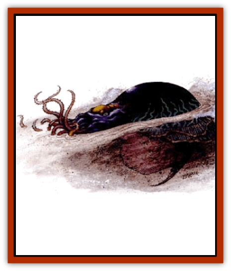

# Silt Horror - Black

| Statistic | **Silt Horror, Black** |
| --- | --- |
| **Activity Cycle:** | Any |
| **Alignment:** | Neutral |
| **Armor Class:** | 7 |
| **Climate/Terrain:** | Any silt |
| **Damage/Attack:** | 1d8/1d4 |
| **Diet:** | Carnivore |
| **Frequency:** | Common |
| **Hit Dice:** | 5 |
| **Intelligence:** | Semi- (2-4) |
| **Magic Resistance:** | Nil |
| **Morale:** | Champion (15-16) |
| **Movement:** | 3, Sw 9 |
| **No. Appearing:** | 3-12 (3d4) |
| **No. of Attacks:** | 1 + bite |
| **Organization:** | Clutch |
| **Size:** | M (4' long) |
| **Special Attacks:** | Entangle, poison |
| **Special Defenses:** | Air jet |
| **THAC0:** | 15 |
| **Treasure:** | Nil |
| **XP Value:** | 650 |

**Psionics Summary**

| Level | Dis/Sci/Dev | Attack/Defense | Score | PSPs |
| --- | --- | --- | --- | --- |
| 5 | 2/2/7 | EW,II,/MBk,TS | 11 | 40 |

**Clairsentience -** *Science:* precognition; *Devotions:* feel sound, feel light.

**Telepathy -** *Science:* mind link; *Devotions:* attraction, contact, ego whip, id insinuation, life detection.

The black silt horror is the smallest and most common of the [[Silt_Horror|silt horrors]]. Resembling a black, dusty octopus or squid with a writhing mass of eight barbed tentacles, the black horror is obviously related to the other horrors. It is much smaller than other silt horrors and roams in groups called clutches. The black silt horror aggressively hunts anything it can catch. Large clutches have attacked white horrors and wading giants.

**Combat:** Black silt horrors attack with pack tactics, dividing into a pursuing group and an ambushing group. The pursuers rapidly let toward the prey to drive the victims toward their clutch-mates, who wait beneath the sand. If the tactic works, there is a -2 penalty to their opponents' surprise rolls; otherwise they break cover and join the pursuit.

Black silt horrors attack with their lashing tentacles. They try to entwine a victim to immobilize it, inflicting 1-8 (1d8) points of damage with a successful attack. The black horror attacks only once for all its tentacles, individually, the tentacle attacks are negligible. On any round the black silt horror hits with its tentacles it can immediately try to bite. If it hits, the bite inflicts 1-4 (1d4) points of damage and injects a paralyzing poison. The victim must successfully save vs. poison or be paralyzed for 3-12 (3d4) rounds. If the silt horror's roll is a natural 20 for its tentacle attack, the horror entwines the victim with its tentacles, pinning one to four limbs. The silt horror automatically hits entwined victims each round for normal tentacle damage and can also attempt to bite. It releases entwined victims if it is reduced to 8 hp or less.

The tentacles of the black silt horror are AC 6 and have 4 hp each. The horror flees if it loses more than five tentacles. When fleeing combat the black silt horror can direct its air jet to create an impenetrable cloud of dust, covering its escape. Any creature caught in the dust cloud must make a successful save vs. breath weapon or be blinded by the silt and begin choking and coughing for 1-4 (1d4) rounds.

**Habitat/Society:** Black silt horrors are a matriarchal society. The largest female, the clutch leader, develops rudimentary psionic abilities that aid in capturing prey. Black silt horrors are found in the Sea of Silt and many smaller silt basins.

Once a year the black silt horrors of the Sea of Silt migrate to the same spot they were born. Here, a mating ritual lasting two weeks takes place. When the mating season is over, the horrors separate into their clutches and return to their home areas.

**Ecology:** Many Athasian sages believe the horrors to be decendants of an ancient water dwelling creature. This has been evidenced by rock formations containing the impressions of creatures bearing a striking resemblance to the silt horror.

Black silt horrors have a voracious appetite and will eat even after a large feeding. They are not picky eaters and consider any creature they can chase down to be their next meal. Their favorite food is the [[Silt_Runner|silt runner]].

---
## Discovery & Documentation

**Source Publication:** Dark Sun Appendix II - Terrors Beyond Tyr (1991)
**Campaign Setting:** Dark Sun
**Author(s):** Jim Atkiss, Steve Brown, Timothy B. Brown, Andrew P. Morris, Bruce Nesmith, Wes Nicholson, Bill Slavicsek

### Other Creatures Found in This Source Book
   * [[Aarakocra_Athas|Aarakocra (Athas)]]
   * [[Animal_Domestic_Athas_II|Animal, Domestic (Athas) II]]
   * [[Aviarag|Aviarag]]
   * [[Baazrag|Baazrag]]
   * [[Baazrag_Boneclaw|Baazrag, Boneclaw]]
   * [[Bloodgrass|Bloodgrass]]
   * [[Cactus_Hunting|Cactus, Hunting]]
   * [[Cactus_Rock|Cactus, Rock]]
   * [[Cilops|Cilops]]
   * [[Crodlu|Crodlu]]
   * [[Dagorran|Dagorran]]
   * [[Dhaot|Dhaot]]
   * [[Drake_Lesser_Athas_General_Information|Drake, Lesser (Athas), General Information]]
   * [[Drake_Lesser_Athas_Magma|Drake, Lesser (Athas), Magma]]
   * [[Drake_Lesser_Athas_Rain|Drake, Lesser (Athas), Rain]]
   * [[Drake_Lesser_Athas_Silt|Drake, Lesser (Athas), Silt]]
   * [[Drake_Lesser_Athas_Sun|Drake, Lesser (Athas), Sun]]
   * [[Dray|Dray]]
   * [[Drik|Drik]]
   * [[Dune_Reaper|Dune Reaper]]
   * [[Dwarf_Athas|Dwarf (Athas)]]
   * [[Elemental_Beast_Athas_Air|Elemental Beast (Athas), Air]]
   * [[Elemental_Beast_Athas_Earth|Elemental Beast (Athas), Earth]]
   * [[Elemental_Beast_Athas_Fire|Elemental Beast (Athas), Fire]]
   * [[Elemental_Beast_Athas_Water|Elemental Beast (Athas), Water]]
   * [[Elf_Athas|Elf (Athas)]]
   * [[Fael|Fael]]
   * [[Feylaar|Feylaar]]
   * [[Fordorran|Fordorran]]
   * [[Giant_Half-giant|Giant, Half-giant]]
   * [[Giant_Shadow|Giant, Shadow]]
   * [[Golem_Athas_Magma|Golem (Athas), Magma]]
   * [[Golem_Athas_Salt|Golem (Athas), Salt]]
   * [[Golem_Athas_General_Information|Golem (Athas), General Information]]
   * [[Gorak|Gorak]]
   * [[Halfling_Athas|Halfling (Athas)]]
   * [[Human_Athas|Human (Athas)]]
   * [[Jhakar|Jhakar]]
   * [[Kaisharga|Kaisharga]]
   * [[Kes'trekel|Kes'trekel]]
   * [[Klar|Klar]]
   * [[Krag|Krag]]
   * [[Kragling|Kragling]]
   * [[Lirr|Lirr]]
   * [[Mastyrial|Mastyrial]]
   * [[Meorty|Meorty]]
   * [[Mul|Mul]]
   * [[Nikaal|Nikaal]]
   * [[Paraelemental_Beast_General_Information|Paraelemental Beast, General Information]]
   * [[Paraelemental_Beast_Magma|Paraelemental Beast, Magma]]
   * [[Paraelemental_Beast_Rain|Paraelemental Beast, Rain]]
   * [[Paraelemental_Beast_Silt|Paraelemental Beast, Silt]]
   * [[Paraelemental_Beast_Sun|Paraelemental Beast, Sun]]
   * [[Pakubrazi|Pakubrazi]]
   * [[Psionocus|Psionocus]]
   * [[Psurlon|Psurlon]]
   * [[Raaig|Raaig]]
   * [[Retriever_Obsidian|Retriever, Obsidian]]
   * [[Ruktoi|Ruktoi]]
   * [[Ruvoka_Athas|Ruvoka (Athas)]]
   * [[Sand_Howler|Sand Howler]]
   * [[Scorpion_Athas|Scorpion (Athas)]]
   * [[Seed_Brain|Seed, Brain]]
   * [[Silt_Horror_Magma|Silt Horror, Magma]]
   * [[Silt_Horror_Red|Silt Horror, Red]]
   * [[Silt_Spawn|Silt Spawn]]
   * [[Slig|Slig]]
   * [[Spider_Athas|Spider (Athas)]]
   * [[Spinewyrm|Spinewyrm]]
   * [[Ssurran|Ssurran]]
   * [[Stalking_Horror|Stalking Horror]]
   * [[Tarek|Tarek]]
   * [[Tari|Tari]]
   * [[Thri-kreen|Thri-kreen]]
   * [[T'liz|T'liz]]
   * [[Tohr-kreen_II|Tohr-kreen II]]
   * [[Tohr-kreen_III|Tohr-kreen III]]
   * [[Trin|Trin]]
   * [[Tul'k|Tul'k]]
   * [[Undead_Athas_General_Information|Undead (Athas), General Information]]
   * [[Wraith_Athas|Wraith (Athas)]]
   * [[Xerichou|Xerichou]]
   * [[Zombie_Thinking|Zombie, Thinking]]
