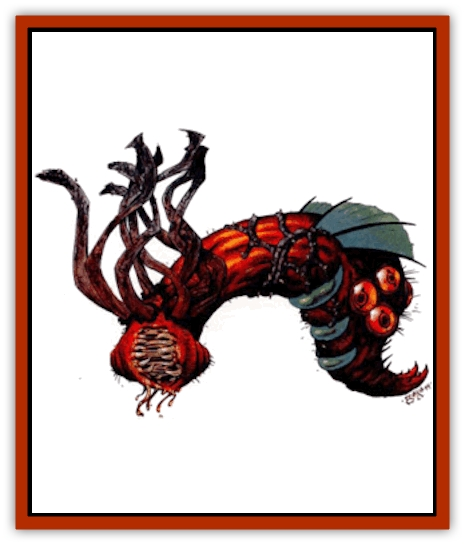

# Silt Horror - Magma

| Statistic | **Silt Horror, Magma** |
| --- | --- |
| **Activity Cycle:** | Any |
| **Alignment:** | Neutral |
| **Armor Class:** | 4 |
| **Climate/Terrain:** | Any volcanic |
| **Damage/Attack:** | 1d8 (&times;8) |
| **Diet:** | Carnivore |
| **Frequency:** | Rare |
| **Hit Dice:** | 12 |
| **Intelligence:** | Very (11-12) |
| **Magic Resistance:** | Nil |
| **Morale:** | Champion (15-16) |
| **Movement:** | 6 |
| **No. Appearing:** | 1 |
| **No. of Attacks:** | 8 |
| **Organization:** | Solitary |
| **Size:** | H (25' long) |
| **Special Attacks:** | Constriction |
| **Special Defenses:** | See below |
| **THAC0:** | 9 |
| **Treasure:** | Nil |
| **XP Value:** | 5,000 |

**Psionics Summary**

| Level | Dis/Sci/Dev | Attack/Defense | Score | PSPs |
| --- | --- | --- | --- | --- |
| 5 | 2/2/7 | MT,PsC,/MB,TS | 11 | 40 |

**Clairsentience -** *Science:* clairvoyance; *Devotions:* danger sense, hear light.

**Telepathy -** *Science:* mind link; *Devotions:* contact, mind thrust, psionic crush, synaptic static, life detection.

The magma horror inhabits areas that are rife in volcanic activity. It is a blood-red color, deepening to black near the top of the head. It has eight tentacles that can grow as long as 25'. Unlike the [[Silt_Horror|other horrors]], the magma horror is very intelligent and has formidable psionic abilities. Because the magma horror has no eyes, it uses its psionic powers to sense the presence of prey.

**Combat:** The magma silt horror lies in wait in pools of magma, hot springs, fumaroles, and geysers. The horror uses its psionic abilities to sense the presence of prey and to lure that prey to it. Periodically the horror activates its life detection and clairvoyance psionic abilities to detect the availability of its next meal. If a creature large enough to be considered a meal is sensed, the magma horror attempts to establish psionic contact with its target and communicate with it using mind link and send thoughts. The ultimate goal of such a communication is to convince the being to approach the location of the horror. Once the prey is in range, the magma silt horror launches its attack. It attacks with all eight arms, hoping to wrap a tentacle around its target. If the horror exceeds its attack roll by four or more, it ensnares the unfortunate creature. Any creature caught in a tentacle suffers an additional 1-8 (1d8) points of damage per round and 1-4 (1d4) limbs are pinned and unusable. The magma horror also attempts to drag the victim into the magma (or water). A successful Open Doors roll allows the victim to stand his ground. If the prey is dragged into the magma or hot water it suffers any applicable heat damage.

For a victim to escape, the tentacle must be severed. Each tentacle requires a total of 8 points of damage before being cut. Any attacks that miss the tentacle must be rolled again to see if the ensnared creature is hit instead.

If the magma silt horror is in danger of losing the combat or more than half of its tentacles, it uses its steam jet to escape. Any creature within 90' of the creature must make a successful save vs. breath weapon or be engulfed by a cloud of steam. While this attack causes no damage, it blocks normal vision and infravision and allows the horror to make its escape. The magma horror is immune to all heat-based and firebased attacks, but suffers double damage from all cold-based attacks.

**Habitat/Society:** The magma silt horror is a solitary creature. It meets in frequently for mating purposes. Once the process is complete, it parts ways. The horror sometimes moves within its domain from a geyser to a hot spring to a lava flow, but always remains in familiar territory.

**Ecology:** As with all horrors, the magma silt horror is always ravenous and takes every opportunity to feed. This horror must feed at least once every six weeks or it begins to weaken. Sometimes this is a challenge, as the areas these creatures call home are not the types of places that many creatures frequent.

---
## Discovery & Documentation

**Source Publication:** Dark Sun Appendix II - Terrors Beyond Tyr (1991)
**Campaign Setting:** Dark Sun
**Author(s):** Jim Atkiss, Steve Brown, Timothy B. Brown, Andrew P. Morris, Bruce Nesmith, Wes Nicholson, Bill Slavicsek

### Other Creatures Found in This Source Book
   * [[Aarakocra_Athas|Aarakocra (Athas)]]
   * [[Animal_Domestic_Athas_II|Animal, Domestic (Athas) II]]
   * [[Aviarag|Aviarag]]
   * [[Baazrag|Baazrag]]
   * [[Baazrag_Boneclaw|Baazrag, Boneclaw]]
   * [[Bloodgrass|Bloodgrass]]
   * [[Cactus_Hunting|Cactus, Hunting]]
   * [[Cactus_Rock|Cactus, Rock]]
   * [[Cilops|Cilops]]
   * [[Crodlu|Crodlu]]
   * [[Dagorran|Dagorran]]
   * [[Dhaot|Dhaot]]
   * [[Drake_Lesser_Athas_General_Information|Drake, Lesser (Athas), General Information]]
   * [[Drake_Lesser_Athas_Magma|Drake, Lesser (Athas), Magma]]
   * [[Drake_Lesser_Athas_Rain|Drake, Lesser (Athas), Rain]]
   * [[Drake_Lesser_Athas_Silt|Drake, Lesser (Athas), Silt]]
   * [[Drake_Lesser_Athas_Sun|Drake, Lesser (Athas), Sun]]
   * [[Dray|Dray]]
   * [[Drik|Drik]]
   * [[Dune_Reaper|Dune Reaper]]
   * [[Dwarf_Athas|Dwarf (Athas)]]
   * [[Elemental_Beast_Athas_Air|Elemental Beast (Athas), Air]]
   * [[Elemental_Beast_Athas_Earth|Elemental Beast (Athas), Earth]]
   * [[Elemental_Beast_Athas_Fire|Elemental Beast (Athas), Fire]]
   * [[Elemental_Beast_Athas_Water|Elemental Beast (Athas), Water]]
   * [[Elf_Athas|Elf (Athas)]]
   * [[Fael|Fael]]
   * [[Feylaar|Feylaar]]
   * [[Fordorran|Fordorran]]
   * [[Giant_Half-giant|Giant, Half-giant]]
   * [[Giant_Shadow|Giant, Shadow]]
   * [[Golem_Athas_Magma|Golem (Athas), Magma]]
   * [[Golem_Athas_Salt|Golem (Athas), Salt]]
   * [[Golem_Athas_General_Information|Golem (Athas), General Information]]
   * [[Gorak|Gorak]]
   * [[Halfling_Athas|Halfling (Athas)]]
   * [[Human_Athas|Human (Athas)]]
   * [[Jhakar|Jhakar]]
   * [[Kaisharga|Kaisharga]]
   * [[Kes'trekel|Kes'trekel]]
   * [[Klar|Klar]]
   * [[Krag|Krag]]
   * [[Kragling|Kragling]]
   * [[Lirr|Lirr]]
   * [[Mastyrial|Mastyrial]]
   * [[Meorty|Meorty]]
   * [[Mul|Mul]]
   * [[Nikaal|Nikaal]]
   * [[Paraelemental_Beast_General_Information|Paraelemental Beast, General Information]]
   * [[Paraelemental_Beast_Magma|Paraelemental Beast, Magma]]
   * [[Paraelemental_Beast_Rain|Paraelemental Beast, Rain]]
   * [[Paraelemental_Beast_Silt|Paraelemental Beast, Silt]]
   * [[Paraelemental_Beast_Sun|Paraelemental Beast, Sun]]
   * [[Pakubrazi|Pakubrazi]]
   * [[Psionocus|Psionocus]]
   * [[Psurlon|Psurlon]]
   * [[Raaig|Raaig]]
   * [[Retriever_Obsidian|Retriever, Obsidian]]
   * [[Ruktoi|Ruktoi]]
   * [[Ruvoka_Athas|Ruvoka (Athas)]]
   * [[Sand_Howler|Sand Howler]]
   * [[Scorpion_Athas|Scorpion (Athas)]]
   * [[Seed_Brain|Seed, Brain]]
   * [[Silt_Horror_Black|Silt Horror, Black]]
   * [[Silt_Horror_Red|Silt Horror, Red]]
   * [[Silt_Spawn|Silt Spawn]]
   * [[Slig|Slig]]
   * [[Spider_Athas|Spider (Athas)]]
   * [[Spinewyrm|Spinewyrm]]
   * [[Ssurran|Ssurran]]
   * [[Stalking_Horror|Stalking Horror]]
   * [[Tarek|Tarek]]
   * [[Tari|Tari]]
   * [[Thri-kreen|Thri-kreen]]
   * [[T'liz|T'liz]]
   * [[Tohr-kreen_II|Tohr-kreen II]]
   * [[Tohr-kreen_III|Tohr-kreen III]]
   * [[Trin|Trin]]
   * [[Tul'k|Tul'k]]
   * [[Undead_Athas_General_Information|Undead (Athas), General Information]]
   * [[Wraith_Athas|Wraith (Athas)]]
   * [[Xerichou|Xerichou]]
   * [[Zombie_Thinking|Zombie, Thinking]]
