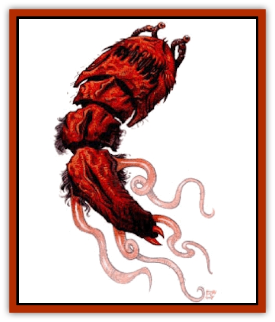

# Silt Horror - Red

| Statistic | **Silt Horror, Red** |
| --- | --- |
| **Activity Cycle:** | Any (night) |
| **Alignment:** | Neutral |
| **Armor Class:** | 6 (8) |
| **Climate/Terrain:** | Any slit, mudflats |
| **Damage/Attack:** | 1d8 (&times;8) |
| **Diet:** | Carnivore |
| **Frequency:** | Uncommon |
| **Hit Dice:** | 8 |
| **Intelligence:** | Low (5-7) |
| **Magic Resistance:** | Nil |
| **Morale:** | Elite (13-14) |
| **Movement:** | 8 (6) |
| **No. Appearing:** | 1 |
| **No. of Attacks:** | 8 |
| **Organization:** | Solitary |
| **Size:** | L (12' body) |
| **Special Attacks:** | Constriction |
| **Special Defenses:** | Air jet |
| **THAC0:** | 13 |
| **Treasure:** | Nil |
| **XP Value:** | 2,000 |

**Psionics Summary**

| Level | Dis/Sci/Dev | Attack/Defense | Score | PSPs |
| --- | --- | --- | --- | --- |
| 4 | 2/1/5 | PB/IF | 8 | 25 |

**Telepathy -** *Science:* psionic blast; *Devotions:* attraction, contact, ESP, false sensory input, repugnance.

The red silt horror is the most mobile of the [[Silt_Horror|horrors]], able to propel itself across the surface of Athas using four tentacles that can support its weight.

The red slit horror is one of the smaller horrors, measuring about 12 feet long. The creature gets its name from the scarlet hue of its leathery hide.

**Combat:** The red silt horror tries to lure prey to it using its psionic abilities to establish contact with its quarry. It uses either its telepathic devotion attraction or its ESP to discover what the victim desires most. Once this desire is determined, the red silt horror uses false sensory input to create a complete sensory image of the desired object.

Once the red horror lures the creature close, this aggressive creature launches its attack. Initially it attempts to hit the victim with its eight tentacles. If the horror exceeds its attack roll by four or more, the intended victim is entangled by one of the tentacles. Each round thereafter the ensnared creature receives damage at the rate of 1-6 (1d6) points per round. One to four of the victim's limbs are rendered useless by the constricting tentacle. A victim can escape from a tentacle's clutch by making a successful Bend Bars/Lift Gates roll. A victim can also be released if the tentacle receives at least 6 points of damage. Attacks that miss against an entwined tentacle require an additional attack roll to see if the slit horror's victim has been hit instead.

On any round that a tentacle scores a hit, the red silt horror also receives a bite attack on the same opponent. This attack causes 1-6 (1d6) points of damage and injects a poison. The victim must make a successful save vs. poison or be paralyzed for 3-18 (3d6) rounds. A creature that has been entangled can receive a bite attack every round that it is caught in the horror's deadly embrace.

If the red slit horror has only 10 hit points remaining or loses four or more of its tentacles, it uses its air let to create a cloud of silt or sand. Any creatures within 60 feet of the horror must make a successful save vs. breath weapon or be blinded for 1-4 (1d4) rounds. Such creatures must also make a Constitution check or begin sneezing and coughing for 1-4 (1d4) rounds. The horror cannot create this cloud in a mudflat.

**Habitat/Society:** The red silt horror prefers to live in the Sea of Silt and stays there as long as it can maintain a regular diet. If traffic should slow to the point that the horror can't feed itself, it moves to another silt basin, a mudflat, or even the desert. This journey is always made at night to limit the chances that it is seen and attacked. While on the surface, the red silt horror has a decreased movement of 6 per round. Also, its AC is lowered to 8. Once a suitable lair is found, the red silt horror uses its air jet to dig into the ground where it awaits its next victim.

**Ecology:** The red silt horror has a voracious appetite. It has been known to devour creatures twice its size, only to catch another creature hours later. Giants are the favored food of the red silt horror.

---
## Discovery & Documentation

**Source Publication:** Dark Sun Appendix II - Terrors Beyond Tyr (1991)
**Campaign Setting:** Dark Sun
**Author(s):** Jim Atkiss, Steve Brown, Timothy B. Brown, Andrew P. Morris, Bruce Nesmith, Wes Nicholson, Bill Slavicsek

### Other Creatures Found in This Source Book
   * [[Aarakocra_Athas|Aarakocra (Athas)]]
   * [[Animal_Domestic_Athas_II|Animal, Domestic (Athas) II]]
   * [[Aviarag|Aviarag]]
   * [[Baazrag|Baazrag]]
   * [[Baazrag_Boneclaw|Baazrag, Boneclaw]]
   * [[Bloodgrass|Bloodgrass]]
   * [[Cactus_Hunting|Cactus, Hunting]]
   * [[Cactus_Rock|Cactus, Rock]]
   * [[Cilops|Cilops]]
   * [[Crodlu|Crodlu]]
   * [[Dagorran|Dagorran]]
   * [[Dhaot|Dhaot]]
   * [[Drake_Lesser_Athas_General_Information|Drake, Lesser (Athas), General Information]]
   * [[Drake_Lesser_Athas_Magma|Drake, Lesser (Athas), Magma]]
   * [[Drake_Lesser_Athas_Rain|Drake, Lesser (Athas), Rain]]
   * [[Drake_Lesser_Athas_Silt|Drake, Lesser (Athas), Silt]]
   * [[Drake_Lesser_Athas_Sun|Drake, Lesser (Athas), Sun]]
   * [[Dray|Dray]]
   * [[Drik|Drik]]
   * [[Dune_Reaper|Dune Reaper]]
   * [[Dwarf_Athas|Dwarf (Athas)]]
   * [[Elemental_Beast_Athas_Air|Elemental Beast (Athas), Air]]
   * [[Elemental_Beast_Athas_Earth|Elemental Beast (Athas), Earth]]
   * [[Elemental_Beast_Athas_Fire|Elemental Beast (Athas), Fire]]
   * [[Elemental_Beast_Athas_Water|Elemental Beast (Athas), Water]]
   * [[Elf_Athas|Elf (Athas)]]
   * [[Fael|Fael]]
   * [[Feylaar|Feylaar]]
   * [[Fordorran|Fordorran]]
   * [[Giant_Half-giant|Giant, Half-giant]]
   * [[Giant_Shadow|Giant, Shadow]]
   * [[Golem_Athas_Magma|Golem (Athas), Magma]]
   * [[Golem_Athas_Salt|Golem (Athas), Salt]]
   * [[Golem_Athas_General_Information|Golem (Athas), General Information]]
   * [[Gorak|Gorak]]
   * [[Halfling_Athas|Halfling (Athas)]]
   * [[Human_Athas|Human (Athas)]]
   * [[Jhakar|Jhakar]]
   * [[Kaisharga|Kaisharga]]
   * [[Kes'trekel|Kes'trekel]]
   * [[Klar|Klar]]
   * [[Krag|Krag]]
   * [[Kragling|Kragling]]
   * [[Lirr|Lirr]]
   * [[Mastyrial|Mastyrial]]
   * [[Meorty|Meorty]]
   * [[Mul|Mul]]
   * [[Nikaal|Nikaal]]
   * [[Paraelemental_Beast_General_Information|Paraelemental Beast, General Information]]
   * [[Paraelemental_Beast_Magma|Paraelemental Beast, Magma]]
   * [[Paraelemental_Beast_Rain|Paraelemental Beast, Rain]]
   * [[Paraelemental_Beast_Silt|Paraelemental Beast, Silt]]
   * [[Paraelemental_Beast_Sun|Paraelemental Beast, Sun]]
   * [[Pakubrazi|Pakubrazi]]
   * [[Psionocus|Psionocus]]
   * [[Psurlon|Psurlon]]
   * [[Raaig|Raaig]]
   * [[Retriever_Obsidian|Retriever, Obsidian]]
   * [[Ruktoi|Ruktoi]]
   * [[Ruvoka_Athas|Ruvoka (Athas)]]
   * [[Sand_Howler|Sand Howler]]
   * [[Scorpion_Athas|Scorpion (Athas)]]
   * [[Seed_Brain|Seed, Brain]]
   * [[Silt_Horror_Black|Silt Horror, Black]]
   * [[Silt_Horror_Magma|Silt Horror, Magma]]
   * [[Silt_Spawn|Silt Spawn]]
   * [[Slig|Slig]]
   * [[Spider_Athas|Spider (Athas)]]
   * [[Spinewyrm|Spinewyrm]]
   * [[Ssurran|Ssurran]]
   * [[Stalking_Horror|Stalking Horror]]
   * [[Tarek|Tarek]]
   * [[Tari|Tari]]
   * [[Thri-kreen|Thri-kreen]]
   * [[T'liz|T'liz]]
   * [[Tohr-kreen_II|Tohr-kreen II]]
   * [[Tohr-kreen_III|Tohr-kreen III]]
   * [[Trin|Trin]]
   * [[Tul'k|Tul'k]]
   * [[Undead_Athas_General_Information|Undead (Athas), General Information]]
   * [[Wraith_Athas|Wraith (Athas)]]
   * [[Xerichou|Xerichou]]
   * [[Zombie_Thinking|Zombie, Thinking]]
