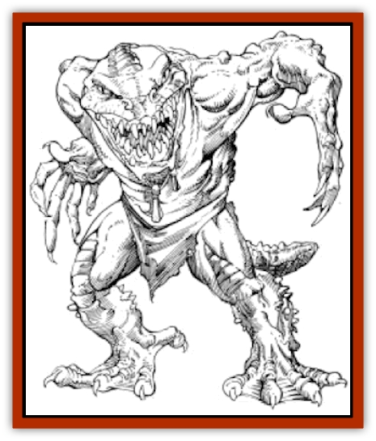
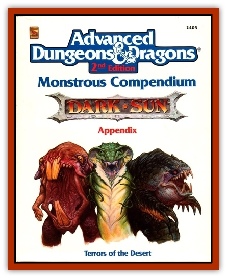

# Silt Runner

| Statistic | **Silt Runner** |
| --- | --- |
| **Activity Cycle:** | Day |
| **Alignment:** | Chaotic evil |
| **Armor Class:** | 7 |
| **Climate/Terrain:** | Sea of Silt islands, tablelands |
| **Damage/Attack:** | 1-3/1-3/1-6 or by weapon |
| **Diet:** | Omnivore |
| **Frequency:** | Common |
| **Hit Dice:** | 2 |
| **Intelligence:** | Low (5-7) |
| **Magic Resistance:** | Nil |
| **Morale:** | Average (8-10) |
| **Movement:** | 48 |
| **No. Appearing:** | 5-30 (5d6) |
| **No. of Attacks:** | 3 or 1 |
| **Organization:** | Tribe |
| **Size:** | S (3-4' tall) |
| **Special Attacks:** | Nil |
| **Special Defenses:** | Nil |
| **THAC0:** | 19 |
| **Treasure:** | J,K (A) |
| **XP Value:** | 35 / Guard: 65 / Leader: 120 |

**Psionics Summary**

| Level | Dis/Sci/Dev | Attack/Defense | Score | PSPs |
| --- | --- | --- | --- | --- |
| 1 | 1/1/3 | -/TS | 10 | 24 |

**Clairsentience -** *Science:* clairaudience; *Devotions:* combat mind, radial navigation, see sound.

These small lizard-like men are common on Athas. They usually live the life of raiders, although occasionally a lair will be found. Silt runners move very quickly and have broad, flat feet. They can even run across silt for short stretches. They hate [[Elf_Athas|elves]] with a passion; an entire raiding party of silt runners may turn aside from a caravan to attack a lone elf.

Silt runners are small, green, scaled, and ugly. They have protruding snouts filled with sharp teeth. Silt runners wear little or no clothing. What they do wear is usually more of a trophy than any covering for the sake of modesty or protection.

Silt runners speak a tribal language, and 35% of them can speak the common tongue.

**Combat:** Silt runners use two basic tactics in combat. The first is to ambush someone if possible; the second is to overrun an opponent using wave tactics. Silt runners never attack, however, unless they outnumber the foe by at least three to one.

Silt runners have naturally hard scales, which accounts for their armor class. They are able to attack with their claws and teeth. Each claw hits for 1d3 points of damage, and their sharp teeth can do 1d6 points of damage. Silt runners also carry weapons, if they can steal them. Each silt runner is armed as follows:

| Roll | Weapons |
| --- | --- |
| 1-50 | No weapons |
| 51-60 | blowgun and wooden or bone dagger |
| 61-80 | sling and wooden club |
| 81-90 | wooden or bone spear |
| 91-00 | bone or wooden dagger |

Leaders often (50%) are armed with a wooden long sword or short bow, and his guards usually carry wooden or bone hand axes or short swords. Leaders and guards often carry wooden or other types of shields.

Silt runners use their natural speed and combat mind devotion to gain surprise, appearing over a hill and descending on a party with startling speed. They try to overrun the party before any spells can be cast. In such a situation, opponents have a -3 penalty to their surprise rolls.

Silt runners break off combat if enough are brought down that they outnumber their opponents by less than two to one.

**Habitat/Society:** Silt runners are tribal in nature, living in lairs of up to 200 individuals. These tribes are usually based on islands near the shores of the Sea of Silt or in a remote desert oasis. Silt runners consider elf a delicacy, and in melee they always attack any elves present first. Their natural speed usually makes this easy.

Silt runners often inhabit the same types of islands that giants do. Giants are usually left alone by silt runners (who know when they are overmatched). The giants tend to view these creatures as pests or vermin, overrunning their homes. Unfortunately, they are just too fast to swat properly.

A silt runner band always has a leader, the largest of the tribe, growing perhaps five feet tall. If more than 10 silt runners are encountered, the leader also has two guards with him. If more than 20 are encountered, an additional 1d4 guards are present. Leaders have 4 HD, have thick scales, and carry a shield, giving them AC 5. Guards are 3 HD and carry shields, giving them an Armor Class of 6. If encountered in their lair, there are 11-30 guards (d20+10) and 2-8 (2d4) leaders. The overall leader has maximum hit points and 10% of the time will be armed with a stolen metal weapon, possibly a rusty short sword or pitted battle axe.

**Ecology:** They can eat almost anything, although they always prefer elf if they can get it. Silt runners reproduce by laying eggs, and only the leaders are allowed to breed.

---
## Discovery & Documentation

**Source Publication:** MC12 Dark Sun Appendix I - Terrors of the Desert (1991)
**Campaign Setting:** Dark Sun
**Author(s):** Tom Prusa, Louis J. Prosperi, Walter M. Baas

### Other Creatures Found in This Source Book
   * [[Animal_Herd_Athas|Animal, Herd (Athas)]]
   * [[Animal_Household_Athas|Animal, Household (Athas)]]
   * [[Antloid_Desert|Antloid, Desert]]
   * [[Banshee_Dwarf|Banshee, Dwarf]]
   * [[Beetle_Agony|Beetle, Agony]]
   * [[Bog_Wader|Bog Wader]]
   * [[Brambleweed|Brambleweed]]
   * [[B'rohg|B'rohg]]
   * [[Burnflower|Burnflower]]
   * [[Cat_Psionic|Cat, Psionic]]
   * [[Cha'thrang|Cha'thrang]]
   * [[Cistern_Fiend|Cistern Fiend]]
   * [[Clam_Giant|Clam, Giant]]
   * [[Cloud_Ray|Cloud Ray]]
   * [[Drake_Athas_Air|Drake (Athas), Air]]
   * [[Drake_Athas_Earth|Drake (Athas), Earth]]
   * [[Drake_Athas_Fire|Drake (Athas), Fire]]
   * [[Drake_Athas_Water|Drake (Athas), Water]]
   * [[Dune_Runner|Dune Runner]]
   * [[Dune_Trapper|Dune Trapper]]
   * [[Elemental_Athas_Greater_Air|Elemental (Athas), Greater, Air]]
   * [[Elemental_Athas_Greater_Earth|Elemental (Athas), Greater, Earth]]
   * [[Elemental_Athas_Greater_Fire|Elemental (Athas), Greater, Fire]]
   * [[Elemental_Athas_Greater_Water|Elemental (Athas), Greater, Water]]
   * [[Elemental_Athas_Lesser_Air_Earth|Elemental (Athas), Lesser, Air/Earth]]
   * [[Elemental_Athas_Lesser_Fire_Water|Elemental (Athas), Lesser, Fire/Water]]
   * [[Elemental_Athas_General_Information|Elemental (Athas), General Information]]
   * [[Erdland|Erdland]]
   * [[Esperweed|Esperweed]]
   * [[Flailer|Flailer]]
   * [[Floater|Floater]]
   * [[Giant_Athas|Giant (Athas)]]
   * [[Golem_Athas_I|Golem (Athas) I]]
   * [[Golem_Athas_II|Golem (Athas) II]]
   * [[Golem_Athas_III|Golem (Athas) III]]
   * [[Golem_Athas_General_Information|Golem (Athas), General Information]]
   * [[Halfling_Renegade|Halfling, Renegade]]
   * [[Hej-kin|Hej-kin]]
   * [[Id_Fiend|Id Fiend]]
   * [[Insect_Swarm_Athas|Insect Swarm (Athas)]]
   * [[Kank_Wild|Kank, Wild]]
   * [[Kirre|Kirre]]
   * [[Megapede|Megapede]]
   * [[Mul_Wild|Mul, Wild]]
   * [[Nightmare_Beast|Nightmare Beast]]
   * [[Plant_Carnivorous_Athas|Plant, Carnivorous (Athas)]]
   * [[Pterran|Pterran]]
   * [[Pterrax|Pterrax]]
   * [[Pulp_Bee|Pulp Bee]]
   * [[Pyreen|Pyreen]]
   * [[Rasclinn|Rasclinn]]
   * [[Razorwing|Razorwing]]
   * [[Roc_Athas|Roc (Athas)]]
   * [[Sand_Bride|Sand Bride]]
   * [[Sand_Cactus|Sand Cactus]]
   * [[Sand_Vortex|Sand Vortex]]
   * [[Scrab|Scrab]]
   * [[Silt_Horror|Silt Horror]]
   * [[Sink_Worm|Sink Worm]]
   * [[Sloth_Athas|Sloth (Athas)]]
   * [[So-ut|So-ut]]
   * [[Spider_Cactus|Spider Cactus]]
   * [[Spider_Crystal|Spider, Crystal]]
   * [[Spirit_of_the_Land|Spirit of the Land]]
   * [[T'Chowb|T'Chowb]]
   * [[Thrax|Thrax]]
   * [[Tohr-kreen_I|Tohr-kreen I]]
   * [[Villichi|Villichi]]
   * [[Zhackal|Zhackal]]
   * [[Zombie_Plant|Zombie Plant]]
