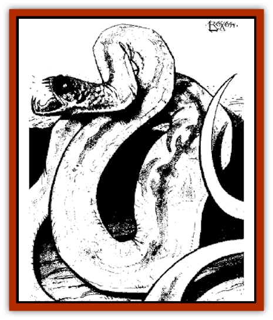

# Silt Serpent

| Statistic | **Silt Serpent** |
| --- | --- |
| **Activity Cycle:** | Day |
| **Alignment:** | Lawful good |
| **Armor Class:** | 1 (in silt) or 5 |
| **Climate/Terrain:** | Silt shallows |
| **Damage/Attack:** | 1-2 plus poison |
| **Diet:** | Carnivore |
| **Frequency:** | Uncommon |
| **Hit Dice:** | 1 |
| **Intelligence:** | Animal (1) |
| **Magic Resistance:** | Nil |
| **Morale:** | Average (8-10) |
| **Movement:** | 15 |
| **No. Appearing:** | 1-2 or 2-12 |
| **No. of Attacks:** | 1 |
| **Organization:** | Nest or Solitary |
| **Size:** | S (2-4' long) |
| **Special Attacks:** | Poison, Type E |
| **Special Defenses:** | Camouflage |
| **THAC0:** | 20 |
| **Treasure:** | Nil |
| **XP Value:** | 65 |

**Psionics Summary**

| Level | Dis/Sci/Dev | Attack/Defense | Score | PSPs |
| --- | --- | --- | --- | --- |
| 3 | 2/2/7 | II,EW/M-,TS | 12 | 60 |

**Clairsentience -** *Science:* precognition; *Devotions:* feel sound, feel light.

**Telepathy -** *Science:* mind link; *Devotions:* attraction, contact, life detection.

Silt serpents are simply [[Snake|snakes]] that have adapted to the dusty shoals of the Silt Sea. They use the silt as camouflage and cover as they sneak up on their prey, and it is this tactic that gives them their name. Though they are small creatures, their venomous bite can bring down a hearty [[Mul|mul]] in seconds.

Most serpents grow to a length of only two to four feet, but it is possible that larger versions live in the deeper stretches of the Sea of Silt. Silt serpents are a light gray to pale tan in color, just like the choking dust that lends them their name.

**Combat:** The silt serpent is a stalker and a master of stealth. The serpents have eyes, but it is their sense of vibration that provides them with most of their uncanny perception. A typical tactic of a snake is to lie completely beneath a shallow layer of silt. The dust packed in around the creature's sensory organs acts as a medium for vibrations. While buried beneath the surface, a silt serpent can sense things moving over the land or through the silt within a 40-foot radius. Often, a serpent rests upon a high vantage point and waits until it sees prey in the distance. Then it drops into the silt and tries to sneak up on its victim from below. This leaves a small trail in the serpent's wake, which an adventurer might notice on an Intelligence -5 check.

Once the snake has detected its prey and moved within five feet, it strikes. If the silt serpent attacks with surprise, it receives a +4 attack roll bonus on the first round. Anyone hit by the serpent takes 1d2 points of damage and must immediately make a saving throw versus poisons. Failure results in death, while those who are successful take 20 points of damage.

A silt serpent always attempts to strike at unprotected flesh as a first resort. It seeks to pierce armor with its sharp fangs only if no exposed flesh is within range. The silt serpent's bite can break through hides and leathers, but it cannot pierce metal armor of any sort.

Once a snake has bitten a victim, it invariably retreats beneath the silt and looks for a safe hiding place to wait for its prey to die. As a silt serpent never knows whether or not its poison has done its job, the serpent always flees after delivering a successful attack. If the prey does not collapse after 1d4 rounds, or if the prey starts to leave the area, the silt serpent moves closer and strikes again. It repeats this process until the prey collapses, kills or drives off its tormenter, or somehow outdistances the silt serpent.

When the snake senses that its victim has expired, it emerges from the silt to consume its meal. Note that it can't actually eat anything much larger than itself, but as the meat begins to decay it can tear off pieces small enough to swallow and consume.

Silt serpents only attack creatures that appear to be alive. To a silt serpent, this means a creature that is moving. If a creature stops moving for any length of time, and no vibrations of movement reach the serpent's sensory organs, then the creature is assumed to be dead. In that case, the silt serpent will not deliver a venom attack but will instead begin to feast.

A silt serpent produces enough venom to deliver four poisonous bites before its supply is exhausted. After its venom supply is exhausted (and only successful hits exhaust the venom supply), a silt serpent must wait four hours to replenish enough venom for one attack.

**Habitat/Society:** Silt serpents are either encountered hunting as a mated pair (1-9, or in a nest of 2-12 young. Young silt serpents are accompanied by 1-2 adults 50% of the time (90% of the time at night). When encountered in a nest, the serpents will not retreat. Their only thought is to kill whatever is invading their home.

Young silt serpents produce a more powerful venom than their parents, so saving throws against their bites are made at -2.

**Ecology:** Silt serpents are carnivores, though they actually consume carrion more often than not. They gather in family units and nest in rocky ruins covered in soft, gray silt. The average life span of a silt serpent is unknown, for explorers poking through silt covered ruins usually kill the creatures as quickly as they spot them - if they spot them and are not killed themselves.

The giants of the Sea of Silt and others who live along the dusty shores know that silt serpents make excellent meals. Their meat is sweet, tasty and extremely juicy, and it can be eaten raw or cooked over a slow-burning fire. The Sky Singers [[Elf_Athas|elf]] tribe makes a particularly famous dish using silt serpent meat and faro leaves. The meal, called alrasb in the elven tongue, can be sampled at the Happy Hurrum Inn in Nibenay's Hill District, or at the food tents at the Sky Singers' trade road bazaars.

**Silt Serpent, Giant**

  Though considered to be nothing more than elf tales by the people of the Tyr region, the giants of the Sea of Silt know that giant silt serpents exist. These creatures are simply gigantic versions of the regular silt serpent, and they grow to a length of 18 feet. Giant silt serpents never appear in great numbers. The usual encounter with these rare creatures involves one or two giant serpents.

A giant silt serpent has an Armor Class of 4 (0 in silt), 5 HD, a THAC0 of 15, and its bite causes 1d8 points of damage (plus the special poison attack). Otherwise, a giant silt serpent is simply a larger version of the small poisonous snake.

[[Silt_Horror|Silt horrors]] and giants are among the prey giant silt serpents hunt. On the other hand, silt horrors and giants also see the giant silt serpent as the source of a potential meal. Which is prey and which is predator often depends on which creature strikes first - and last.

---
## Discovery & Documentation

**Source Publication:** City by the Silt Sea (1994)
**Campaign Setting:** Dark Sun
**Author(s):** Shane Lacy Hensley

### Other Creatures Found in This Source Book
   * [[Beetle_Dragon|Beetle, Dragon]]
   * [[Caller_in_Darkness|Caller in Darkness]]
   * [[Dray|Dray]]
   * [[Dregoth|Dregoth]]
   * [[Dwarf_Cursed_Dead|Dwarf, Cursed Dead]]
   * [[Kalin|Kalin]]
   * [[Krag|Krag]]
   * [[Kragling|Kragling]]
   * [[Pit_Snatcher|Pit Snatcher]]
   * [[Silt_Spawn|Silt Spawn]]
   * [[Venger|Venger]]
   * [[Wall_Walker|Wall Walker]]
