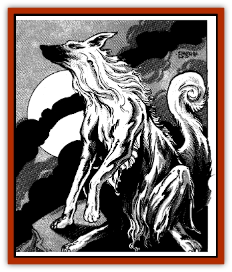

# Silver Dog

| Statistic | **Silver Dog** |
| --- | --- |
| **Activity Cycle:** | Night |
| **Alignment:** | Neutral |
| **Armor Class:** | -10 |
| **Climate/Terrain:** | Forest |
| **Damage/Attack:** | N/A (see below) |
| **Diet:** | Water/moonlight |
| **Frequency:** | Very rare |
| **Hit Dice:** | 20 |
| **Intelligence:** | Genius (17-18) |
| **Magic Resistance:** | 90% |
| **Morale:** | Unsteady (5-7) |
| **Movement:** | 18 |
| **No. Appearing:** | 1 |
| **No. of Attacks:** | N/A (see below) |
| **Organization:** | Solitary |
| **Size:** | M (5' long) |
| **Special Attacks:** | Nil |
| **Special Defenses:** | See below |
| **THAC0:** | N/A (see below) |
| **Treasure:** | Nil |
| **XP Value:** | 1,000 or -1,000 |

The few travelers who have glimpsed these beautiful canines say that silver [[Dog|dogs]] seem more creatures of dream than truth. They appear to be large dogs with long, flowing hair the color of mercury or molten silver. Witnesses describe them as having a thin and elegant frame, manelike mantle, regal face, and piercing eyes.

Silver dogs have only appeared at night, when they shimmer darkly like the finest steel in starlight. Demihuman observers have said that silver dogs radiate no heat, and thus can only be seen with normal vision.

**Combat:** Silver dogs never attack; they always flee from combat. They are shy and elusive creatures who avoid any creatures they smell, see, or hear. Sadly for these retiring beasts, though, intelligent creatures who glimpse them often pursue them.

Because of the shadowy, metallic bodies of silver dogs, characters must make a Wisdom check to even glimpse a silver dog in the night-time forest. Those unlucky enough to see the creature, though, are overcome by the grace and beauty of the creature unless they make a successful save vs. spells. If the save fails, the character is so struck by the creature.s elegance that he feels he must capture it. The character must pursue the silver dog for 1d10+4 rounds, seeking not to injure it, but to catch it alive and unharmed. All the while, the dog flees at its full rate, heading ever deeper into the forest. At the end of the character's monomaniacal desire to capture the dog, he may or may not continue the pursuit. Unfortunately, many such chases end with the character separated from his party and lost in deep woodlands.

In addition to silver dogs' 90% magic resistance, only certain enchantment and charm spells can affect them. The priest spells *command*, *remove fear*, *charm person or mammal*, *hold person*, *quest*, and *confusion* affect a silver dog normally. The wizard spells *friends*, *hypnotism*, *sleep*, *suggestion*, *charm monster*, *confusion*, *emotion*, *domination*, *hold monster*, *binding*, and *demand* also affect a silver dog normally. Other spells have no effect upon this odd beast.

If a silver dog is ever captured, whether by nets or spells, one of two things occurs. If the capturing character is any alignment but pure neutral, or if the character is of neutral alignment and means to harm the silver dog, the dog *disintegrates*, as per the wizard spell, and the character suffers a 1,000 XP loss. If the silver dog is captured by a character of neutral alignment who means the dog no harm, the character receives a *wish* and 1,000 XP. As soon as the wish is fulfilled, the silver dog disappears as per *teleport without error*. If ever a silver dog is cornered and slain, the slaying character suffers a loss of 1,000 XP.

**Habitat/Society:** According to some sources, silver dogs dwell in dens located in deepest woodlands. No silver dog pups have ever been discovered, nor any bones or droppings found about these dens. As far as is known, silver dogs are utterly solitary.

**Ecology:** Unlike other canines, silver dogs have only been witnessed drinking water and "consuming" moonlight. The beasts perform the latter process by standing upon lonely cliffs with head raised as if to howl at the moon. No sound is ever produced, however. Some speculate that the diet of the silver dog consists entirely of water and moonlight. Though this theory seems quite unlikely, it does explain why silver dogs emerge from their deep woodland homes and sometimes encounter adventurers.

Though unbiased observers hesitate to ascribe to silver dogs any contribution to forest ecology, druids consider silver dogs to be guardian spirits of the forest. According to druid lore, silver dogs are key to the balance of predator and prey in the woodlands. When silver dogs are plentiful, meaning one spotted by a druid every year, the forest thrives. When silver dogs are few, meaning one spotted by a druid every decade, the forest is threatened and begins to dwindle. Druids thus often pursue the dogs, wanting to be granted a *wish*. Typically, successful druids *wish* that a silver dog be sighted by a druid of this forest in every season of this decade.

---
## Discovery & Documentation

**Source Publication:** MC11 Forgotten Realms Appendix II (1991)
**Campaign Setting:** Advanced Dungeons & Dragons 2nd Edition
**Author(s):** Tim Beach, Tim Brown, William W. Connors, Dale Donovan, Ed Greenwood, Jeff Grubb, Bruce Heard, Slade Henson, Rob King, Colin McComb, Roger E. Moore, Bruce Nesmith, Jon Pickens, Jean Rabe, Dori Watry, Skip Williams

### Other Creatures Found in This Source Book
   * [[Alaghi|Alaghi]]
   * [[Alguduir|Alguduir]]
   * [[Beguiler|Beguiler]]
   * [[Bird_Toril|Bird (Toril)]]
   * [[Cantobele|Cantobele]]
   * [[Carapace|Carapace]]
   * [[Cat_Toril|Cat (Toril)]]
   * [[Chitine|Chitine]]
   * [[Cildabrin|Cildabrin]]
   * [[Dimensional_Warper|Dimensional Warper]]
   * [[Dragon_Deep|Dragon, Deep]]
   * [[Fachan_Toril|Fachan (Toril)]]
   * [[Fael|Fael]]
   * [[Feyr|Feyr]]
   * [[Firetail|Firetail]]
   * [[Frost|Frost]]
   * [[Gaund|Gaund]]
   * [[Gloomwing|Gloomwing]]
   * [[Golden_Ammonite|Golden Ammonite]]
   * [[Golem_Lightning|Golem, Lightning]]
   * [[Hamadryad|Hamadryad]]
   * [[Harrier|Harrier]]
   * [[Harrla|Harrla]]
   * [[Haun|Haun]]
   * [[Haundar|Haundar]]
   * [[Hendar|Hendar]]
   * [[Inquisitor|Inquisitor]]
   * [[Lhiannan_Shee|Lhiannan Shee]]
   * [[Loxo|Loxo]]
   * [[Manni|Manni]]
   * [[Manscorpion|Manscorpion]]
   * [[Mara|Mara]]
   * [[Morin|Morin]]
   * [[Naga_Dark|Naga, Dark]]
   * [[Orpsu|Orpsu]]
   * [[Plant_Carnivorous_Black_Willow|Plant, Carnivorous, Black Willow]]
   * [[Plant_Carnivorous_Toril|Plant, Carnivorous (Toril)]]
   * [[Plant_Dangerous_I|Plant, Dangerous I]]
   * [[Ring-Worm|Ring-Worm]]
   * [[Rohch|Rohch]]
   * [[Sand_Cat|Sand Cat]]
   * [[Saurial|Saurial]]
   * [[Sha'az|Sha'az]]
   * [[Simpathetic|Simpathetic]]
   * [[Skuz|Skuz]]
   * [[Spider_Monkey|Spider, Monkey]]
   * [[Tren|Tren]]
