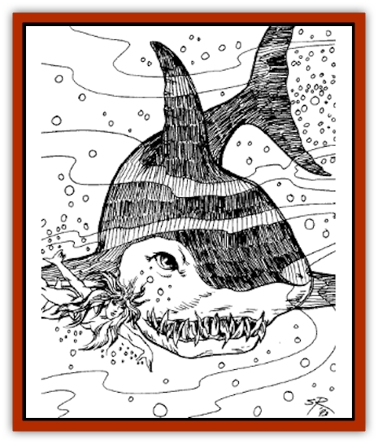

# Simorgyan

| Statistic | **Simorgyan** |
| --- | --- |
| **Activity Cycle:** | Night |
| **Alignment:** | Neutral evil |
| **Armor Class:** | 5 |
| **Climate/Terrain:** | Ocean |
| **Damage/Attack:** | 1-4/1-4/1-10 |
| **Diet:** | Omnivore |
| **Frequency:** | Very rare |
| **Hit Dice:** | 6 |
| **Intelligence:** | High (13-14) |
| **Magic Resistance:** | Nil |
| **Morale:** | Champion (16) |
| **Movement:** | 12, Sw 24 |
| **No. Appearing:** | 2-8 |
| **No. of Attacks:** | 3 |
| **Organization:** | Tribal |
| **Size:** | M (6' tall) |
| **Special Attacks:** | Shape change |
| **Special Defenses:** | Nil |
| **THAC0:** | 15 |
| **Treasure:** | R (F,I) |
| **XP Value:** | 650 |

Sunken, mysterious Simorgya is far from empty. Its ancient inhabitants who once ruled a vast empire live and seek vengeance against the surface dwellers who defeated them and continue to raid their drowned temples.

Simorgyans are [[Fish|fish]]like humanoids with magical shapechanging abilities. No one knows if this is their true form or whether they were once humanoid and changed when their land sank beneath the waves.

**Combat:** In their natural form, Simorgyans slash with their clawed hands and bite with their sharklike mouths. They may also use weapons such as tridents, spears and nets. Simorgyans dislike bright light and fight at -2 to hit in sunlight or similar illumination. They can survive out of water for 1-6 hours.

Simorgyans are a magical race and have the ability to shapechange into attractive human forms. In human shape, a Simorgyan can survive out of water indefinitely but still fights in bright light at -2 to hit.

They may also shapeehange into [[Shark|sharks]].

**Habitat/Society:** Simorgyans dwell in the depths of the ocean, swimming through the sunken corridors of their temples and palaces. They guard their treasures jealously, sometimes by themselves and at other times through guard beasts such as [[Cloaker_Sea|sea cloakers]] and [[Shark|giant sharks]]. Simorgyans can command up to six sharks or sea cloakers, four [[Octopus_Giant|giant octopi]], a single [[Whale|giant whale]] or [[Squid_Giant|kraken]], or any number of ordinary fish within a mile of their location. Simorgyan nobles - such as princess Ississi - can command Deep Rusher, a titanic whale with statistics as listed for the [[Whale|Leviathan]].

**Ecology:** Simorgyans are carnivores with a taste for fish though they take humans if the need arises. They command most of the sealife in this region of Simorgya.

---
## Discovery & Documentation

**Source Publication:** Lankhmar: City of Adventure (2nd Ed.) (1993)
**Campaign Setting:** Lankhmar
**Author(s):** Bruce Nesmith, Douglas Niles, and Ken Rolston

### Other Creatures Found in This Source Book
   * [[Astral_Wolf|Astral Wolf]]
   * [[Behemoth|Behemoth]]
   * [[Bird_of_Tyaa|Bird of Tyaa]]
   * [[Cat_War|Cat, War]]
   * [[Cloaker_Sea|Cloaker, Sea]]
   * [[Cold_Woman|Cold Woman]]
   * [[Devourer_Lankhmar|Devourer (Lankhmar)]]
   * [[Ghoul_Kleshite|Ghoul, Kleshite]]
   * [[Ghoul_Lankhmar|Ghoul (Lankhmar)]]
   * [[Gladiator_Lizard|Gladiator Lizard]]
   * [[Horag|Horag]]
   * [[Howler|Howler]]
   * [[Ice_Gnome|Ice Gnome]]
   * [[Invisible_of_Stardock|Invisible of Stardock]]
   * [[Lizard|Lizard]]
   * [[Ophidian|Ophidian]]
   * [[Ray_Invisible_Flying|Ray, Invisible Flying]]
   * [[Scorpion|Scorpion]]
   * [[Snow_Serpent|Snow Serpent]]
   * [[Thunder_Children|Thunder Children]]
   * [[Wraith-Spider|Wraith-Spider]]
   * [[Zombie_Sea|Zombie, Sea]]
