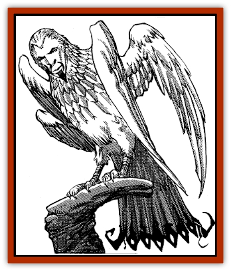

# Simurgh

| Statistic | **Simurgh** |
| --- | --- |
| **Activity Cycle:** | Day |
| **Alignment:** | Lawful good |
| **Armor Class:** | 1 |
| **Climate/Terrain:** | Warm hills and mountains |
| **Damage/Attack:** | 2-16/2-16 |
| **Diet:** | Omnivore |
| **Frequency:** | Very rare |
| **Hit Dice:** | 10+10 |
| **Intelligence:** | Genius (17-18) |
| **Magic Resistance:** | Nil |
| **Morale:** | Elite (14) |
| **Movement:** | 3, Fl 48 (A) |
| **No. Appearing:** | 1 |
| **No. of Attacks:** | 2 |
| **Organization:** | Solitary |
| **Size:** | G (20' wingspan) |
| **Special Attacks:** | See below |
| **Special Defenses:** | See below |
| **THAC0:** | 11 |
| **Treasure:** | (A) |
| **XP Value:** | 10,000 |

The simurgh, sometimes called the king of the [[Bird|birds]], is known to aid and protect other lawful good beings. It is a peace-loving and friendly creature, helpful and kind to all good creatures.

In its natural form, the simurgh has a male or female human face and the body of an enormous [[Eagle|eagle]] with orange metallic feathers. Two pairs of golden wings sprout from its back, and its long tail feathers can spread into a magnificent fan that would make even a peacock jealous. On the ground or while perching, a simurgh uses its talons for support.

Simurghs speak the languages of all birds and creatures of the air (including [[Elemental_Air_Earth|air elementals]] and [[Sakina|sakina]]). They can also speak Midani.

**Combat:** Although keenly interested in helping other good creatures, simurghs are pacifistic and will rarely enter into physical combat, even to save another being's life.

A simurgh can employ the following spell-like abilities at 10th level of ability (available once per round) at will: *detect invisibility*, *know alignment*, *infravision*, *shape change* (into the form of any small bird or human only), and *speak with animals/monsters* (birds and avian creatures only).

When the need arises, a simurgh will unfold its beautiful golden tail, which will begin to glow with all the colors of the rainbow, dazzling everyone nearby (friend and foe alike). The tail feathers shift in hue, constantly changing their fascinating, intricate patterns. Everyone within a 50-foot radius must save vs. spells or stand transfixed (hypnotized by the scintillating color) until 1d4 +1 rounds after the simurgh folds up its tail. Creatures must save each round they spend in the area of effect. Although it takes one round for a simurgh to unfold its tail and start the colors in motion, the dazzling display can be maintained indefinitely with little or no concentration. The unfolding of a simurgh's tail is usually the prelude to its hasty retreat.

If cornered with no avenue for escape, a simurgh can physically attack twice in a round with a powerful wing buffet (one from each set of wings). The wing feathers are not only metallic, but have razor-sharp edges, inflicting 2d8 points of damage. Their strong claws are not used in combat except when rescuing or transporting other good-aligned beings.

**Habitat/Society:** Simurghs are solitary creatures, about 65% of which are female. Although treated with respect and generally obeyed by most avian beings, simurghs are usually (about 70% of the time) found with a flock of admirers. This "court" of birds might include any of the normal birds (for instance, nightingales, sparrows, and swallows), small predators ([[Hawk|hawks]], eagles, or [[Vulture|vultures]]), and giant-sized eagles, condors, or perhaps even a [[Roc|roc]]. These wandering "courts" of birds are only encountered far away from human habitation.

Simurghs keep no lair, except when mating, which occurs about once every six years. A mating pair prefers a mountain cavern, deep in the wilderness, in which to rear their young. Such a lair will include two adults and 1-3 helpless young. (Treat these young as having half the hit dice of their parents; they have no attacks except their shimmering tail. Allow a +3 bonus on saves against the hypnotizing effect of the tail.) The simurghs will be guarded by 3-12 [[Eagle|giant eagles]] and 1-2 rocs. The mated pair separates after the young are old enough to care for themselves (about 2-3 years old).

Simurghs have no interest in collecting or keeping material wealth or treasure.

**Ecology:** Because of the astonishing beauty of their tails, simurghs are frequently hunted, especially by humans who dwell in the mountainous regions of Zakhara.

The golden tail feather of a simurgh, if freely given, is strongly magical. Described by some as "a piece of the sun", it radiates *continual light* and will hypnotize any and all creatures within a 50' radius (including the owner, if he is not careful; all creatures viewing the feather get a +3 bonus on their saving throws vs. spell). A simurgh's tail feather is needed to concoct a *potion of rainbow hues* and to enchant a *robe of scintillating colors*. It can also be used to inscribe *color spray*, *hypnotic pattern*, *rainbow pattern*, *prismatic spray*, *prismatic wall*, and *prismatic sphere* scrolls.

---
## Discovery & Documentation

**Source Publication:** MC13 Al-Qadim Appendix (1992)
**Campaign Setting:** Al-Qadim (Forgotten Realms)
**Author(s):** C. Terry Phillips

### Other Creatures Found in This Source Book
   * [[Ammut|Ammut]]
   * [[Ashira|Ashira]]
   * [[Asuras|Asuras]]
   * [[Black_Cloud_of_Vengeance|Black Cloud of Vengeance]]
   * [[Buraq|Buraq]]
   * [[Camel|Camel]]
   * [[Camel_of_the_Pearl|Camel of the Pearl]]
   * [[Centaur_Desert|Centaur, Desert]]
   * [[Copper_Automaton|Copper Automaton]]
   * [[Debbi|Debbi]]
   * [[Elephant_Bird|Elephant Bird]]
   * [[Gen|Gen]]
   * [[Genie_Noble_Dao|Genie, Noble Dao]]
   * [[Genie_Noble_Djinni|Genie, Noble Djinni]]
   * [[Genie_Noble_Efreeti|Genie, Noble Efreeti]]
   * [[Genie_Noble_Marid|Genie, Noble Marid]]
   * [[Genie_Tasked_Architect_Builder|Genie, Tasked, Architect/Builder]]
   * [[Genie_Tasked_Artist|Genie, Tasked, Artist]]
   * [[Genie_Tasked_Guardian|Genie, Tasked, Guardian]]
   * [[Genie_Tasked_Herdsman|Genie, Tasked, Herdsman]]
   * [[Genie_Tasked_Slayer|Genie, Tasked, Slayer]]
   * [[Genie_Tasked_Warmonger|Genie, Tasked, Warmonger]]
   * [[Genie_Tasked_Winemaker|Genie, Tasked, Winemaker]]
   * [[Ghost_Mount|Ghost Mount]]
   * [[Ghul|Ghul]]
   * [[Giant_Desert|Giant, Desert]]
   * [[Giant_Jungle|Giant, Jungle]]
   * [[Giant_Reef|Giant, Reef]]
   * [[Giant_Zakhara_General_Information|Giant (Zakhara), General Information]]
   * [[Hama|Hama]]
   * [[Heway|Heway]]
   * [[Living_Idol|Living Idol]]
   * [[Lycanthrope_Werehyena|Lycanthrope, Werehyena]]
   * [[Lycanthrope_Werelion|Lycanthrope, Werelion]]
   * [[Markeen|Markeen]]
   * [[Maskhi|Maskhi]]
   * [[Mason_Wasp_Giant|Mason Wasp, Giant]]
   * [[Nasnas|Nasnas]]
   * [[Pahari|Pahari]]
   * [[Rom|Rom]]
   * [[Sabu_Lord|Sabu Lord]]
   * [[Sakina|Sakina]]
   * [[Serpent_Lord|Serpent Lord]]
   * [[Serpent_Winged|Serpent, Winged]]
   * [[Silat|Silat]]
   * [[Stone_Maiden|Stone Maiden]]
   * [[Vishap|Vishap]]
   * [[Zaratan|Zaratan]]
   * [[Zin|Zin]]
