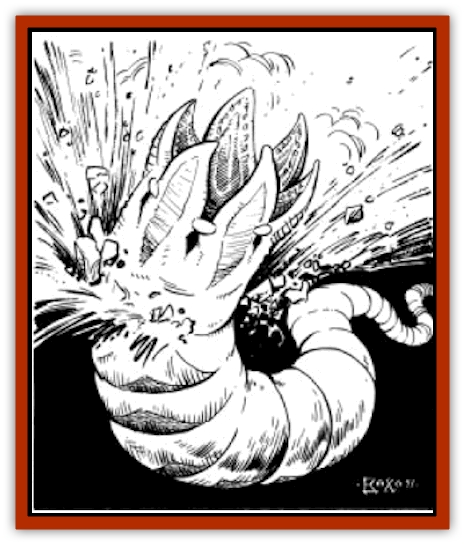

# Sink Worm

| Statistic | **Sink Worm** |
| --- | --- |
| **Activity Cycle:** | Day |
| **Alignment:** | Neutral |
| **Armor Class:** | 6 |
| **Climate/Terrain:** | Sea of Silt, sandy wastes |
| **Damage/Attack:** | 2-24 |
| **Diet:** | Carnivore |
| **Frequency:** | Rare |
| **Hit Dice:** | 14 |
| **Intelligence:** | Animal (1) |
| **Magic Resistance:** | Nil |
| **Morale:** | Steady (11-12) |
| **Movement:** | 12, Br 18 |
| **No. Appearing:** | 1 |
| **No. of Attacks:** | 1 |
| **Organization:** | Solitary |
| **Size:** | G (50' long) |
| **Special Attacks:** | Swallow whole |
| **Special Defenses:** | Phasing |
| **THAC0:** | 7 |
| **Treasure:** | Q |
| **XP Value:** | 7,000 |

The sink worm is a huge white [[Worm|worm]] that travels beneath the sand or silt, leaving a sunken depression in the surface behind it. In spite of this clear warning sign, few prey escape once a sink worm begins hunting them.

A sink worm is a huge creature stretching fully 50 or more feet. It is a pale white, looking like a long giant maggot. The huge maw is capable of swallowing man-sized creatures with a single gulp.

**Combat:** The sink worm travels through the sand until it is almost underneath its prey. It then bursts out of the sand or silt and tries to swallow its victim. Unsuspecting adventurers have been swallowed before they even realized they were under attack. The sink worm attacks with its huge mouth, which is lined with sword-like teeth. Its bite causes 2d12 points of damage. If the worm's attack roll is 4 or more greater than the necessary roll, it has swallowed its prey. The worm's mouth is only about seven feet across; prey larger than that can't be swallowed.

The sink worm moves very silently, partly due to its ability to "phase" through the sand and rock. It has very sharp senses and is seldom surprised, receiving a +1 bonus to its surprise roll. Opponents receive a normal surprise roll. Success means that they have noticed the sunken trail in the sand or silt when the worm is 10-60 (1d6x10) yards away. In silt the trail can be seen farther off; the range for noticing it increases to 20-120 (2d6x10) yards. The sink worm can feel the vibrations of someone walking on sand or wading through silt. The range of detection is 120 yards on sand and 90 yards in silt.

If the sink worm successfully swallows an opponent, it dives back below the surface, where it chews up the victim, doing an automatic 2d12 points of damage per round. If prey remains nearby, it will return for another snack after it chews up the first one. Swallowed victims may attack from within the worm with small weapons, provided they were already held in hand. Attacks and damage rolls are both at a -1 penalty, and this penalty is cumulative each round. Two rounds after the victim reaches zero hit points, he is unrecoverable, except as small pieces.

The sink worm also has a unique method of travel. If it meets a rocky outcropping in the sand, it simply phases past it. It can phase no more than 90 feet. If this distance would leave it encased in rock, the phasing does not work. It uses this ability only to pass through rock or to escape. A sink worm will not phase above the ground since it is much slower there. It may use its ability to phase ahead of a running [[Elf_Athas|elf]] or other victim, especially if it is very hungry.

If a sink worm is hurt, it retreats beneath the surface very swiftly. It phases into the ground, although it cannot do this with a victim in its mouth. It takes two rounds for the sink worm to disappear beneath a sandy surface, but only one for it to dive under the silt. A sink worm may abandon its victim in favor of escape if it has taken damage exceeding 50% of its total hit points.

**Habitat/Society:** The sink worm is a solitary creature, meeting with other sink worms to mate only once every three years. The hatchlings are left to fend for themselves, and most turn cannibal immediately. The strongest few survive to burrow away. The eggs are usually buried at least 10 feet below the surface and are very hard to locate.

Sink worms will try to eat nearly anything. A sink worm needs at least one man-sized victim per day, so they are very aggressive hunters.

**Ecology:** The sink worm is an unusual beast in that it actually sucks sand and silt through its body. The minute particles of air in the sand or silt are filtered past gills which allow the creature to breath under the silt. This removal of air also causes the sunken depression in the surface of the sand or silt through which the sink worm passes. A sink worm is especially sensitive to the vibrations of someone running over the sand.

Sinkworm "gills" are a curiosity among sages, so a sinkworm egg would be worth whatever the owner asked for it. However, the difficulty in locating the eggs makes this nearly impossible.

---
## Discovery & Documentation

**Source Publication:** MC12 Dark Sun Appendix I - Terrors of the Desert (1991)
**Campaign Setting:** Dark Sun
**Author(s):** Tom Prusa, Louis J. Prosperi, Walter M. Baas

### Other Creatures Found in This Source Book
   * [[Animal_Herd_Athas|Animal, Herd (Athas)]]
   * [[Animal_Household_Athas|Animal, Household (Athas)]]
   * [[Antloid_Desert|Antloid, Desert]]
   * [[Banshee_Dwarf|Banshee, Dwarf]]
   * [[Beetle_Agony|Beetle, Agony]]
   * [[Bog_Wader|Bog Wader]]
   * [[Brambleweed|Brambleweed]]
   * [[B'rohg|B'rohg]]
   * [[Burnflower|Burnflower]]
   * [[Cat_Psionic|Cat, Psionic]]
   * [[Cha'thrang|Cha'thrang]]
   * [[Cistern_Fiend|Cistern Fiend]]
   * [[Clam_Giant|Clam, Giant]]
   * [[Cloud_Ray|Cloud Ray]]
   * [[Drake_Athas_Air|Drake (Athas), Air]]
   * [[Drake_Athas_Earth|Drake (Athas), Earth]]
   * [[Drake_Athas_Fire|Drake (Athas), Fire]]
   * [[Drake_Athas_Water|Drake (Athas), Water]]
   * [[Dune_Runner|Dune Runner]]
   * [[Dune_Trapper|Dune Trapper]]
   * [[Elemental_Athas_Greater_Air|Elemental (Athas), Greater, Air]]
   * [[Elemental_Athas_Greater_Earth|Elemental (Athas), Greater, Earth]]
   * [[Elemental_Athas_Greater_Fire|Elemental (Athas), Greater, Fire]]
   * [[Elemental_Athas_Greater_Water|Elemental (Athas), Greater, Water]]
   * [[Elemental_Athas_Lesser_Air_Earth|Elemental (Athas), Lesser, Air/Earth]]
   * [[Elemental_Athas_Lesser_Fire_Water|Elemental (Athas), Lesser, Fire/Water]]
   * [[Elemental_Athas_General_Information|Elemental (Athas), General Information]]
   * [[Erdland|Erdland]]
   * [[Esperweed|Esperweed]]
   * [[Flailer|Flailer]]
   * [[Floater|Floater]]
   * [[Giant_Athas|Giant (Athas)]]
   * [[Golem_Athas_I|Golem (Athas) I]]
   * [[Golem_Athas_II|Golem (Athas) II]]
   * [[Golem_Athas_III|Golem (Athas) III]]
   * [[Golem_Athas_General_Information|Golem (Athas), General Information]]
   * [[Halfling_Renegade|Halfling, Renegade]]
   * [[Hej-kin|Hej-kin]]
   * [[Id_Fiend|Id Fiend]]
   * [[Insect_Swarm_Athas|Insect Swarm (Athas)]]
   * [[Kank_Wild|Kank, Wild]]
   * [[Kirre|Kirre]]
   * [[Megapede|Megapede]]
   * [[Mul_Wild|Mul, Wild]]
   * [[Nightmare_Beast|Nightmare Beast]]
   * [[Plant_Carnivorous_Athas|Plant, Carnivorous (Athas)]]
   * [[Pterran|Pterran]]
   * [[Pterrax|Pterrax]]
   * [[Pulp_Bee|Pulp Bee]]
   * [[Pyreen|Pyreen]]
   * [[Rasclinn|Rasclinn]]
   * [[Razorwing|Razorwing]]
   * [[Roc_Athas|Roc (Athas)]]
   * [[Sand_Bride|Sand Bride]]
   * [[Sand_Cactus|Sand Cactus]]
   * [[Sand_Vortex|Sand Vortex]]
   * [[Scrab|Scrab]]
   * [[Silt_Horror|Silt Horror]]
   * [[Silt_Runner|Silt Runner]]
   * [[Sloth_Athas|Sloth (Athas)]]
   * [[So-ut|So-ut]]
   * [[Spider_Cactus|Spider Cactus]]
   * [[Spider_Crystal|Spider, Crystal]]
   * [[Spirit_of_the_Land|Spirit of the Land]]
   * [[T'Chowb|T'Chowb]]
   * [[Thrax|Thrax]]
   * [[Tohr-kreen_I|Tohr-kreen I]]
   * [[Villichi|Villichi]]
   * [[Zhackal|Zhackal]]
   * [[Zombie_Plant|Zombie Plant]]
