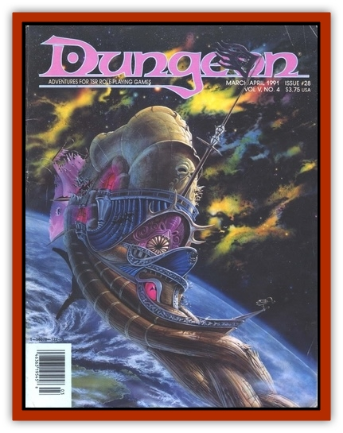

# Siragle

| Statistic | **Siragle** |
| --- | --- |
| **Activity Cycle:** | Any |
| **Alignment:** | Chaotic evil |
| **Armor Class:** | -3 |
| **Climate/Terrain:** | Abyss |
| **Damage/Attack:** | 2d4+7/2d4+7/2d2/3 (see below) |
| **Diet:** | Carnivore |
| **Frequency:** | Unique (very rare) |
| **Hit Dice:** | 85 hp (18 HD) |
| **Intelligence:** | Genius (17-18) |
| **Magic Resistance:** | 50% |
| **Morale:** | Fearless (19) |
| **Movement:** | 12 |
| **No. Appearing:** | 1 |
| **No. of Attacks:** | 4 |
| **Organization:** | Solitary |
| **Size:** | L (8½' tall) |
| **Special Attacks:** | Magic use, stinger (see below) |
| **Special Defenses:** | +2 or better weapon to hit; half damage from cold, electricity, fire, and gas |
| **THAC0:** | 5 |
| **Treasure:** | S,U,Y |
| **XP Value:** | 21,000 |

Siragle is a major Abyssal fiend whose form is an unsettling humanoid/reptile blend. He stands 8½' tall and has the head of a [[Crocodile|crocodile]] crowned with sharp black antlers. His body is that of a huge, muscular human, a full 3' wide. His eyes are a solid blood-red, his numerous teeth are black as soot, and his 5'-long tail trails behind him, ending in a daggerlike yellowed ivory stinger. His feet and hands sport vicious claws, and his leathery, muscled body is a blackish-green.

Skilled at magic, Siragle can perform the following spell-like abilities as a 20th-level caster. At will: *detect magic*, *detect invisible*, *darkness 10' radius*, *infravision*, *know alignment*, *fly*, *dispel magic*; three times/day: *invisibility*, *polymorph self*, *shout*, *suggestion*, *plane shift*, *teleport*; once/day: *chaos*, *gate* 2-4 [[Tanar'ri_Greater_Chasme|chasmes]] (45% chance); once/week: *mass charm*, *forcecage*. He is also able to utilize wizard scrolls and frequently has some in his possession.

Siragle has a strength of 19 (+3 to hit, +7 to damage). If he hits with both claw attacks (2-8/2-8 hp damage plus strength bonus), his bite (2-12 hp damage) and tail stinger (3 hp damage) hit automatically. Under such circumstances, the stinger has a 45% chance of draining one life level from the victim and transferring a corresponding number of hit points to Siragle (dice type determined by the victim's character class), though Siragle can never receive more than his original number of hit points. He is capable of wielding a weapon rather than using his claw attacks.

Siragle saves as a 16th-level fighter or wizard, whichever is better. If a battle goes poorly for him and he is reduced to one-quarter his original hit points, he will try to use his *plane shift* spell to escape or use whatever other means are available to get him to safety. If Siragle is driven off by the adventurers, he will definitely hold a grudge. If slain, he will re-form on his home plane in one year, whereupon he will do all he can to make life unpleasant for his slayers.

---
## Discovery & Documentation

**Source Publication:** Dungeon #28 (1991)
**Campaign Setting:** Dungeon Magazine
**Author(s):**
