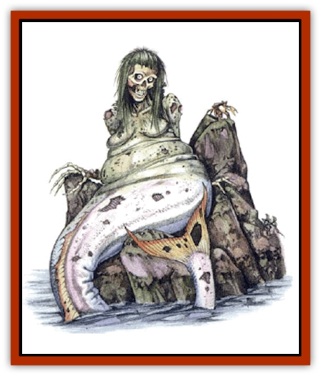

# Siren - Ravenloft

| Statistic | **Siren (Ravenloft)** |
| --- | --- |
| **Activity Cycle:** | Any |
| **Alignment:** | Neutral evil |
| **Armor Class:** | 6 |
| **Climate/Terrain:** | Ocean |
| **Damage/Attack:** | 2d4 |
| **Diet:** | Carnivore |
| **Frequency:** | Rare |
| **Hit Dice:** | 4 |
| **Intelligence:** | High (13-14) |
| **Magic Resistance:** | 10% |
| **Morale:** | Steady (11-12) |
| **Movement:** | 8, Sw 18 |
| **No. Appearing:** | 2-8 |
| **No. of Attacks:** | 2 |
| **Organization:** | Schools |
| **Size:** | M (5' tall) |
| **Special Attacks:** | <i>Mass charm</i>, <i>advanced illusion</i>, disease |
| **Special Defenses:** | Nil |
| **THAC0:** | 17 |
| **Treasure:** | C |
| **XP Value:** | 975 |

A Ravenloft <a href="sirine">siren</a> is a hideous, undead creature with the upper body of a woman and the lower body of a fish. Her hair is tangled and entwined with rotting seaweed, and her body is gray and bloated, resembling a corpse that has been in the water for some time. The flesh has rotted back from the finger tips, exposing the bone. The siren sharpens this bone on the rocks on which she reclines, turning each finger into a deadly weapon.

By means of their innate ability to cast *advanced illusion* spells, Ravenloft sirens present a very different face to the world. They appear to be beautiful [[Merman|mermaids]] with voluptuous bodies and sleek sea-green hair.

**Combat:** Ravenloft sirens lure their victims into striking range by means of a song that acts as a *mass charm*. This song can be heard at great distances over open water: those aboard ships passing within a mile of an islet on which Ravenloft sirens are sunning themselves have been known to fall victim to it. The song can be avoided by plugging the ears with wax or by means of a *silence, 15' radius spell*, but these measures must be taken in advance.

Each siren in the school can affect up to 8 Hit Dice worth of victims. Victims must make a successful saving throw vs. spell with a -2 penalty to the roll. Those who fail are compelled to set course with all possible speed toward the singing. Upon sighting the sirens, they feel a compulsion to go ashore and sit down beside them. They may only be prevented from doing so by being physically restrained.

Any character who sights a Ravenloft siren and makes a successful saving throw vs. spell can see her as she really is. Typically this roll will be made in secret by the DM and is made with a -4 penalty.

Those characters who actively attempt to disbelieve the illusion do not suffer the a penalty. Disbelief may not be attempted, however, by characters who have fallen victim to the sirens' *mass charm*.

Once their prey is within reach, the sirens attack with their sharpened, bony fingers. Due to the *advanced illusion*, which includes tactile elements, this attack at first seems to be a gentle caress. During each round that a siren succeeds in inflicting damage, the victim gets to make an additional saving throw vs. spell, (Again, this is typically done in secret by the DM.) A successful roll means that both the *illusion* and the *charm* suddenly vanish. The victim sees the siren for what she really is and can begin fighting back. At the DM's discretion, a fear check may be called for due to the sudden revelation of the creature's true form.

Those who suffer damage at the hands of a Ravenloft siren must make a saving throw vs. poison. Failure means that the wounds become infected. This infection must be magically healed before natural healing can occur.

Ravenloft sirens can be turned as undead and suffer damage from holy water. When turned, they flee back into the sea, disappearing beneath the waves.

**Habitat/Society:** Ravenloft sirens can exist on a diet of fish but prefer to dine on sentient creatures. They live in the ocean, traveling in schools like fish, but spend much of their time basking on rocky islets. These are typically surrounded by the rotting corpses of their victims. Because the sirens have no use for the victims' possessions, valuable treasures or magical items can often be found there.

The sirens are astute enough to realize that this booty can act as a lure. They often lurk just beneath the waves, looking up at the surface for the hull of a visiting ship, then emerging suddenly to sing their song.

The stench of decay that hangs in the air around an islet that is a resting place for Ravenloft sirens is almost overwhelming. This foul taint emanates both from the sirens themselves and from the corpses of their victims. It is masked, however, by the sirens' ability to cast *advanced illusion* spells that include an olfactory component.

**Ecology:** Thus far, Ravenloft sirens have only been sighted along the Jagged Coast of Necropolis. It is likely, however, that they will soon begin spreading south along the coastlines of other Ravenloft domains that border on the Sea of Sorrows.

It is thought that the sirens are [[Merman|merfolk]] who were transformed by the burst of negative energy that was released when the *doomsday device* was activated. If this theory is correct, it is possible that male Ravenloft sirens also exist.

---
## Discovery & Documentation

**Source Publication:** Requiem: The Grim Harvest (1996)
**Campaign Setting:** Ravenloft
**Author(s):** William W. Connors, Lisa Smedman

### Other Creatures Found in This Source Book
   * [[Dream_Stalker|Dream Stalker]]
   * [[Golem_Maggot|Golem, Maggot]]
   * [[Mummy_Bog|Mummy, Bog]]
