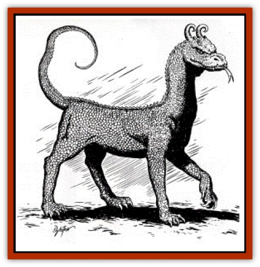

# Sirrush

| Statistic | **Sirrush** |
| --- | --- |
| **Activity Cycle:** | Day |
| **Alignment:** | Chaotic evil |
| **Armor Class:** | 3 |
| **Climate/Terrain:** | Subtropical or tropical desert or hills |
| **Damage/Attack:** | 1-10/1-4/1-4 or 1-4 |
| **Diet:** | Carnivore |
| **Frequency:** | Rare |
| **Hit Dice:** | 5+1 |
| **Intelligence:** | Low (5) |
| **Magic Resistance:** | Nil |
| **Morale:** | Champion (15) |
| **Movement:** | 15 |
| **No. Appearing:** | 1-4 |
| **No. of Attacks:** | 3 or 1 |
| **Organization:** | Solitary/pack |
| **Size:** | L (6' at shoulder, 10' long) |
| **Special Attacks:** | Poison |
| **Special Defenses:** | Immune to poison, kick in retreat |
| **THAC0:** | 15 |
| **Treasure:** | Nil |
| **XP Value:** | 1,400 |

The sirrush is a creature with a catlike, scaled torso; forelegs like those of a scaled lion; hind legs like those of a giant bird or lizard; a long, prehensile tail; and a snakelike head at the end of a long neck. Adorning that head is a pair of curled horns, like ram's horns but mounted backward. A short neck-crest or dewlap adorns the neck just below the head. The entire animal is of a sandy yellow hue.

**Combat:** In fighting with its own kind, the sirrush relies solely on head-butting with its curled horns in a test of strength. Such attacks usually take place in competition for a mate. Should it use this form of attack on other animals, this attack inflicts 14 hp damage. For self-defense and predation, however, the sirrush employs a claw/claw/bite routine that causes 1-4/1-4/ 1-10 hp damage. Its fangs are also venomous (Type E poison).

Should retreat become necessary, the sirrush may also kick out with its wickedly-clawed hind feet in the manner of a [[Leucrotta|leucrotta]], inflicting 1-10 hp damage from each taloned foot. It is immune to all poisons.

**Habitat/Society:** Usually, the sirrush is solitary, hunting small game and lone human or demihuman wayfarers as well as the strayed, aged, crippled, or young members of herds of game animals or domestic stock. When easy prey grows scarce, however, two mated pairs form a small pack in the interests of bringing down larger prey, or an entire party of travelers. One mated pair takes care of their young for the four months (spring and early summer) it takes them to reach maturity, each parent accepting equal responsibility for feeding and defending the 1-5 (1d4+1) eggs and young that constitute a typical sirrush clutch. When defending their young, sirrush parents gain a +1 attack bonus, and their morale rises to Fanatic (17).

**Ecology:** The sirrush is just another large predator, albeit one somewhat more intelligent than most, having no more effect on its environment than a pack of dire wolves or a pride of lions would.

When military forces or strong parties of adventurers are not available to deal with a sirrush, or a pack of them, the locals and any caravans that regularly travel through their territory have no choice but to deal with them. In practical terms, this means leaving behind one or more animals as sacrifices. The number of victims laid out at a time depends entirely upon how many sirrushes are in the area. Naturally, if their prey runs away, the sacrifice is for nothing, and the monsters resume their raids. Therefore, the sacrifices are typically bound, hobbled, or crippled in some manner. The victims are not slain outright, however, as sirrush prefer live prey.

Humans have several uses for this monster. As with most venomous beasts, its poison is much sought after by wizards and alchemists alike. It has a leathery hide like bull's hide beneath the layer of scales, and this hide may be used in the manufacture of a *cloak of poisonousness*, while the scales themselves, if the animal is carefully skinned, may be formed into a suit of scale mail quite suitable for enchantment. There are even reports that a *staff of the serpent*- though only the "adder" version -may be created by steeping a quarterstaff in the sirrush's blood.

---
## Discovery & Documentation

**Source Publication:** Dragon248 (1998)
**Campaign Setting:** Dragon Magazine
**Author(s):** Gregory W. Detwiler, Terry Dykstra

### Other Creatures Found in This Source Book
   * [[Amphitere|Amphitere]]
   * [[Cetus_Lesser|Cetus, Lesser]]
   * [[Dragonet|Dragonet]]
   * [[Dragon_Orange_Sodium|Dragon, Orange (Sodium)]]
   * [[Dragon_Purple_Energy|Dragon, Purple (Energy)]]
   * [[Dragon_Yellow_Salt|Dragon, Yellow (Salt)]]
   * [[Gargouille|Gargouille]]
   * [[Hai_Riyo|Hai Riyo]]
   * [[Peluda|Peluda]]
   * [[Vore_Lekiniskiy_Master_Fire_Worm|Vore Lekiniskiy, Master Fire Worm]]
